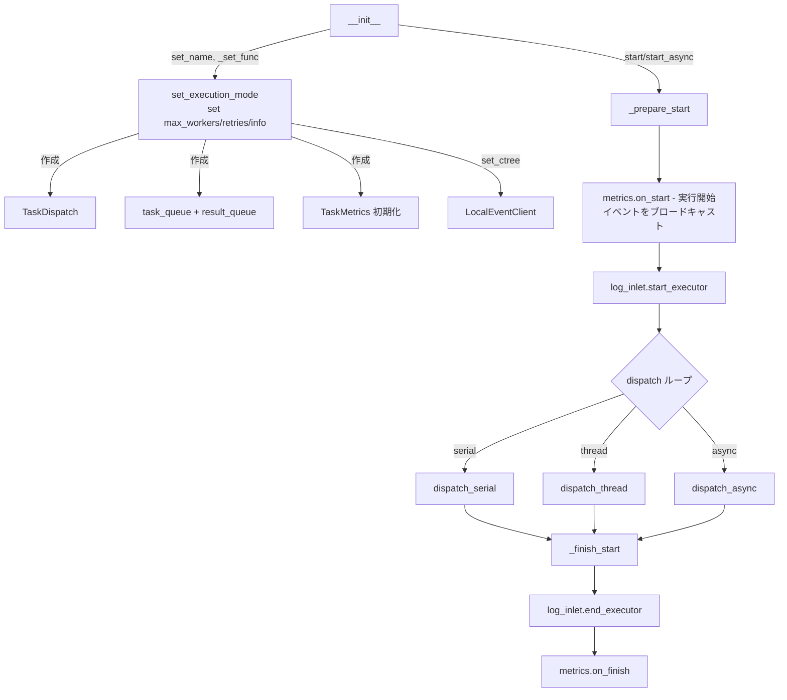

# TaskExecutor

> 📅 最終更新日: 2026/08/31

`TaskExecutor` は単一タスクロジックを実行するコアコンポーネントです。タスクの実行、並行性制御、エラー処理、リトライ機構、およびログ記録を担当します。

> 注意：`TaskExecutor` は使い捨てオブジェクトです。`run()` または `run_async()` の完了後、現在のインスタンスを安全に再利用できるとは限りません。再実行が必要な場合は、新しい `TaskExecutor` を作成してください。

## 初期化

```python
class TaskExecutor[T, R]:
    def __init__(
        self,
        name: str,
        func: Callable[[T], R] | Callable[[T], Awaitable[R]],
        *,
        execution_mode: str = "serial",
        max_workers: int | None = None,
        max_retries: int = 1,
        max_queue_size: int = 0,
        max_info: int = 50,
        enable_duplicate_check: bool = False,
    ): ...
```

### パラメータ説明

| パラメータ | デフォルト値 | 説明 |
|------|--------|------|
| `name` | — | 実行者名。ログと追跡に使用 |
| `func` | — | タスクを実際に実行する呼び出し可能オブジェクト（同期関数とコルーチン関数の両方をサポート） |
| `execution_mode` | `"serial"` | 実行モード：`"serial"` / `"thread"` / `"async"` |
| `max_workers` | `None` | 並行数制限（None の場合は動的: `min(32, cpu_count+4)`） |
| `max_retries` | `1` | タスク失敗後の最大リトライ回数（最大で retries+1 回実行） |
| `max_queue_size` | `0` | タスク入力キューの最大容量（0 は無制限を意味する） |
| `max_info` | `50` | ログにおける各情報の最大長 |
| `enable_duplicate_check` | `False` | タスクハッシュに基づく重複チェックを有効にするか |

## Observer パターン

`TaskExecutor` は observer パターンを通じてライフサイクルイベントを外部にブロードキャストします。

### 登録と解除

```python
executor.add_observer(observer)  # オブザーバーを登録
executor.remove_observer(observer)  # オブザーバーを削除
```

### ブロードキャストイベント

| イベント | トリガー位置 | 説明 |
|------|---------|------|
| `on_start(name, total)` | `metrics.on_start()` | 実行開始（注意：total は固定で 0。実際のタスク数は `on_tasks_added` で通知） |
| `on_task_success(count=1)` | `metrics.add_success_count()` | タスク成功（count は今回追加されたカウント） |
| `on_task_fail(count=1)` | `metrics.add_fail_count()` | タスク失敗（count は今回追加されたカウント） |
| `on_task_duplicate(count=1)` | `metrics.add_duplicate_count()` | 重複検出（count は今回追加されたカウント） |
| `on_tasks_added(count)` | `metrics.add_task_count()` | 新規タスクがキューに追加 |
| `on_finish()` | `metrics.on_finish()` | 実行終了 |

## コアメソッド

### run / run_async / restore_db

```python
def run(self, task_source: Iterable[T], *, if_put_signal: bool = True) -> None:
    """
    同期的にエグゼキュータを起動します（funnel_scope ライフサイクルを含む）。内部で順次
    put_task() で全タスクを注入、put_signal() で終了シグナルを注入、start() を呼び出します。
    """


async def run_async(
    self, task_source: Iterable[T], *, if_put_signal: bool = True
) -> None:
    """
    非同期的にエグゼキュータを起動します（funnel_scope ライフサイクルを含む）。内部で順次
    put_task() で全タスクを注入、put_signal() で終了シグナルを注入、start_async() を await します。
    """


def restore_db(
    self,
    db_path: str | Path,
    statuses: Iterable[str] | None = None,
    *,
    filter_by_error_type: bool = False,
) -> None:
    """
    sqlite 永続化ストアから現在の stage のタスクを読み込み、実行を開始します。

    :param db_path: sqlite データベースファイルパス
    :param statuses: レコードステータスフィルタリスト。デフォルト ["failed", "pending"]
    :param filter_by_error_type: 現在のエグゼキュータの retry_exceptions で
        error_type をフィルタリングするかどうか。デフォルト False
    """
```

ライフサイクル制約：

- 実行中はキュー、`spout/inlet`、統計状態、スケジューラー実行時リソースを作成・保持します。
- 現在の実装は単回実行向けに設計されており、一度の実行終了後に完全にリセットできることは保証されません。
- 同じロジックを複数回実行する必要がある場合は、同じオブジェクトの `run()` / `run_async()` / `restore_db()` を繰り返し呼ぶのではなく、新しい実行者インスタンスを作成してください。

## エラー処理

### リトライロジック

例外は `TaskDispatch._worker` / `_async_worker` の分類ループで処理されます：
- **リトライ可能な例外**: `retry_exceptions` に含まれ、かつ `max_retries` に達していない場合、`log_task_retry()` でログを記録した後、次のループでリトライ
- **リトライ不可能な例外**: `handle_task_fail()` を呼び出し、レコードを `LifecycleInlet`（SQLite）と `LogInlet`（ログファイル）に書き込み

```python
def set_retry_exceptions(self, *exceptions: type[Exception]) -> None:
    """リトライが必要な例外型を追加します。"""
```

### 結果処理（コアメソッド）

タスクの結果処理は以下のメソッドで実装されます：

```python
def process_task_success(
    self, task_envelope: TaskEnvelope[T], result: R, start_time: float
) -> None:
    """成功タスクの処理：observer に通知、ログ書き込み、結果エンベロープを生成し result_queue に投入。"""


def handle_task_fail(
    self, task_envelope: TaskEnvelope[T], exception: Exception
) -> None:
    """失敗タスクの処理：observer に通知、LifecycleInlet と LogInlet に記録。"""


def deal_duplicate(self, task_envelope: TaskEnvelope[T]) -> None:
    """重複タスクの処理：observer に通知、ログ記録。"""
```

### 結果の取得

```python
def get_success_pairs(self) -> list[tuple[T, R]]:
    """
    成功タスク (task, result) リストを取得します。
    グローバル LifecycleSpout の SQLite レコードから本エグゼキュータ名で読み込みます。
    """


def get_error_pairs(self) -> list[tuple[T, PersistedError]]:
    """失敗タスク (task, PersistedError) リストを取得します。"""
```

## CelestialTree 統合

```python
def set_ctree(self, ctree_client: EventClient) -> None:
    """イベントクライアントインスタンスを設定します。"""
```

> デフォルトでは、`TaskExecutor` は内部で `LocalEventClient()` を使用してローカルインクリメンタルイベント ID を生成します。
> CelestialTree に接続する必要がある場合は、まず `celestialtree` を追加インストールし、クライアントオブジェクトを構築して `set_ctree()` に渡してください。

## 状態照会メソッド

```python
def get_name(self) -> str:                    # 実行者名
def get_full_name(self) -> str:               # "name(mode-workers)" または "name(serial)"
def get_func_name(self) -> str:               # 関数名
def get_summary(self) -> dict:                # スナップショット：name, func_name, execution_mode, max_workers
def get_counts(self) -> dict:                 # カウンター：tasks_input/succeeded/failed/duplicated/processed/pending
def get_lifecycle_path(self) -> Path:         # グローバル lifecycle SQLite ファイルの絶対パス（未設定時は空 Path）
```

## ライフサイクル


```mermaid
flowchart TD
    INIT[__init__] -->|set_name, _set_func| CONFIG[set_execution_mode<br/>set max_workers/retries/info]
    CONFIG -->|作成| DISPATCH[TaskDispatch]
    CONFIG -->|作成| QUEUE[task_queue + result_queue]
    CONFIG -->|作成| METRICS[TaskMetrics 初期化]
    CONFIG -->|set_ctree| CTREE[LocalEventClient]

    INIT -->|start/start_async| PREPARE[_prepare_start]
    PREPARE --> METRICS_START[metrics.on_start - 実行開始イベントをブロードキャスト]
    METRICS_START --> LOG_START[log_inlet.start_executor]
    LOG_START --> RUN{dispatch ループ}
    RUN -->|serial| SERIAL[dispatch_serial]
    RUN -->|thread| THREAD[dispatch_thread]
    RUN -->|async| ASYNC[dispatch_async]

    SERIAL --> FINISH[_finish_start]
    THREAD --> FINISH
    ASYNC --> FINISH

    FINISH --> LOG_END[log_inlet.end_executor]
    LOG_END --> METRICS_FINISH[metrics.on_finish]
```

> グローバル `LifecycleSpout` / `LogSpout` のバックグラウンドスレッドは `funnel_scope` が起動・停止を担当します。`TaskExecutor` 自身はこれらの spout を直接管理しません。

## 使用例

### 基本タスク実行

```python
from celestialflow import TaskExecutor


def process_item(x: int) -> int:
    return x * 10


executor = TaskExecutor(
    name="Calculator",
    func=process_item,
    execution_mode="serial",
)
executor.run([1, 2, 3])

# 成功/失敗結果を取得
success = executor.get_success_pairs()
errors = executor.get_error_pairs()
print(f"成功: {len(success)}, 失敗: {len(errors)}")
```

### SQLite から失敗タスクを復元

```python
from celestialflow import TaskExecutor


def process_item(x: int) -> int:
    return x * 10


executor = TaskExecutor("Recovery", process_item, execution_mode="thread")
# 永続化された失敗および pending レコードから実行を復元
executor.restore_db("lifecycles/2026-08-26/flow_lifecycle(10-00-00-123).sqlite3")

# 失敗レコードのみを復元するように指定することも可能
executor.restore_db(
    "lifecycles/2026-08-26/flow_lifecycle(10-00-00-123).sqlite3", statuses=["failed"]
)
```

## 注意事項

| モード | 適したシナリオ | 注意事項 |
|------|----------|---------|
| `serial` | デバッグ、単純なタスク | 並行性なし、シングルスレッド |
| `thread` | I/O 密集型 | GIL 制限に注意、内部でスレッドプールを使用 |
| `async` | ネットワーク I/O | 関数はコルーチンである必要あり。`run_async` を使用 |

- `process_task_success` は結果エンベロープを作成し `result_queue` に投入
- `handle_task_fail` はエラーレコードを `LifecycleInlet` と `LogInlet` に書き込み
- `deal_duplicate` は重複タスクを処理しログを記録
- グローバル `LifecycleSpout` / `LogSpout` のバックグラウンドスレッドは `funnel_scope` が起動・停止を担当し、`TaskExecutor` 自身はこれらを直接作成しません
