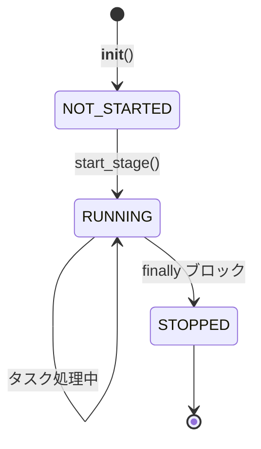

# TaskStage

> 📅 最終更新日: 2026/06/18

`TaskStage` は `TaskGraph` を構築する基本単位です。`TaskExecutor` を継承し、グラフ構造関連の接続機能と `stage_mode` 制御ロジックを追加しています。

> ⚠️ **変更点**：`set_inlet` のパラメータ名が `fail_queue` から `fallback_queue` に変更されました。`prev_bindings` メソッドは `prev_binding`（単数形）にリネームされ、シグネチャがリスト受け取りから単一の `TaskStage` 受け取りに変更されました。

> 注意：`TaskStage` も使い捨てオブジェクトです。通常は `TaskGraph` に管理され、一度の完全実行に参加します。実行終了後、キューバインディング、カウント状態、グラフ内関連付けが安全にリセットされることは保証されません。

## 継承関係

`TaskExecutor` -> `TaskStage`

`TaskStage` は `TaskExecutor` のすべてのコア機能（実行モード、リトライ、メトリクス監視など）を継承し、ノード間の接続ロジックを追加しています。

## コアコンセプト

- **Stage Mode**: タスクグラフ内でのノードのスケジューリングロジックモード。
  - `serial`: シリアルモード。メインプロセス内で実行。
  - `thread`: スレッドモード。メインプロセス内で独立スレッドとして実行。
- **Execution Mode**: ノード内部でタスクを処理する並行モード（`serial`, `thread`, `async`）。`TaskExecutor` から継承。
- **トポロジー関係**: ノード間の上下游接続関係は `TaskGraph` が管理し、`TaskStage` 自身は隣接リストを保持しません。

## 初期化

```python
class TaskStage[T, R](TaskExecutor[T, R]):
    def __init__(
        self,
        name: str,
        func: Callable[[T], R] | Callable[[T], Awaitable[R]],
        stage_mode: str = "serial",
        **kwargs: Any,
    ):
        """
        :param name: ノード名（一意の識別子）
        :param func: 実行関数
        :param stage_mode: グラフ内での実行モード ('serial' または 'thread')
        :param kwargs: TaskExecutor に透過渡しするパラメータ (execution_mode, max_workers, max_retries など)
        """
```

例：
```python
stage_a = TaskStage("StageA", func=process_a, execution_mode="thread", stage_mode="thread")
stage_b = TaskStage("StageB", func=process_b, execution_mode="serial", stage_mode="thread")

# グラフを作成してノードを接続
graph = TaskGraph()
graph.set_stages(stages=[stage_a, stage_b])
graph.connect([stage_a], [stage_b])
```

## 設定メソッド

### set_stage_mode

```python
def set_stage_mode(self, stage_mode: str):
    """
    タスクグラフ内でのノードの実行モードを設定。
    :param stage_mode: 'serial' または 'thread'
    :raises StageModeError: モードがサポートされていない場合
    """
```

### set_inlet

```python
def set_inlet(self, fallback_queue: ThreadQueue[Any], log_queue: ThreadQueue[Any]) -> None:
    """
    コレクターを初期化し、fallback/log キューを永続化層に接続。
    :param fallback_queue: fallback キュー
    :param log_queue: ログキュー
    """
```

### TaskExecutor から継承した設定メソッド

| メソッド | 説明 |
|------|------|
| `set_execution_mode(mode)` | ノード内部のタスク処理モードを設定（`serial`/`thread`/`async`） |
| `set_name(name)` | ノード名を設定 |
| `set_log_level(level)` | ログレベルを設定 |

## 接続バインディング

### prev_binding

```python
def prev_binding(self, pending_prev_binding: TaskStage[Any, Any]) -> None:
    """
    単一の先行ノードをバインドし、そのカウンターを現在の stage の task_counter に登録。
    """
```

### get_binding_counter

```python
def get_binding_counter(self, _downstream_name: str) -> Any:
    """
    下流 stage がバインドすべきカウンターを返す。サブクラスでオーバーライド可能（デフォルトは success_counter を返す）。
    """
```

## 状態管理

`TaskStage` は `StageStatus` 列挙型を使用してライフサイクルを管理します：



### 状態メソッド

```python
# 実行中マーク
def mark_running(self) -> None:
    """マーク：stage が実行中。"""

# 停止マーク
def mark_stopped(self) -> None:
    """マーク：stage が停止済み（正常終了時に finally 内で呼び出し）。"""

# 状態取得
def get_status(self) -> StageStatus:
    """現在の状態を読み取り（StageStatus 列挙型を返す）。"""
```

## 実行メカニズム

### start / start_async（直接呼び出し禁止）

`TaskStage` が `TaskGraph` に管理されている場合、`start()` または `start_async()` を直接呼び出すと `GraphManagedError` が送出されます。`TaskGraph.start_graph()` による統一起動が必要です。

### start_stage

`TaskGraph` が起動されると、このメソッドが呼び出されてノードの実際の実行が開始されます。

```python
def start_stage(self):
    """
    execution_mode の値に応じて、タスクをシリアル、スレッド、または非同期で実行。
    起動/終了ログを記録し、状態遷移を管理。
    """
```

ライフサイクル制約：

- `TaskStage` の実行時状態は、起動フェーズで `TaskGraph` によって確立・駆動されます。
- 現在の実装は、複数回の再利用に対応した完全なリセットセマンティクスを提供していません。
- 同じノードを再度実行する必要がある場合は、新しい `TaskStage` を作成し、新しい `TaskGraph` に再接続することを推奨します。

### drain_task_queue

```python
def drain_task_queue(self) -> None:
    """タスクキューをクリアし、残存する全タスクを失敗キューに移動し UnconsumedError としてマーク。"""
```

## 状態スナップショット

```python
def get_summary(self) -> dict[str, Any]:
    """
    現在のノードの状態サマリーを取得。
    TaskExecutor から継承したフィールド（name, func_name, execution_mode, max_workers）
    に加えて stage_mode を返す。
    """
```

## 使用例

以下は `TaskStage` の完全な使用法を示す例で、複数の実行モード、状態管理、グラフ接続を含みます。

### 基本的な使用法（serial モード）

```python
from celestialflow import TaskGraph, TaskStage

def step1(x: int) -> int:
    return x + 5

def step2(x: int) -> int:
    return x * 3

stage1 = TaskStage("Step1", func=step1, execution_mode="serial", stage_mode="serial")
stage2 = TaskStage("Step2", func=step2, execution_mode="serial", stage_mode="serial")

chain = TaskGraph()
chain.set_stages([stage1, stage2])
chain.connect([stage1], [stage2])
chain.start_graph({stage1.get_name(): [1, 2, 3, 4, 5]})

for name, runtime in chain.stage_runtime_dict.items():
    pairs = runtime.stage.get_success_pairs()
    print(f"{name}: {len(pairs)} 成功")
```

### thread 実行モードの使用（I/O 密集型）

```python
import time
from celestialflow import TaskGraph, TaskStage

def io_task(x: int) -> int:
    time.sleep(0.05)
    return x * 10

stage_a = TaskStage(
    name="IOWorker",
    func=io_task,
    execution_mode="thread",
    max_workers=4,
    stage_mode="thread",
)

graph = TaskGraph()
graph.set_stages([stage_a])
graph.start_graph({stage_a.get_name(): list(range(20))})
```

### 非同期モード（async）

```python
import asyncio
from celestialflow import TaskStage

async def async_process(x: int) -> int:
    await asyncio.sleep(0.01)
    return x ** 2

async_stage = TaskStage(
    name="AsyncProcessor",
    func=async_process,
    execution_mode="async",
    max_workers=4,
)
print(f"非同期ステージサマリー: {async_stage.get_summary()}")
```

### 状態管理

```python
from celestialflow import TaskStage
from celestialflow.runtime.util_types import StageStatus

stage = TaskStage("StatusDemo", func=lambda x: x)

print(f"初期状態: {stage.get_status().name}")  # NOT_STARTED
stage.mark_running()
print(f"実行中: {stage.get_status().name}")   # RUNNING
stage.mark_stopped()
print(f"停止済み: {stage.get_status().name}")   # STOPPED
```

## 注意事項

1. **名前の一意性**: 同一の `TaskGraph` 内では、各 `TaskStage` の `name` は一意でなければならない。
2. **非同期サポート**: `execution_mode` が `async` に設定されている場合、`func` はコルーチン関数である必要がある。
3. **Graph 管理**: `TaskGraph` に管理されている Stage では `start()` / `start_async()` を直接呼び出せない。
4. **使い捨て**: 実行完了後、同一の `TaskStage` インスタンスを再利用すべきではない。
