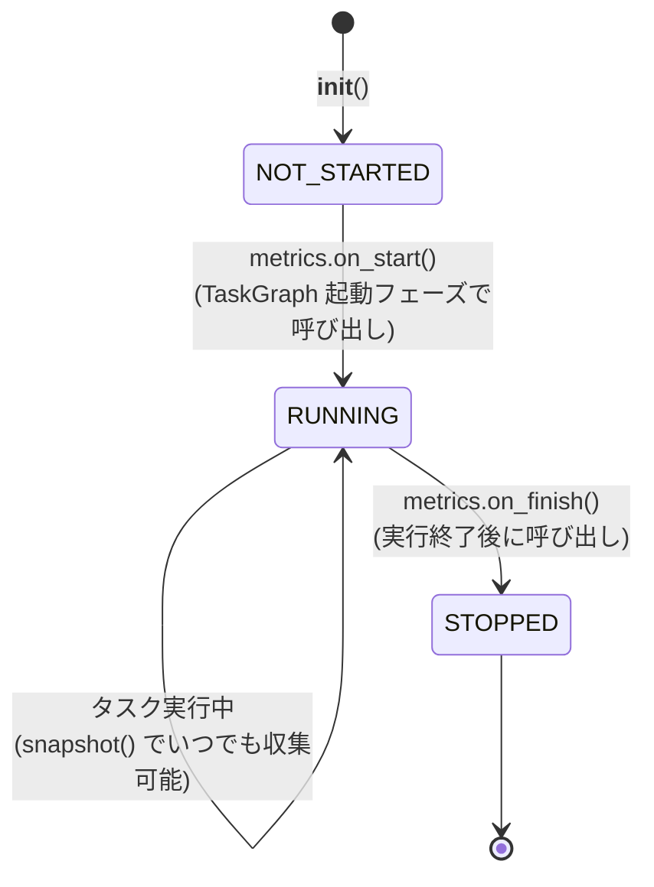

# TaskStage

> 📅 最終更新日: 2026/08/26

`TaskStage` は `TaskGraph` を構築する基本単位です。`TaskExecutor` を継承し、グラフ構造関連の接続機能を追加しています。

> 注意：`TaskStage` も使い捨てオブジェクトです。通常は `TaskGraph` に管理され、一度の完全実行に参加します。実行終了後、キューバインディング、カウント状態、グラフ内関連付けが安全にリセットされることは保証されません。

## 継承関係

`TaskExecutor` -> `TaskStage`

`TaskStage` は `TaskExecutor` のすべてのコア機能（実行モード、リトライ、メトリクス監視など）を継承し、ノード間の接続ロジックを追加しています。

## コアコンセプト

- **Execution Mode**: ノード内部でタスクを処理する並行モード（`serial`, `thread`, `async`）。`TaskExecutor` から継承。
- **トポロジー関係**: ノード間の上下游接続関係は `TaskGraph` が管理し、`TaskStage` 自身は隣接リストを保持しません。

## 初期化

```python
class TaskStage[T, R](TaskExecutor[T, R]):
    def __init__(
        self,
        name: str,
        func: Callable[[T], R] | Callable[[T], Awaitable[R]],
        **kwargs: Any,
    ) -> None:
        """
        :param name: ノード名（一意識別子）
        :param func: 実行関数
        :param kwargs: TaskExecutor にそのまま渡されるパラメータ
            （execution_mode, max_workers, max_retries, max_queue_size,
            max_info, enable_duplicate_check など）
        """
```

例：
```python
stage_a = TaskStage("StageA", func=process_a, execution_mode="thread", max_workers=4)
stage_b = TaskStage("StageB", func=process_b, execution_mode="serial")

# グラフを作成してノードを接続
graph = TaskGraph("DemoGraph")
graph.set_stages(stages=[stage_a, stage_b])
graph.connect([stage_a], [stage_b])
```

## 設定メソッド

### TaskExecutor から継承した設定メソッド

| メソッド | 説明 |
|------|------|
| `set_execution_mode(mode)` | ノード内部のタスク処理モード（`serial`/`thread`/`async`）を設定 |
| `set_name(name)` | ノード名を設定 |

## 接続バインディング

### prev_binding

```python
def prev_binding(self, pending_prev_binding: TaskStage[Any, Any]) -> None:
    """
    単一の前置ノードをバインドし、そのカウンターを現在の stage の task_counter に登録します。
    """
```

### get_binding_counter

```python
def get_binding_counter(self, _downstream_name: str) -> Any:
    """
    下流 stage がバインドすべきカウンターを返します。サブクラスで上書き可能（デフォルトは success_counter）。
    """
```

## 状態スナップショット

`TaskStage` は `snapshot()` メソッドによりランタイムスナップショットを収集し、状態、カウント、経過時間推定などの情報を含みます。

### snapshot

```python
def snapshot(self, interval: float) -> dict[str, Any]:
    """
    現在の stage のランタイムスナップショットを収集します。
    :param interval: スナップショット収集間隔（秒）
    :return: 状態、カウント、経過時間推定などを含むスナップショット辞書
    """
```

## 実行メカニズム

### run / run_async

`TaskStage` が `TaskGraph` に管理されている場合、`TaskGraph.run()` / `start()` が各ノードの実際の実行を統一的に駆動します。

ライフサイクル制約：

- `TaskStage` の実行時状態は、起動フェーズで `TaskGraph` によって確立・駆動されます。
- 現在の実装は、複数回の再利用に対応した完全なリセットセマンティクスを提供していません。
- 同じノードを再度実行する必要がある場合は、新しい `TaskStage` を作成し、新しい `TaskGraph` に再接続することを推奨します。

### drain_task_queue

```python
def drain_task_queue(self) -> None:
    """タスクキューをクリアし、残った全タスクを失敗キューに移して UnconsumedError としてマークします。"""
```

## 状態遷移

`TaskStage` の実行状態は内部の `TaskMetrics.get_status()` によって提供され、`StageStatus` 列挙型を返します：


```mermaid
stateDiagram-v2
    [*] --> NOT_STARTED: __init__()
    NOT_STARTED --> RUNNING: metrics.on_start()<br/>(TaskGraph 起動フェーズで呼び出し)
    RUNNING --> RUNNING: タスク実行中<br/>(snapshot() でいつでも収集可能)
    RUNNING --> STOPPED: metrics.on_finish()<br/>(実行終了後に呼び出し)
    STOPPED --> [*]
```

- 状態は `TaskExecutor._prepare_start()` 内の `metrics.on_start()` により `RUNNING` に設定され、`_finish_start()` 内の `metrics.on_finish()` により `STOPPED` に設定されます。
- `snapshot()` が返すスナップショット辞書の `status` フィールドが現在の状態値です。

## 接続とキューの連携

`TaskStage` 自身は隣接リストを保持せず、グラフ接続は `TaskGraph.connect()` が一元的に確立し、3 つの連携動作を引き起こします：

1. `to_stage.prev_binding(from_stage)`：前段の `get_binding_counter()` カウンター（デフォルト `metrics.success_counter`）を現在の stage の `task_counter` に追加し、下流の pending 統計が上流通過中のタスクを認識できるようにします。
2. `from_stage.result_queue.add_queue(to_stage.task_queue, to_name)`：下流入力キューを上流結果の配信ターゲットとして登録します。
3. `to_stage.task_queue.add_source_name(from_name)`：上流ソース名を登録します。

タスク実行終了後、`TaskGraph._finish_start()` は各 stage に対して `drain_task_queue()` を呼び出し、入力キュー内の未消費タスクをすべて失敗としてマークします。

## 状態サマリ

```python
def get_summary(self) -> dict[str, Any]:
    """
    現在のノードの状態サマリを取得します。
    TaskExecutor から継承したフィールドを返します
    （name, func_name, execution_mode, max_workers）。
    """
```

## 使用例

以下の例は `TaskStage` の完全な使用法を示す例で、複数の実行モード、状態管理、グラフ接続を含みます。

### 基本的な使用法（serial モード）

```python
from celestialflow import TaskGraph, TaskStage


def step1(x: int) -> int:
    return x + 5


def step2(x: int) -> int:
    return x * 3


stage1 = TaskStage("Step1", func=step1, execution_mode="serial")
stage2 = TaskStage("Step2", func=step2, execution_mode="serial")

chain = TaskGraph("ChainDemo")
chain.set_stages([stage1, stage2])
chain.connect([stage1], [stage2])
chain.run({stage1.get_name(): [1, 2, 3, 4, 5]})

for name, stage in chain.stage_dict.items():
    pairs = stage.get_success_pairs()
    print(f"{name}: {len(pairs)} 成功")
```

### thread 実行モードの使用（I/O 密集型）

```python
import time
from celestialflow import TaskGraph, TaskStage


def io_task(x: int) -> int:
    time.sleep(0.05)
    return x * 10


stage_a = TaskStage(
    name="IOWorker",
    func=io_task,
    execution_mode="thread",
    max_workers=4,
)

graph = TaskGraph("IOGraph")
graph.set_stages([stage_a])
graph.run({stage_a.get_name(): list(range(20))})
```

### 非同期モード（async）

```python
import asyncio
from celestialflow import TaskStage


async def async_process(x: int) -> int:
    await asyncio.sleep(0.01)
    return x**2


async_stage = TaskStage(
    name="AsyncProcessor",
    func=async_process,
    execution_mode="async",
    max_workers=4,
)
print(f"非同期ステージサマリ: {async_stage.get_summary()}")
```

### スナップショット収集

```python
from celestialflow import TaskStage

stage = TaskStage("SnapshotDemo", func=lambda x: x)

# ランタイムスナップショットを収集
snapshot = stage.snapshot(interval=1.0)
print(f"ノード: {snapshot['name']}")
print(f"状態: {snapshot['status']}")
print(f"処理済み: {snapshot['tasks_processed']}")
print(f"保留中: {snapshot['tasks_pending']}")
```

## 注意事項

1. **名前の一意性**: 同一の `TaskGraph` 内では、各 `TaskStage` の `name` は一意でなければならない。
2. **非同期サポート**: `execution_mode` が `async` に設定されている場合、`func` はコルーチン関数である必要がある。
3. **Graph 管理**: `TaskGraph` に管理されている Stage では `run()` / `run_async()` を直接呼び出せない。
4. **使い捨て**: 実行完了後、同一の `TaskStage` インスタンスを再利用すべきではない。
