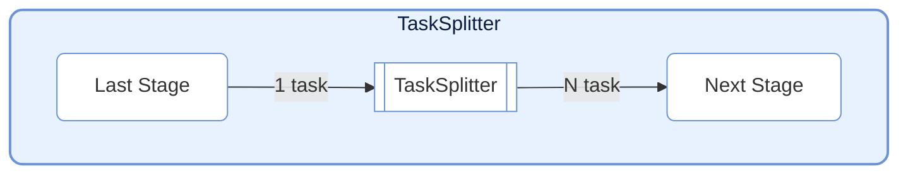
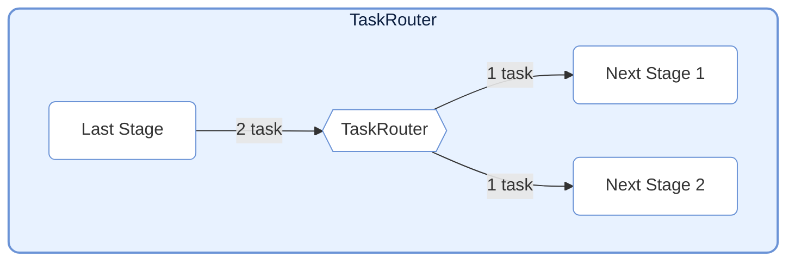

# TaskNodes

> 📅 最終更新日: 2026/06/22

TaskNodes モジュールは、フロー制御や外部システム連携などのシナリオ向けに、さまざまな特殊機能を持つ `TaskStage` 実装を提供します。

## TaskSplitter（スプリッター）



単一の入力タスクを複数の出力タスクに分割します。一対多のシナリオに適しています。

### 初期化

```python
class TaskSplitter[TItem, RItem](TaskStage[Iterable[TItem], Iterable[RItem]]):
    def __init__(
        self,
        name: str,
        split_item: Callable[[TItem], RItem] | None = None,
        *,
        stage_mode: str = "serial",
    ):
        """
        初始化 TaskSplitter。

        :param name: 节点名称
        :param split_item: 自定义单个子任务处理函数，默认使用恒等映射
        :param stage_mode: 节点运行模式
        """
```

### 使用方法

```python
class MySplitter(TaskSplitter):
    def _split(self, task):
        # 将输入数据分裂为多个部分
        return tuple(task)
```

### 特性

- **メカニズム**: 1 つのタスクを入力とし、`_split` が返すタプルの各要素が独立した `TaskEnvelope` にラップされて下流に送信されます。
- **カウント**: 内部で `split_counter` を保持し、分割された総タスク数を統計します。
- **固定設定**: `execution_mode="serial"`, `max_retries=0`（`__init__` 内でハードコード）。
- **split_item**: オプションのカスタムサブタスク処理関数。各分割項目に対して前処理を行います。

---

## TaskRouter（ルーター）



条件に応じてタスクを異なる下流パスに振り分けます。

### 初期化

```python
class TaskRouter(TaskStage):
    def __init__(
        self,
        name: str,
        router: Callable[[T], str],
        *,
        stage_mode: str = "serial",
    ):
        """
        初始化 TaskRouter。

        :param name: 节点名称
        :param router: 路由函数，根据任务数据返回目标 stage 名称
        :param stage_mode: 节点运行模式
        """
```

### 使用方法

`TaskRouter` は上流が事前に `(target_tag, data)` タプルを構築する必要がなくなり、自身が保持する `router(task) -> str` 関数が下流の決定を担当します：

```python
# 定义路由函数：根据任务内容返回下游节点名称
def route_logic(data: int) -> str:
    if data > 0:
        return "positive_stage"
    else:
        return "negative_stage"

# 上游只产出原始任务
source = TaskStage("Source", func=lambda x: x)

# Router 内部完成路由决策
router = TaskRouter("路由器", route_logic)

# 连接下游（返回值必须与下游 stage 名称匹配）
graph.connect([router], [pos_stage, neg_stage])
```

### 特性

- **メカニズム**: 元のタスク `task` を受信し、まず `router(task)` を呼び出してターゲット名を計算し、次に元の `task` を対応する下流 Stage に送信します。
- **カウント**: 各ターゲットに対して独立したカウンター `route_counters` を保持。
- **エラー処理**: `router(task)` が返すターゲット名がバインド済みの下流リストに存在しない場合、`InvalidOptionError` が送出されます。
- **固定設定**: `execution_mode="serial"`, `max_retries=0`（`__init__` 内でハードコード）。

---

## 使用例

### TaskSplitter：1 件のレコードを複数に分割

```python
from celestialflow import TaskGraph, TaskStage, TaskSplitter

# 自定义分裂器：按行分裂文本
class LineSplitter(TaskSplitter):
    def _split(self, task):
        return tuple(task.split("\\n"))

# 定义后续处理阶段
source = TaskStage("Input", func=lambda x: x, stage_mode="serial")
splitter = LineSplitter("SplitLines")
processor = TaskStage("Process", func=lambda x: f">>> {x}", stage_mode="serial")

graph = TaskGraph()
graph.set_stages([source, splitter, processor])
graph.connect([source], [splitter])
graph.connect([splitter], [processor])

# 输入一条包含三行的文本，分裂为三个独立任务
text_data = "line1\\nline2\\nline3"
graph.start_graph({source.get_name(): [text_data]})
```

### TaskRouter：条件に応じたタスク振り分け

```python
from celestialflow import TaskGraph, TaskStage, TaskRouter

# 定义路由判断逻辑（只返回目标名称）
def classify_number(x: int) -> str:
    if x > 0:
        return "positive"
    elif x < 0:
        return "negative"
    else:
        return "zero"

# 构建图节点
source = TaskStage("Source", func=lambda x: x, stage_mode="serial")
router = TaskRouter("Router", classify_number)
handler_pos = TaskStage("positive", func=lambda x: f"Positive: {x}", stage_mode="serial")
handler_neg = TaskStage("negative", func=lambda x: f"Negative: {x}", stage_mode="serial")
handler_zero = TaskStage("zero", func=lambda x: f"Zero: {x}", stage_mode="serial")

graph = TaskGraph()
graph.set_stages([source, router, handler_pos, handler_neg, handler_zero])
graph.connect([source], [router])
graph.connect([router], [handler_pos, handler_neg, handler_zero])

graph.start_graph({source.get_name(): [10, -5, 0, 3, -1]})
```

> **注意**: `router(task)` の戻り値は下流 `TaskStage` の `name` と完全一致する必要があります。

---

## 注意事項

1. **構造型ノードの位置づけ**: `TaskSplitter` と `TaskRouter` はグラフ構造と下流分配セマンティクスを変更するものであり、フレームワーク内蔵ノードとして保持するのに適しています。
2. **カスタムプロトコル実装**: Redis、メッセージキュー、RPC などの外部システムとの連携は、呼び出し側が通常の `TaskStage` で独自に実装する方が適しています。
