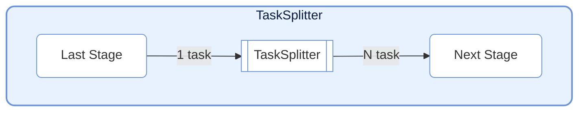
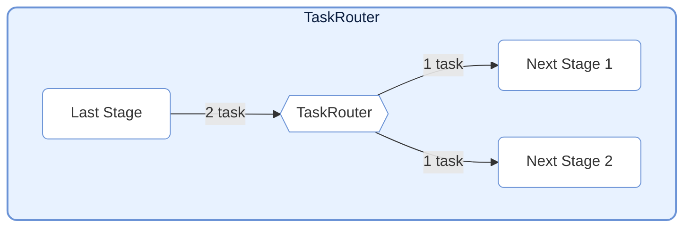
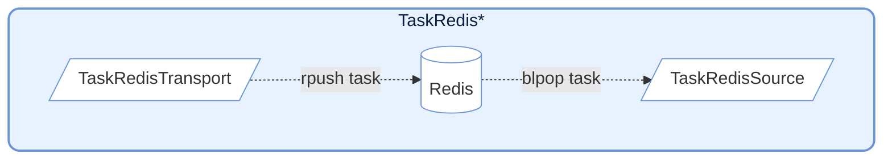
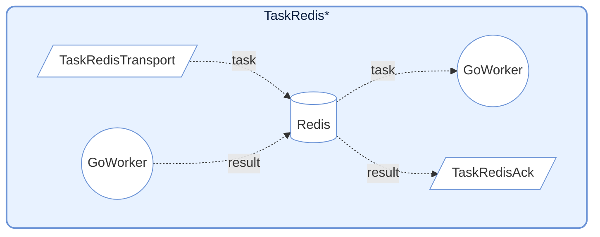

# TaskNodes

> 📅 最終更新日: 2026/06/11

TaskNodes モジュールは、フロー制御や外部システム連携などのシナリオ向けに、さまざまな特殊機能を持つ `TaskStage` 実装を提供します。

## TaskSplitter（スプリッター）



単一の入力タスクを複数の出力タスクに分割します。一対多のシナリオに適しています。

### 初期化

```python
class TaskSplitter[TItem, RItem](TaskStage[Iterable[TItem], Iterable[RItem]]):
    def __init__(
        self,
        name: str,
        split_item: Callable[[TItem], RItem] | None = None,
        stage_mode: str = "serial",
        enable_duplicate_check: bool = True,
        log_level: str = "INFO",
    ):
        """
        TaskSplitter を初期化。

        :param name: ノード名
        :param split_item: カスタムの単一サブタスク処理関数。デフォルトは恒等写像
        :param stage_mode: ノード実行モード
        :param enable_duplicate_check: 重複チェックを有効にするか
        :param log_level: ログレベル
        """
```

> **変更点**：`execution_mode` は `"serial"` に、`max_retries` は `0` に固定されており、外部パラメータで変更する必要はなく、また変更すべきではありません。以前のドキュメントに記載されていた `unpack_task_args=True` パラメータは現在のソースコードには存在しません。

### 使用方法

```python
class MySplitter(TaskSplitter):
    def _split(self, *task):
        # 入力データを複数の部分に分割
        return task[0], task[1]  # タプルを返し、各要素が独立したタスクになる
```

### 特性

- **メカニズム**: 1 つのタスクを入力とし、`_split` が返すタプルの各要素が独立した `TaskEnvelope` にラップされて下流に送信されます。
- **カウント**: 内部で `split_counter` を保持し、分割された総タスク数を統計します。
- **固定設定**: `execution_mode="serial"`, `max_retries=0`（`__init__` 内でハードコード）。
- **split_item**: オプションのカスタムサブタスク処理関数。各分割項目に対して前処理を行います。

---

## TaskRouter（ルーター）



条件に応じてタスクを異なる下流パスに振り分けます。

### 初期化

```python
class TaskRouter(TaskStage):
    def __init__(self, name: str, stage_mode: str = "serial"):
        """
        TaskRouter を初期化。

        :param name: ノード名
        :param stage_mode: ノード実行モード
        """
```

### 使用方法

ルーティングタスクは `(target_tag, data)` 形式のタプルを返す必要があります：

```python
# 上流タスクがルーティングタプルを生成するよう定義
def route_logic(data):
    if data > 0:
        return ("positive_stage", data)
    else:
        return ("negative_stage", data)

# ルーターノードを作成
router = TaskRouter("ルーター")

# 下流を接続（target はルーティングロジック内の tag と一致する必要あり）
graph.connect([router], [pos_stage, neg_stage])
```

### 特性

- **メカニズム**: `(target_tag, data)` 形式のタプルを受信。`target_tag` に基づいて `data` を対応する下流 Stage に送信。
- **カウント**: 各ターゲットに対して独立したカウンター `route_counters` を保持。
- **エラー処理**: `target_tag` が下流リストに存在しない場合、エラーを記録。

---

## Redis 統合



Redis と連携するノードを提供し、言語間・プロセス間連携（Go Worker との連携など）によく使用されます。

### TaskRedisTransport

タスクを Redis List にプッシュします。

```python
class TaskRedisTransport(TaskStage):
    def __init__(
        self,
        name: str,        # ノード名
        key: str = "",                  # Redis List 名
        host: str = "localhost",        # Redis ホストアドレス
        port: int = 6379,               # Redis ポート
        db: int = 0,                    # Redis データベース番号
        password: str | None = None,    # Redis パスワード
        unpack_task_args: bool = False, # タスクパラメータをアンパックするか
        stage_mode: str = "serial",     # ノード実行モード
    ):
        ...
```

**動作**: タスクを JSON にシリアライズし、Redis List に `rpush` します。内部で `execution_mode="thread"` と `max_workers=4` を使用して並行書き込みします。

### TaskRedisSource

Redis List からタスクを取得し入力ソースとします。

```python
class TaskRedisSource(TaskStage):
    def __init__(
        self,
        name: str,     # ノード名
        key: str = "",               # Redis List 名
        host: str = "localhost",     # Redis ホストアドレス
        port: int = 6379,            # Redis ポート
        db: int = 0,                 # Redis データベース番号
        password: str | None = None, # Redis パスワード
        timeout: int = 10,           # ブロッキングタイムアウト時間（秒）。0 は無限待機
        stage_mode: str = "serial",  # ノード実行モード
    ):
        ...
```

**動作**: `blpop` を使用してブロッキング方式でタスクを取得。内部で `execution_mode="serial"` を使用し、パイプラインのエントリーノードに適しています。

### TaskRedisAck



リモート Worker の実行結果を待機します。

```python
class TaskRedisAck(TaskStage):
    def __init__(
        self,
        name: str,     # ノード名
        key: str = "",               # Redis Hash 名（結果を格納）
        host: str = "localhost",     # Redis ホストアドレス
        port: int = 6379,            # Redis ポート
        db: int = 0,                 # Redis データベース番号
        password: str | None = None, # Redis パスワード
        timeout: int = 10,           # 待機タイムアウト時間（秒）。0 は無限待機
        stage_mode: str = "serial",  # ノード実行モード
    ):
        ...
```

**動作**: Redis Hash をポーリングして対応する `task_id` の結果を待機。成功結果の処理または `RemoteWorkerError` の送出をサポート。

---

## 事前設定

### 1. Redis サービスの起動

`TaskRedis*` 系ノードを実行する際は、事前に Redis サービスを起動する必要があります。

### 2. 環境変数の設定（オプション）

プロジェクトルートに `.env` ファイルを作成します：

```env
# .env
REDIS_HOST=127.0.0.1
REDIS_PORT=6379
REDIS_PASSWORD=your_redis_password
```

### 3. ノードの設定

```python
import os
from dotenv import load_dotenv
from celestialflow import TaskRedisTransport, TaskRedisAck, TaskRedisSource

load_dotenv()

redis_host = os.getenv("REDIS_HOST", "127.0.0.1")
redis_password = os.getenv("REDIS_PASSWORD", "")

# Transport + Ack の組み合わせ（Redis にプッシュして結果を待機）
redis_sink = TaskRedisTransport(
    "RedisTransport",
    key="testFibonacci:input",
    host=redis_host,
    password=redis_password
)
redis_ack = TaskRedisAck(
    "RedisAck",
    key="testFibonacci:output",
    host=redis_host,
    password=redis_password
)
```

---

## Redis データ形式

### TaskRedisTransport プッシュ形式

```json
{
    "id": 12345678,
    "task": ["arg1", "arg2"],
    "emit_ts": 1703001234.567
}
```

### TaskRedisAck 期待結果形式

```json
{
    "status": "success",
    "result": "computed_value"
}
```

またはエラー形式：
```json
{
    "status": "error",
    "error": "Error message"
}
```

---

## 注意事項

1. **接続管理**: Redis クライアントは初回使用時に遅延初期化されます。
2. **タイムアウト処理**: `TaskRedisSource` と `TaskRedisAck` はタイムアウト設定をサポートし、タイムアウト時に `TimeoutError` が送出されます。
3. **エラー伝播**: リモート Worker が返すエラーは `RemoteWorkerError` を通じて伝播されます。
4. **冪等性**: `TaskRedisAck` は結果取得後に Redis 内のレコードを削除し、一回限りの消費を保証します。

## 使用例

### TaskSplitter：1 件のレコードを複数に分割

```python
from celestialflow import TaskGraph, TaskStage, TaskSplitter

# カスタムスプリッター：テキストを行単位で分割
class LineSplitter(TaskSplitter):
    def _split(self, *task):
        return tuple(task[0].split("\\n"))

# 後続処理ステージを定義
source = TaskStage("Input", func=lambda x: x, stage_mode="serial")
splitter = LineSplitter("SplitLines")
processor = TaskStage("Process", func=lambda x: f">>> {x}", stage_mode="serial")

graph = TaskGraph()
graph.set_stages([source, splitter, processor])
graph.connect([source], [splitter])
graph.connect([splitter], [processor])

# 3 行を含むテキストを入力し、3 つの独立タスクに分割
text_data = "line1\\nline2\\nline3"
graph.start_graph({source.get_name(): [text_data]})
```

### TaskRouter：条件に応じたタスク振り分け

```python
from celestialflow import TaskGraph, TaskStage, TaskRouter

# ルーティング判定ロジックを定義（(target_tag, data) 形式のタプルを生成）
def classify_number(x: int) -> tuple:
    if x > 0:
        return ("positive", x)
    elif x < 0:
        return ("negative", x)
    else:
        return ("zero", x)

# グラフノードを構築
source = TaskStage("Source", func=classify_number, stage_mode="serial")
router = TaskRouter("Router")
handler_pos = TaskStage("positive", func=lambda x: f"Positive: {x}", stage_mode="serial")
handler_neg = TaskStage("negative", func=lambda x: f"Negative: {x}", stage_mode="serial")
handler_zero = TaskStage("zero", func=lambda x: f"Zero: {x}", stage_mode="serial")

graph = TaskGraph()
graph.set_stages([source, router, handler_pos, handler_neg, handler_zero])
graph.connect([source], [router])
graph.connect([router], [handler_pos, handler_neg, handler_zero])

graph.start_graph({source.get_name(): [10, -5, 0, 3, -1]})
```

> **注意**: Route target tag は下流 `TaskStage` の `name` と完全一致する必要があります。

---

## 注意事項

1. **接続管理**: Redis クライアントは初回使用時に遅延初期化（`init_redis()` メソッド）されます。
2. **タイムアウト処理**: `TaskRedisSource` と `TaskRedisAck` はタイムアウト設定をサポートします。
3. **エラー伝播**: リモート Worker が返すエラーは `RemoteWorkerError` を通じて伝播されます。
4. **冪等性**: `TaskRedisAck` は結果取得後に Redis 内のレコードを削除し、一回限りの消費を保証します。
