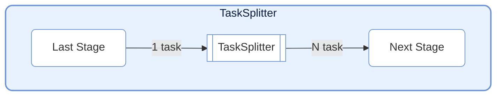
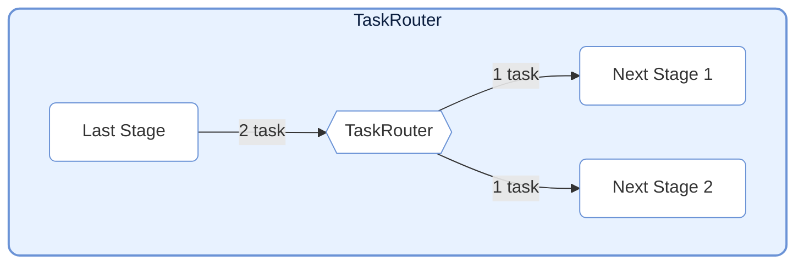
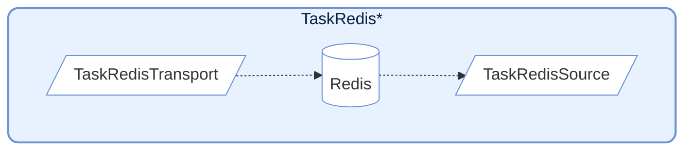
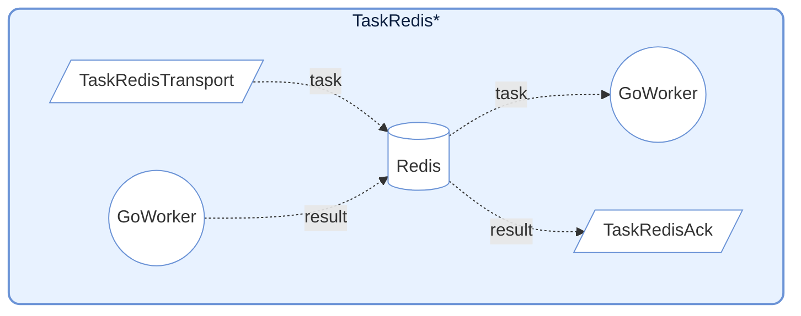

# TaskNodes

TaskNodes モジュールは、フロー制御、外部システム連携などのシナリオ向けに、複数の特殊機能を持つ `TaskStage` 実装を提供します。

## TaskSplitter (スプリッター)



単一の入力タスクを複数の出力タスクに分割します。1対多のシナリオに適しています。

### 初期化

```python
class TaskSplitter(TaskStage):
    def __init__(self):
        """
        TaskSplitter を初期化します。
        デフォルト: execution_mode="serial", max_retries=0, unpack_task_args=True
        """
```

### 使用方法

```python
class MySplitter(TaskSplitter):
    def _split(self, *task):
        # 入力データを複数の部分に分割
        return task[0], task[1]  # タプルを返し、各要素が独立したタスクになります
```

### 特徴

- **メカニズム**: 1つのタスクを入力として受け取り、タプル/リストを返します。各要素は独立した `TaskEnvelope` にラップされて下流に送信されます。
- **カウント**: 内部で `split_counter` を保持し、分割されたタスクの合計数を追跡します。
- **デフォルト設定**: `execution_mode="serial"`, `max_retries=0`, `unpack_task_args=True`

---

## TaskRouter (ルーター)



条件に基づいてタスクを異なる下流パスにルーティングします。

### 初期化

```python
class TaskRouter(TaskStage):
    def __init__(self):
        """
        TaskRouter を初期化します。
        デフォルト: execution_mode="serial", max_retries=0
        """
```

### 使用方法

ルーティングタスクは `(target_tag, data)` 形式のタプルを返す必要があります：

```python
# 上流タスクでルーティングタプルを生成
def route_logic(data):
    if data > 0:
        return ("positive_stage", data)
    else:
        return ("negative_stage", data)

# ルーターノードを作成
router = TaskRouter()

# 下流を接続（target はルーティングロジック内のタグと一致する必要があります）
graph.connect([router], [pos_stage, neg_stage])
```

### 特徴

- **メカニズム**: `(target_tag, data)` 形式のタプルを受信します。`target_tag` に基づいて対応する下流 Stage に `data` を送信します。
- **カウント**: 各ターゲットに対して独立したカウンター `route_counters` を保持します。
- **エラーハンドリング**: `target_tag` が下流リストに存在しない場合、`InvalidOptionError` を発生させます。

---

## Redis 統合



Redis と連携するノードを提供し、クロス言語/クロスプロセス協調（Go Worker との連携など）に一般的に使用されます。

### TaskRedisTransport

タスクを Redis List にプッシュします。

```python
class TaskRedisTransport(TaskStage):
    def __init__(
        self,
        key: str,                       # Redis List 名
        host: str = "localhost",        # Redis ホストアドレス
        port: int = 6379,               # Redis ポート
        db: int = 0,                    # Redis データベース番号
        password: str | None = None,    # Redis パスワード
        unpack_task_args: bool = False, # タスク引数を展開するかどうか
    ):
        ...
```

**動作**: タスクを JSON にシリアライズし、Redis List に `rpush` します。内部では `execution_mode="thread"` と `max_workers=4` を使用して並行書き込みを行います。

### TaskRedisSource

入力ソースとして Redis List からタスクを取得します。

```python
class TaskRedisSource(TaskStage):
    def __init__(
        self,
        key: str,                    # Redis List 名
        host: str = "localhost",     # Redis ホストアドレス
        port: int = 6379,            # Redis ポート
        db: int = 0,                 # Redis データベース番号
        password: str | None = None, # Redis パスワード
        timeout: int = 10,           # ブロッキングタイムアウト（秒）、0 は無期限待機
    ):
        ...
```

**動作**: `blpop` を使用してブロッキング方式でタスクを取得します。内部では `execution_mode="serial"` を使用し、パイプラインのエントリーノードとして適しています。

### TaskRedisAck



リモート Worker からの実行結果を待ちます。

```python
class TaskRedisAck(TaskStage):
    def __init__(
        self,
        key: str,                    # Redis Hash 名（結果を保存）
        host: str = "localhost",     # Redis ホストアドレス
        port: int = 6379,            # Redis ポート
        db: int = 0,                 # Redis データベース番号
        password: str | None = None, # Redis パスワード
        timeout: int = 10,           # 待機タイムアウト（秒）、0 は無期限待機
    ):
        ...
```

**動作**: Redis Hash をポーリングして対応する `task_id` の結果を待ちます。成功結果の処理または `RemoteWorkerError` の発生をサポートします。

---

## 前提条件

### 1. Redis サービスの起動

`TaskRedis*` 系ノードを実行する前に、Redis サービスを起動する必要があります。

### 2. 環境変数の設定（オプション）

プロジェクトのルートディレクトリに `.env` ファイルを作成します：

```env
# .env
# Redis サービスアドレス
REDIS_HOST=127.0.0.1
# Redis サービスポート
REDIS_PORT=6379
# Redis サービスパスワード、ない場合は空欄
REDIS_PASSWORD=your_redis_password
```

### 3. ノードの設定

```python
import os
from dotenv import load_dotenv
from celestialflow import TaskRedisTransport, TaskRedisAck, TaskRedisSource

# 環境変数をロード
load_dotenv()

redis_host = os.getenv("REDIS_HOST", "127.0.0.1")
redis_password = os.getenv("REDIS_PASSWORD", "")

# Transport + Ack の組み合わせ（Redis にプッシュして結果を待つ）
redis_sink = TaskRedisTransport(
    key="testFibonacci:input",
    host=redis_host,
    password=redis_password
)
redis_ack = TaskRedisAck(
    key="testFibonacci:output",
    host=redis_host,
    password=redis_password
)

# Source の組み合わせ（Redis からタスクを取得）
redis_source = TaskRedisSource(
    key="test_redis",
    host=redis_host,
    password=redis_password
)
```

---

## Redis データフォーマット

### TaskRedisTransport プッシュフォーマット

```json
{
    "id": 12345678,
    "task": ["arg1", "arg2"],
    "emit_ts": 1703001234.567
}
```

### TaskRedisAck 期待される結果フォーマット

```json
{
    "status": "success",
    "result": "computed_value"
}
```

またはエラーフォーマット：
```json
{
    "status": "error",
    "error": "Error message"
}
```

---

## 注意事項

1. **接続管理**: Redis クライアントは初回使用時に遅延初期化されます。
2. **タイムアウト処理**: `TaskRedisSource` と `TaskRedisAck` はタイムアウト設定をサポートしており、タイムアウト時に `TimeoutError` を発生させます。
3. **エラー伝播**: リモート Worker から返されたエラーは `RemoteWorkerError` を通じて伝播されます。
4. **冪等性**: `TaskRedisAck` は結果取得後に Redis のレコードを削除し、一回限りの消費を保証します。
