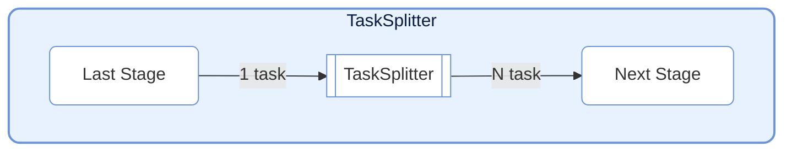
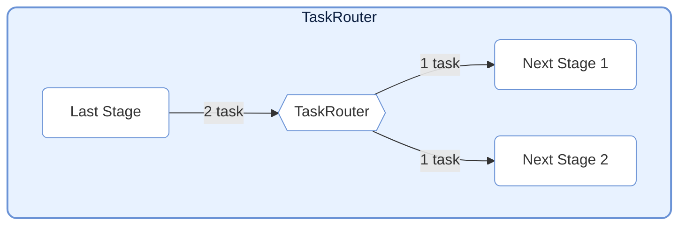

# TaskNodes

> 📅 最終更新日: 2026/06/18

TaskNodes モジュールは、フロー制御や外部システム連携などのシナリオ向けに、さまざまな特殊機能を持つ `TaskStage` 実装を提供します。

## TaskSplitter（スプリッター）



単一の入力タスクを複数の出力タスクに分割します。一対多のシナリオに適しています。

### 初期化

```python
class TaskSplitter[TItem, RItem](TaskStage[Iterable[TItem], Iterable[RItem]]):
    def __init__(
        self,
        name: str,
        split_item: Callable[[TItem], RItem] | None = None,
        stage_mode: str = "serial",
        enable_duplicate_check: bool = True,
        log_level: str = "INFO",
    ):
        """
        TaskSplitter を初期化。

        :param name: ノード名
        :param split_item: カスタムの単一サブタスク処理関数。デフォルトは恒等写像
        :param stage_mode: ノード実行モード
        :param enable_duplicate_check: 重複チェックを有効にするか
        :param log_level: ログレベル
        """
```

> **変更点**：`execution_mode` は `"serial"` に、`max_retries` は `0` に固定されており、外部パラメータで変更する必要はなく、また変更すべきではありません。以前のドキュメントに記載されていた `unpack_task_args=True` パラメータは現在のソースコードには存在しません。

### 使用方法

```python
class MySplitter(TaskSplitter):
    def _split(self, *task):
        # 入力データを複数の部分に分割
        return task[0], task[1]  # タプルを返し、各要素が独立したタスクになる
```

### 特性

- **メカニズム**: 1 つのタスクを入力とし、`_split` が返すタプルの各要素が独立した `TaskEnvelope` にラップされて下流に送信されます。
- **カウント**: 内部で `split_counter` を保持し、分割された総タスク数を統計します。
- **固定設定**: `execution_mode="serial"`, `max_retries=0`（`__init__` 内でハードコード）。
- **split_item**: オプションのカスタムサブタスク処理関数。各分割項目に対して前処理を行います。

---

## TaskRouter（ルーター）



条件に応じてタスクを異なる下流パスに振り分けます。

### 初期化

```python
class TaskRouter(TaskStage):
    def __init__(
        self,
        name: str,
        router: Callable[[T], str],
        *,
        stage_mode: str = "serial",
    ):
        """
        TaskRouter を初期化。

        :param name: ノード名
        :param router: ルーティング関数。タスクデータに基づいてターゲット stage 名を返す
        :param stage_mode: ノード実行モード
        """
```

### 使用方法

`TaskRouter` は上流が事前に `(target_tag, data)` タプルを構築する必要がなくなり、自身が保持する `router(task) -> str` 関数が下流の決定を担当します：

```python
# ルーティング関数を定義：タスク内容に基づいて下流ノード名を返す
def route_logic(data: int) -> str:
    if data > 0:
        return "positive_stage"
    else:
        return "negative_stage"

# 上流は元のタスクのみを生成
source = TaskStage("Source", func=lambda x: x)

# Router が内部でルーティング判断を完了
router = TaskRouter("ルーター", route_logic)

# 下流を接続（戻り値は下流 stage 名と一致する必要あり）
graph.connect([router], [pos_stage, neg_stage])
```

### 特性

- **メカニズム**: 元のタスク `task` を受信し、まず `router(task)` を呼び出してターゲット名を計算し、次に元の `task` を対応する下流 Stage に送信します。
- **カウント**: 各ターゲットに対して独立したカウンター `route_counters` を保持。
- **エラー処理**: `router(task)` が返すターゲット名がバインド済みの下流リストに存在しない場合、`InvalidOptionError` が送出されます。
- **固定設定**: `execution_mode="serial"`, `max_retries=0`（`__init__` 内でハードコード）。

---

## 使用例

### TaskSplitter：1 件のレコードを複数に分割

```python
from celestialflow import TaskGraph, TaskStage, TaskSplitter

# カスタムスプリッター：テキストを行単位で分割
class LineSplitter(TaskSplitter):
    def _split(self, *task):
        return tuple(task[0].split("\\n"))

# 後続処理ステージを定義
source = TaskStage("Input", func=lambda x: x, stage_mode="serial")
splitter = LineSplitter("SplitLines")
processor = TaskStage("Process", func=lambda x: f">>> {x}", stage_mode="serial")

graph = TaskGraph()
graph.set_stages([source, splitter, processor])
graph.connect([source], [splitter])
graph.connect([splitter], [processor])

# 3 行を含むテキストを入力し、3 つの独立タスクに分割
text_data = "line1\\nline2\\nline3"
graph.start_graph({source.get_name(): [text_data]})
```

### TaskRouter：条件に応じたタスク振り分け

```python
from celestialflow import TaskGraph, TaskStage, TaskRouter

# ルーティング判定ロジックを定義（ターゲット名のみを返す）
def classify_number(x: int) -> str:
    if x > 0:
        return "positive"
    elif x < 0:
        return "negative"
    else:
        return "zero"

# グラフノードを構築
source = TaskStage("Source", func=lambda x: x, stage_mode="serial")
router = TaskRouter("Router", classify_number)
handler_pos = TaskStage("positive", func=lambda x: f"Positive: {x}", stage_mode="serial")
handler_neg = TaskStage("negative", func=lambda x: f"Negative: {x}", stage_mode="serial")
handler_zero = TaskStage("zero", func=lambda x: f"Zero: {x}", stage_mode="serial")

graph = TaskGraph()
graph.set_stages([source, router, handler_pos, handler_neg, handler_zero])
graph.connect([source], [router])
graph.connect([router], [handler_pos, handler_neg, handler_zero])

graph.start_graph({source.get_name(): [10, -5, 0, 3, -1]})
```

> **注意**: `router(task)` の戻り値は下流 `TaskStage` の `name` と完全一致する必要があります。

---

## 注意事項

1. **構造型ノードの位置づけ**: `TaskSplitter` と `TaskRouter` はグラフ構造と下流分配セマンティクスを変更するものであり、フレームワーク内蔵ノードとして保持するのに適しています。
2. **カスタムプロトコル実装**: Redis、メッセージキュー、RPC などの外部システムとの連携は、呼び出し側が通常の `TaskStage` で独自に実装する方が適しています。
