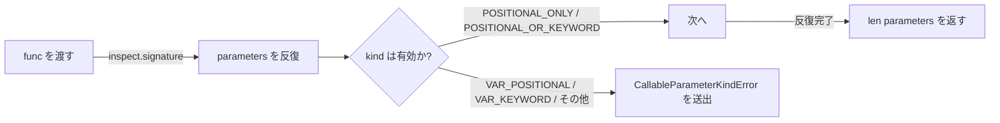

# StageCallable

> 📅 最終更新日: 2026/06/18

`stage/util_callable.py` は、executor 関数のシグネチャ検証ツールを提供します。`TaskExecutor` の初期化時に、渡された関数がパラメータ仕様に準拠しているかをチェックするために使用されます。

## コア関数

### validate_executor_func_signature

```python
def validate_executor_func_signature(func: Callable[..., Any]) -> int:
    """
    executor 関数のパラメータ kind が要件を満たしているかを検証し、パラメータ数を返します。

    :param func: executor 関数
    :return: パラメータ数
    :raises CallableParameterKindError: パラメータに *args、**kwargs などの非純粋な位置パラメータが含まれる場合に送出
    """
```

`inspect.signature` を使用して関数シグネチャの各パラメータを検査し、`POSITIONAL_ONLY` と `POSITIONAL_OR_KEYWORD` の 2 種類のパラメータタイプのみを許可します。`VAR_POSITIONAL`（`*args`）、`VAR_KEYWORD`（`**kwargs`）などのタイプが検出された場合、`CallableParameterKindError` が送出されます。

**検証フロー:**



## 使用例

### TaskExecutor 初期化時の自動呼び出し

`validate_executor_func_signature` は `TaskExecutor.__init__` 内で `_set_func` → `validate_executor_func_signature` の呼び出しチェーンを通じて自動実行されます：

```python
from celestialflow.stage.util_callable import validate_executor_func_signature
from celestialflow.runtime.util_errors import CallableParameterKindError


# 有効な executor 関数（純粋な位置パラメータ）
def good_func(x: int, y: str) -> bool:
    return True

param_count = validate_executor_func_signature(good_func)
print(f"パラメータ数: {param_count}")  # 2


# 無効な executor 関数（*args を含む）
def bad_func(*args):
    return args

try:
    validate_executor_func_signature(bad_func)
except CallableParameterKindError as e:
    print(f"シグネチャ検証失敗: {e}")
```

## 注意事項

- この関数は `TaskExecutor._set_func()` によって内部で呼び出されるため、ユーザーが直接使用する必要は通常ありません。
- 有効なパラメータ kind は `POSITIONAL_ONLY`、`POSITIONAL_OR_KEYWORD` です。
- 無効なパラメータ kind は `VAR_POSITIONAL`（`*args`）、`VAR_KEYWORD`（`**kwargs`）、`KEYWORD_ONLY` などです。
