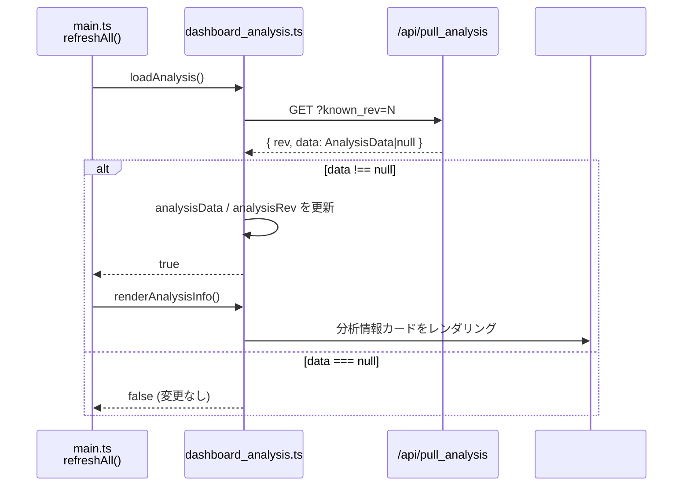

# dashboard_analysis.ts

> 📅 最終更新日: 2026/06/11

グラフ分析情報の読み込みと分析パネルのレンダリングを管理します。TaskGraph トポロジー構造に対する深い洞察（DAG 検出、階層分析、スケジュールモードなど）を提供します。

## 型定義

```typescript
type AnalysisData = {
  name: string;                    // タスクグラフ名
  startTime: number;               // タスクグラフ起動タイムスタンプ
  className: string;               // グラフ構造分類名（Python クラス名）
  isDAG: boolean;                  // 現在のタスクグラフが DAG かどうか
  scheduleMode: string;            // グラフレベルスケジュールモード名（eager / staged）
  layersDict: Record<string, unknown>; // 階層分析結果、キー数で階層数を統計
};
```

## グローバル変数

| 変数 | 型 | 説明 |
|------|------|------|
| `analysisData` | `AnalysisData \| null` | トポロジー分析データ；未ロード時は `null` |
| `analysisRev` | `number` | データバージョン番号、初期値 `-1`、増分取得に使用 |
| `analysisRequestSeq` | `number` | リクエストシーケンス番号、古い分析応答が新しい結果を上書きするのを防止 |

## 関数

### `loadAnalysis()`

非同期で `GET /api/pull_analysis?known_rev=N` から分析データを取得します。

- **競合保護**: 呼び出しごとに増分 `analysisRequestSeq` を割り当て、応答到着時にシーケンス番号が一致しない場合は破棄します。
- **増分メカニズム**: バックエンドは `known_rev` が期限切れの場合のみ完全なデータ（`body.data !== null`）を返し、それ以外は `rev` と空データを返します。
- **戻り値**: `Promise<boolean>` — 分析バージョンが変更され正常に更新された場合に `true` を返します。

---

### `renderAnalysisInfo()`

分析データを `#analysis-info` コンテナにレンダリングします。`analysisData` が `null` の場合は、国際化された空状態プレースホルダーテキストを表示します。

**表示フィールド：**

| 表示ラベル (i18n key) | 対応フィールド | 説明 |
|---------|---------|------|
| `analysis.graphName` | `name` | タスクグラフ名 |
| `analysis.startTime` | `startTime` | グラフ起動タイムスタンプ（`> 0` の場合はフォーマット、それ以外は `-` を表示） |
| `analysis.structType` | `className` | TaskGraph の具体的な Python クラス名、ツールチップ付き |
| `analysis.isDAG` | `isDAG` | `true` の場合は緑の `.ok` クラス、`false` の場合は赤の `.warn` クラスを表示 |
| `analysis.scheduleMode` | `scheduleMode` | グラフレベルスケジュールモード、ツールチップ付き |
| `analysis.layerCount` | `layersDict` | `Object.keys(layersDict).length` で階層総数を導出 |

## データフロー



## 使用例

```typescript
// バックエンドから取得した分析データをシミュレート
const mockAnalysis: AnalysisData = {
  name: "MyTaskGraph",
  startTime: 1718000000,
  className: "TaskGraph",
  isDAG: true,
  scheduleMode: "eager",
  layersDict: { "0": ["StageA"], "1": ["StageB", "StageC"] },
};

// loadAnalysis() で取得しグローバル変数を更新
// const changed = await loadAnalysis();
// if (changed) renderAnalysisInfo();

// renderAnalysisInfo() で #analysis-info にレンダリング
// analysisData === null の場合 → 空状態プレースホルダーを表示
// それ以外の場合：グラフ名、起動時間、構造タイプ、DAG判定、スケジュールモード、階層数をレンダリング
```
