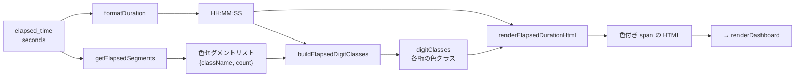

# dashboard_statuses.ts

> 📅 最終更新日: 2026/06/11

各ノードの実行状態データの読み込み、同期、およびダッシュボード状態カードの動的レンダリングを管理します。実行時間のカラーセグメントレンダリング機能を提供します。

> ⚠️ **変更済み**: 旧版ドキュメントで言及されていた `draggingNodeName` 変数と `initSortableDashboard()` 関数は削除されました（ドラッグソート機能は `layout_editor.ts` レイアウトエディタに移行されました）。待機値モード切り替えと残り時間表示設定に関する関数が新たに追加されました。

## 型定義

```typescript
type NodeStatus = {
  status: number;              // 状態コード：0-未実行, 1-実行中, 2-停止済み
  tasks_processed: number;     // 処理済みタスク総数
  tasks_pending: number;       // キュー内待機タスク数
  tasks_succeeded: number;     // 成功処理タスク数
  tasks_failed: number;        // 処理失敗タスク数
  tasks_duplicated: number;    // 重複排除フィルタされたタスク数
  stage_mode: string;          // ノードモード（serial/thread）
  execution_mode: string;      // 実行モード（serial/thread/async）
  max_workers: number;         // 最大並列数
  start_time: number;          // 起動 Unix タイムスタンプ
  elapsed_time: number;        // 実行済み秒数
  remaining_time: number;      // 推定残り秒数（現在のチェーン）
  total_tasks_pending: number; // 総待機タスク数（下流チェーン含む）
  total_remaining_time: number;// 推定総残り秒数（各チェーンの状態を考慮）
  task_avg_time: string;       // タスクあたり平均所要時間テキスト
};

type ElapsedSegment = {
  className: string; // 対応する色 CSS クラス名
  count: number;     // そのタイプのタスク数
};
```

## グローバル変数

| 変数 | 型 | 説明 |
|------|------|------|
| `nodeStatuses` | `Record<string, NodeStatus>` | 全ノードの現在の状態スナップショット |
| `lastNodeStatuses` | `Record<string, NodeStatus>` | 前回の状態スナップショット、増分表示の計算に使用 |
| `statusRev` | `number` | 前回取得のバージョン番号、初期値 `-1`、増分取得に使用 |
| `statusesRequestSeq` | `number` | リクエストシーケンス番号、古い状態応答が新しい結果を上書きするのを防止 |

## 設定駆動関数

以下の関数は `webConfig.dashboard.useTotalPendingInStatus` スイッチに基づいて、ノード状態カード内の「待機タスク数」と「残り時間」のデータソースを動的に切り替えます。

### `getStatusPendingField(): "tasks_pending" | "total_tasks_pending"`

現在の状態カードで採用すべき待機値フィールドを返します。設定で `useTotalPendingInStatus` が有効な場合は `"total_tasks_pending"`（下流チェーン総待機数を含む）を返し、それ以外は `"tasks_pending"`（現在のノードキューのみ）を返します。

### `getDisplayPending(status: NodeStatus): number`

現在の設定に基づいて状態スナップショットから待機タスク数を抽出します。

### `getDisplayRemainingTime(status: NodeStatus): number`

現在の設定に基づいて状態スナップショットから残り時間を抽出します。総待機モード有効時は `total_remaining_time` を使用します。

### `getPendingLabelHtml(): string`

待機ラベルとツールチップの HTML を返し、設定モードに応じて国際化キー（`status.pending` vs `status.pendingGlobal`）を切り替えます。

---

## 補助関数：実行時間カラーセグメントレンダリング

以下の 4 つの関数が連携して `elapsed_time` のカラー HTML レンダリングを実現します。色セグメントは成功/失敗/重複タスク数の比率に基づいて各桁に割り当てられます。

### `formatElapsedDuration(seconds, successCount, failedCount, duplicateCount): string`

エントリ関数。`formatDuration()` を呼び出して時間フォーマットテキストを取得し、さらに `getElapsedSegments()`、`buildElapsedDigitClasses()`、`renderElapsedDurationHtml()` を通じて色付き `<span>` を含む HTML を生成します。

### `getElapsedSegments(successCount, failedCount, duplicateCount): ElapsedSegment[]`

非ゼロカウントによって駆動される色セグメントリストを生成します。

| CSS クラス | 統計フィールド | 意味 |
|--------|---------|------|
| `elapsed-success` | `tasks_succeeded` | 成功タスク |
| `elapsed-error` | `tasks_failed` | 失敗タスク |
| `elapsed-duplicate` | `tasks_duplicated` | 重複タスク |

`count > 0` のセグメントのみを含むリストを返します。すべてゼロの場合は空配列を返します。

### `buildElapsedDigitClasses(segments: ElapsedSegment[], digitCount: number): string[]`

タスク状態の比率に応じて `HH:MM:SS` からコロンを除いた各桁に色クラスを割り当てます。

- **セグメント数 ≥ 桁数**：最初の N 個のセグメントを直接取得。
- **セグメント数 < 桁数**：残りの桁を各セグメントに等比例で分配し、余りをソートして分配誤差を補填し、各桁に必ず色クラスが割り当てられるようにします。

### `renderElapsedDurationHtml(duration, digitClasses, defaultClassName): string`

時間文字列の各文字を `<span>` でラップします。コロン `:` は左側の数字の色クラスを使用し、数字文字は順に `digitClasses` 内のクラス名を使用します。

---

## コア関数

### `loadStatuses(): Promise<boolean>`

非同期で `GET /api/pull_status?known_rev=N` からノード状態を取得します。

- **競合保護**: `statusesRequestSeq` を使用して期限切れの応答を破棄します。
- **状態スナップショット保存**: 成功後、前回の状態を `lastNodeStatuses` に保存します。
- **履歴連携**: 成功後、`appendStatusSnapshotToHistory()` を呼び出してフロントエンドのローカル履歴シーケンスを同期更新します。
- **戻り値**: 状態バージョンが変更され正常に更新された場合に `true` を返します。

---

### `renderDashboard(): void`

`nodeStatuses` を走査して各ノードの状態カードを生成します。

**カードレンダリング特性：**

- **リアルタイム増分**: `lastNodeStatuses` と比較し、成功/失敗/待機/重複タスクの増分を自動計算してカラー表示します。
- **状態マーキング**: カード左側のボーダー色がノード状態を反映します（青=実行中 `status-running`、灰=停止済み `status-stopped`）。
- **実行時間カラーセグメント**: `formatElapsedDuration()` を呼び出し、`elapsed_time` に対してタスク成功/失敗/重複比率に基づく色付き HTML を生成します。
- **4 セグメントプログレスバー**: 成功（緑）、エラー（赤）、重複（黄）、待機（灰）の比率を直感的に表示します。
- **時間推定**: 実行済み時間、推定残り時間、平均タスク所要時間、進捗率を表示します。
- **インタラクションジャンプ**: カード内のエラー数（`.error-clickable`）をクリックすると、「エラーログ」タブに自動ジャンプし、そのノードフィルターがプリセットされます。

## カードスタイルクラス

| 状態 | CSS クラス | 説明 |
|------|--------|------|
| 実行中 | `node-card status-running` | 青左ボーダー |
| 停止済み | `node-card status-stopped` | 灰左ボーダー |
| 未起動 | `node-card` | デフォルト灰左ボーダー |

## 実行時間レンダリングフロー



## 使用例

```typescript
// 完全な NodeStatus オブジェクトを構築
const nodeStatus: NodeStatus = {
  status: 1,
  tasks_processed: 250, tasks_succeeded: 240,
  tasks_failed: 5, tasks_duplicated: 5,
  tasks_pending: 30, total_tasks_pending: 50,
  stage_mode: "thread", execution_mode: "thread",
  max_workers: 4,
  start_time: 1745400000, elapsed_time: 3600,
  remaining_time: 600, total_remaining_time: 1200,
  task_avg_time: "1.44s/it",
};

// 実行時間カラーセグメントを計算
const coloredDuration = formatElapsedDuration(
  nodeStatus.elapsed_time,
  nodeStatus.tasks_succeeded,
  nodeStatus.tasks_failed,
  nodeStatus.tasks_duplicated,
);
// 色付き span の HTML 文字列を返す

// 設定に基づいて表示値を取得
// getDisplayPending(nodeStatus) → 30 または 50
// getDisplayRemainingTime(nodeStatus) → 600 または 1200
```
