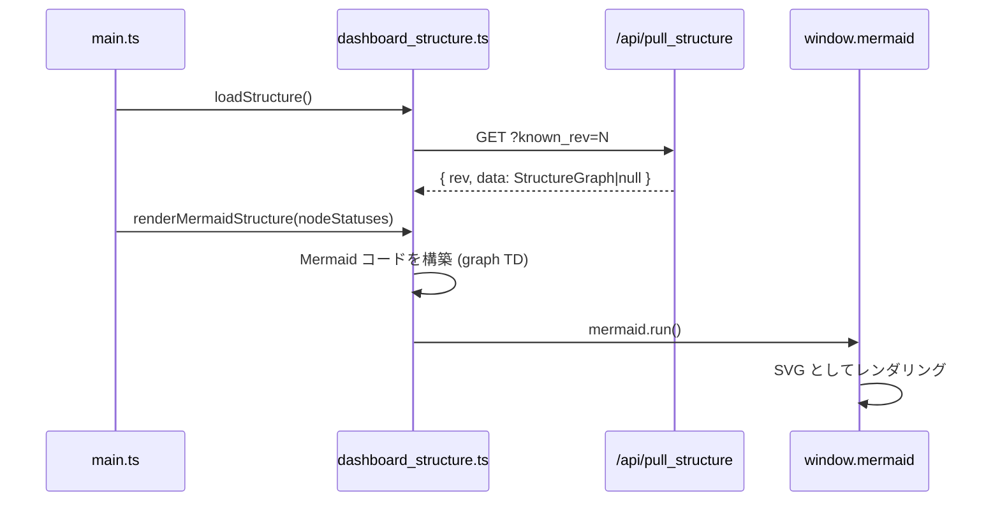

# dashboard_structure.ts

> 📅 最終更新日: 2026/06/11

タスクグラフ構造データの読み込みと Mermaid フローチャートの可視化レンダリングを管理し、ノード状態に基づくリアルタイム着色とエッジ増分表示をサポートします。

> ⚠️ **変更済み**: `structureData` 型が旧版の `any[]`（配列）から `StructureGraph` オブジェクト型（`nodes`、`edges`、`source_nodes` を含む）に変更されました。`getNodeShape()` 関数と完全な型定義が新たに追加されました。

## 型定義

```typescript
type StructureNodeMeta = {
  func_name: string;       // ノード関数名、ノードタイプの推導に使用（例：_split, _route）
  execution_mode: string;  // ノード実行モード
  stage_mode: string;      // ノードステージモード
  max_workers: number;     // 並列 worker 数上限
};

type StructureGraph = {
  nodes: Record<string, StructureNodeMeta>; // ノード名からメタ情報へのマッピング
  edges: Record<string, string[]>;         // 有向辺隣接リスト
  source_nodes: string[];                   // 入次数 0 のソースノードリスト
};
```

## グローバル変数

| 変数 | 型 | 説明 |
|------|------|------|
| `structureData` | `StructureGraph` | タスク構造グラフデータ（有向グラフ）、デフォルトで空の `nodes`/`edges`/`source_nodes` を含む |
| `structureRev` | `number` | 前回取得のバージョン番号、初期値 `-1`、増分取得に使用 |
| `structureRequestSeq` | `number` | リクエストシーケンス番号、古い構造応答が新しい結果を上書きするのを防止 |

## 関数

### `loadStructure(): Promise<boolean>`

非同期で `GET /api/pull_structure?known_rev=N` からグラフ構造を取得します。`structureRequestSeq` を競合保護に使用します。

---

### `getNodeId(nodeName: string): string`

Mermaid 互換のノード ID を生成します（非単語文字を `_` に置換）。

---

### `getNodeShape(nodeMeta: StructureNodeMeta): string`

ノードメタ情報の `func_name` に基づいて Mermaid 形状タイプを推導します。

| `func_name` | 形状 | 説明 |
|-------------|------|------|
| `_split` | `subgraph` | 分流/分割ノード |
| `_route` | `rhombus` | ルーティング/意思決定ノード |
| `_transport` / `_source` / `_ack` | `parallelogram` | 入出力系ノード |
| その他 | `box` | 通常の処理ノード |

---

### `getShapeWrappedLabel(label: string, shape?: string): string`

形状タイプに基づいて Mermaid 構文のノードラベルを生成します。10 種類の形状をサポート：`box`、`circle`、`round`、`rhombus`、`subgraph`、`parallelogram`、`db`、`cloud`、`hex`、`arrow`。

---

### `renderMermaidStructure(statuses?: Record<string, NodeStatus>): void`

Mermaid フローチャートコードを構築し、`window.mermaid.run()` を呼び出してレンダリングします。

**主な特性：**

- **動的着色**: `statuses` 内の `status` コードに基づいて自動的に色クラスを適用（`greenNode`=実行中、`greyNode`=停止済み、`whiteNode`=未起動）。
- **テーマ対応**: `dark-theme` クラスを自動認識し、Mermaid の `classDef` カラースキームを切り替えます（ダーク/ライト 2 セット）。
- **エッジ増分表示**: `webConfig.dashboard.showStructureEdgeDelta` が有効な場合、エッジ（Edge）上に `|+N|` ラベルを表示（前回から今回の `tasks_succeeded` 増分に基づく）。
- **ソースノード優先**: `source_nodes` を非ソースノードより前に配置し、トポロジーグラフの可読性を向上させます。
- **コンテナ置換**: 毎回新しい `#mermaid-container` を作成して古いコンテナを置換し、Mermaid の古い DOM 状態残留問題を回避します。

## ノード状態色マッピング

| `status` | スタイルクラス | 意味 |
|----------|--------|------|
| `1` | `greenNode` | 実行中 |
| `2` | `greyNode` | 停止済み |
| なし/その他 | `whiteNode` | 未起動/不明 |

## データフロー



## 使用例

```typescript
// 構造データをシミュレート
const mockStructure: StructureGraph = {
  nodes: {
    "DataLoader": { func_name: "_source", execution_mode: "serial", stage_mode: "serial", max_workers: 1 },
    "Processor":  { func_name: "process", execution_mode: "thread", stage_mode: "thread", max_workers: 4 },
    "Router":     { func_name: "_route", execution_mode: "serial", stage_mode: "serial", max_workers: 1 },
  },
  edges: {
    "DataLoader": ["Processor"],
    "Processor":  ["Router"],
  },
  source_nodes: ["DataLoader"],
};

// structureData = mockStructure;

// ノード ID と形状を取得
// getNodeId("DataLoader") → "DataLoader"
// getNodeShape(mockStructure.nodes["Router"]) → "rhombus"

// 構造グラフをレンダリング（ノード状態着色付き）
// renderMermaidStructure(nodeStatuses);
```
