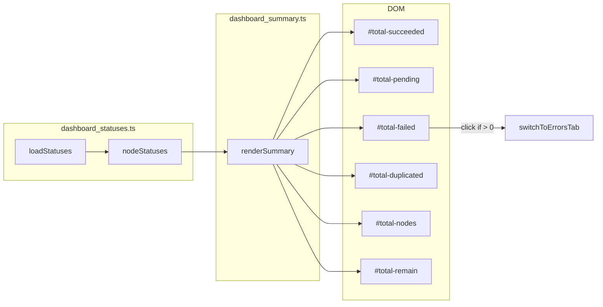

# dashboard_summary.ts

> 📅 最終更新日: 2026/06/11

グローバル集計統計データのレンダリングを管理します。**集計は完全にフロントエンドで `nodeStatuses` に基づいてリアルタイムに集約計算され**、独立したバックエンド API に依存しません。

> ⚠️ **変更済み**: 旧版ドキュメントで言及されていた `loadSummary()` 関数と `/api/pull_summary` エンドポイントは削除されました。現在のバージョンでは、`renderSummary()` は `nodeStatuses`（`dashboard_statuses.ts` が維持）から直接すべての統計項目を集約します。

## グローバル変数

| 変数 | 型 | 説明 |
|------|------|------|
| `summaryRev` | `number` | データバージョン番号（現在保持されているが増分取得ロジックは未使用） |

## DOM 要素参照

| 変数 | DOM ID | 説明 |
|------|--------|------|
| `totalSucceeded` | `#total-succeeded` | 総成功タスク数 |
| `totalPending` | `#total-pending` | 総待機タスク数 |
| `totalDuplicated` | `#total-duplicated` | 総重複タスク数 |
| `totalFailed` | `#total-failed` | 総失敗タスク数 |
| `totalNodes` | `#total-nodes` | アクティブノード数 |
| `totalRemain` | `#total-remain` | 総残り時間 |

## 関数

### `renderSummary(): void`

`nodeStatuses`（グローバル変数、`dashboard_statuses.ts` が維持）の最新スナップショットに基づき、フロントエンドで各項目の合計を集約計算して集計パネルにレンダリングします。

**フロントエンド集約項目：**

| 表示項目 | 計算方法 | フォーマット関数 |
|--------|---------|-----------|
| 総成功タスク | `sum(status.tasks_succeeded)` | `formatLargeNumber()` |
| 総待機タスク | `sum(status.tasks_pending)` | `formatLargeNumber()` |
| 総失敗タスク | `sum(status.tasks_failed)` | `formatLargeNumber()` |
| 総重複タスク | `sum(status.tasks_duplicated)` | `formatLargeNumber()` |
| アクティブノード数 | `count(status === 1)` | `formatLargeNumber()` |
| 総残り時間 | `max(status.total_remaining_time)` | `formatDuration()` |

> グラフレベル残り時間は各ノードの `total_remaining_time` の最大値（各チェーンの推定を考慮）であり、単純な合計ではありません。

**インタラクション特性：**

- 総失敗数が `> 0` の場合、`#total-failed` 要素に `.error-clickable` クラスが追加され、`onclick` で `switchToErrorsTab()` がバインドされ、クリックでエラーログページにジャンプできます。

## データフロー



## 使用例

```typescript
// renderSummary() は refreshAll() によって statusesChanged 時に自動的に呼び出されます

// 内部集約ロジックのイメージ：
const statusList = Object.values(nodeStatuses || {});
const total_succeeded = statusList.reduce((sum, s) => sum + (s.tasks_succeeded || 0), 0);
const total_pending   = statusList.reduce((sum, s) => sum + (s.tasks_pending || 0), 0);
const total_failed    = statusList.reduce((sum, s) => sum + (s.tasks_failed || 0), 0);
const total_duplicated = statusList.reduce((sum, s) => sum + (s.tasks_duplicated || 0), 0);
const total_nodes     = statusList.reduce((sum, s) => sum + (s.status === 1 ? 1 : 0), 0);
const total_remain    = Math.max(...statusList.map(s => s.total_remaining_time || 0), 0);

// DOM を更新
totalSucceeded.innerHTML = formatLargeNumber(total_succeeded);
totalPending.innerHTML   = formatLargeNumber(total_pending);
// ... その他の DOM 更新
totalRemain.textContent  = formatDuration(total_remain);
```
