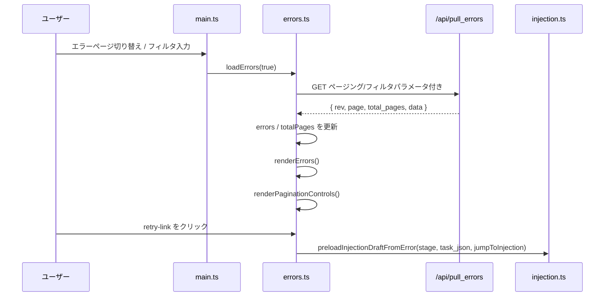

# errors.ts

> 📅 最終更新日: 2026/06/22

エラーログのページング取得、フィルタリング、表示を担当します。エラー記録の非同期取得、フロントエンドページングロジック、およびノード/キーワード検索によるフィルタ表示を行います。

## 型定義

```typescript
type ErrorData = {
  ts: number;            // 生命周期时间戳，单位为秒
  stage: string;         // 错误发生的节点/阶段名称，用于节点筛选
  event_id: number;      // 失败事件的唯一标识 ID，全局唯一
  error_type: string;    // 错误的分类类型
  error_message: string; // 错误的具体描述信息
  task_json: unknown;    // 触发该错误的任务数据，用于展示与重试回填
  result_json: unknown;  // 成功结果或失败时的占位结果
};
```

## グローバル変数

| 変数 | 型 | 説明 |
|------|------|------|
| `errors` | `ErrorData[]` | 現在のページのエラーレコードリスト |
| `currentPage` | `number` | 現在のページ番号。デフォルト `1` |
| `pageSize` | `number` | 1ページあたりの表示件数。デフォルト `10`、`webConfig.errors.pageSize` と同期 |
| `errorSortOrder` | `"newest" \| "oldest"` | 現在のエラーログソート方向。デフォルト `"newest"` |
| `totalPages` | `number` | 総ページ数。デフォルト `1` |
| `errorsRev` | `number` | データバージョン番号。増分取得に使用。デフォルト `-1` |
| `lastQueryKey` | `string` | 前回クエリのキャッシュキー。フィルター条件の変化判定に使用 |
| `errorsRequestSeq` | `number` | リクエストシーケンス番号。古いレスポンスが新しい結果を上書きするのを防止 |

## DOM 要素参照

| 変数 | DOM セレクタ | 説明 |
|------|-----------|------|
| `searchInput` | `#error-search` | キーワード検索入力ボックス |
| `nodeFilter` | `#node-filter` | ノードでフィルタリングするドロップダウン |
| `errorSortSelect` | `#error-sort-order` | ソート方式ドロップダウン |
| `errorsTableBody` | `#errors-table tbody` | エラーテーブルの tbody |
| `paginationContainer` | `#pager-container` | ページネーションコントロールコンテナ |

## 関数

### `buildErrorsQueryKey(page, pageSizeValue, node, keyword, sortOrder): string`

ページング、ページサイズ、ノードフィルタ、キーワード、ソート方式を含むクエリキャッシュキーを構築します。強制全量取得が必要かどうかの判定に使用されます。

### `loadErrors(forceReload = false): Promise<boolean>`

バックエンド `GET /api/pull_errors` から現在のフィルター条件に一致するエラーログを取得します。

- **クエリパラメータ**: `known_rev`、`page`、`page_size`、`node`、`keyword`、`sort_order`
- **キャッシュ戦略**: フィルター条件（`lastQueryKey`）が変化するか、`forceReload=true` の場合、`known_rev` を `-1` にリセットして強制全量取得します。
- **競合保護**: `errorsRequestSeq` を使用して、古いレスポンスを破棄します。
- **戻り値**: バックエンドが新しいエラーレコードデータを返した場合に `true` を返します。

### `renderErrors(): void`

`errors` 配列をテーブルにレンダリングします。各行にはエラー連番、イベント ID、エラー情報、ノード、タスクデータ、発生時刻、リトライボタンが含まれます。

- `task_json` が解析可能で、先頭が `<` の文字列でない場合、クリック可能な「タスク注入」リトライリンクが表示されます。
- リトライクリック時は `preloadInjectionDraftFromError(stage, task_json, webConfig.errors.jumpToInjectionAfterRetry)` を呼び出します。
- レコードがない場合は空状態のプレースホルダーを表示します。

### `goToErrorsPage(nextPage): Promise<void>`

指定ページに移動し、データを再読み込みします。目標ページ番号は `[1, totalPages]` の範囲に制限されます。

### `buildPageList(current, total): Array<number \| string>`

ページ番号リストを生成します。先頭、末尾、現在ページ、前後ページを含み、間隔が 1 より大きい場合には省略記号 `…` を挿入します。

### `renderPaginationControls(totalPages): void`

「前へ/次へ」ボタンと省略記号付きの数字ページ番号領域からなるページネーションコントロールをレンダリングします。総ページ数 `<= 1` の場合はレンダリングしません。

### `populateNodeFilter(statuses): void`

現在のノード状態スナップショットに基づいてノードフィルタードロップダウンを埋めます。可能な限りユーザーの既存のフィルター値を保持します。選択中のノードが消えていた場合は「すべてのノード」に戻します。

## イベントバインディング

| 要素 | イベント | 動作 |
|------|------|------|
| `searchInput` | `input` | 1 ページ目に戻り、強制再取得してレンダリング |
| `nodeFilter` | `change` | 1 ページ目に戻り、強制再取得してレンダリング |
| `errorSortSelect` | `change` | `errorSortOrder` と `webConfig.errors.sortOrder` を更新し、1 ページ目に戻して取得・レンダリングし、`saveWebConfig()` を呼び出して設定を保存 |

## データフロー



## 使用例

```typescript
// 直接第 3 ページに移動
await goToErrorsPage(3);

// ノードでフィルタリング（nodeFilter を設定して change イベントを発火するのと同等）
nodeFilter.value = "Processor";
nodeFilter.dispatchEvent(new Event("change"));

// クエリキャッシュキーを構築
const key = buildErrorsQueryKey(1, 10, "Processor", "timeout", "newest");
// "1|10|Processor|timeout|newest"

// renderErrors はグローバル errors を読み込んでテーブルをレンダリング
// renderPaginationControls(totalPages) は下部ページネーションをレンダリング
```
