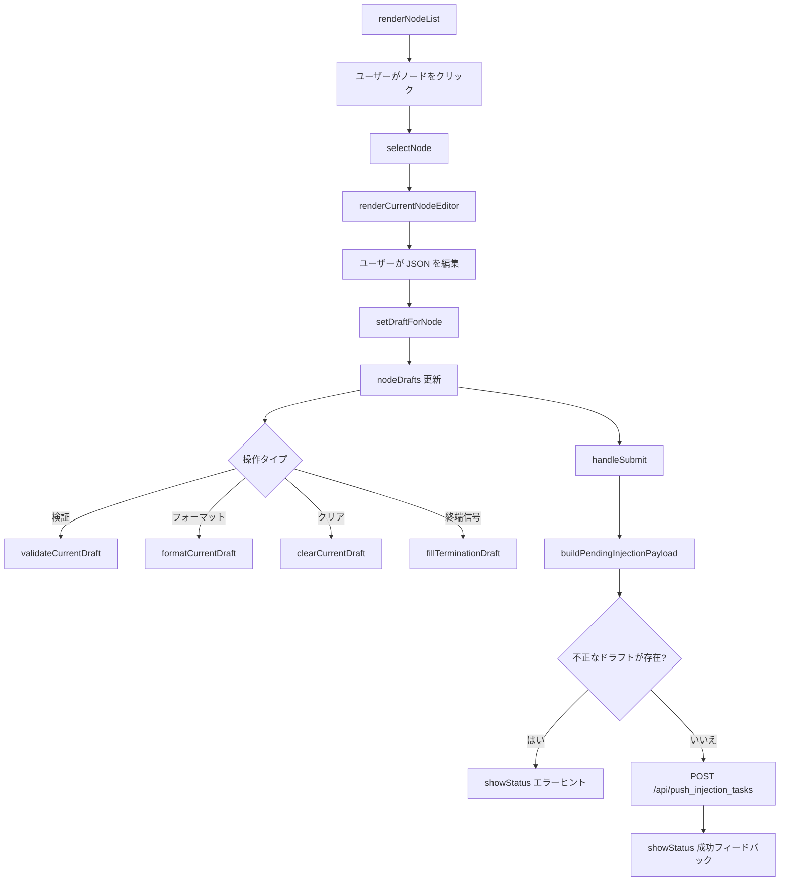

# injection.ts

> 📅 最終更新日: 2026/06/22

タスク手動注入モジュール。**単一ノード編集 + 一括送信**のドラフト式アーキテクチャを採用：各ノードは独立した JSON ドラフトを保持し、最終的に `{ node_name: [tasklist] }` 構造としてまとめて送信されます。

## 型定義

```typescript
type ValidationState = "success" | "error" | "neutral";
```

## グローバル変数

| 変数 | 型 | 説明 |
|------|------|------|
| `currentNodeName` | `string \| null` | 現在編集中のノード名。未選択時は `null` |
| `nodeDrafts` | `Record<string, string>` | ノード名をキーとする JSON ドラフトテキストのマッピング |
| `statusHideTimer` | `number \| null` | 下部ステータスヒントの自動非表示タイマー |

## i18n メタ情報補助関数

注入ページ内には言語切り替え後に再描画が必要な動的文案があるため、`data-message-key` / `data-message-args` で元の翻訳情報をキャッシュします。

| 関数 | シグネチャ | 説明 |
|------|------|------|
| `setLocalizedMessageMeta` | `(element, messageKey, args = []) => void` | 要素に翻訳キーとプレースホルダ引数を記録 |
| `clearLocalizedMessageMeta` | `(element) => void` | 要素の翻訳メタ情報を削除 |
| `getLocalizedMessageArgs` | `(element) => string[]` | キャッシュされたプレースホルダ引数を読み出して解析 |

## ステータスヒント補助関数

| 関数 | シグネチャ | 説明 |
|------|------|------|
| `getStatusIconSvg` | `(isSuccess: boolean) => string` | 成功/失敗状態に応じた SVG アイコン HTML を返す |
| `renderStatusMessage` | `(statusDiv, messageKey, isSuccess, args = []) => void` | 指定コンテナ内にアイコン付き翻訳文案をレンダリング |
| `showStatus` | `(messageKey, isSuccess = false, ...args) => void` | `#status-message` にステータスヒントを表示。3 秒後に自動非表示 |

## DOM 要素取得関数

| 関数 | 戻り値の型 | 対応 DOM ID |
|------|----------|-------------|
| `getSearchInput` | `HTMLInputElement` | `#search-input` |
| `getInjectableOnlyToggle` | `HTMLInputElement` | `#injectable-only-toggle` |
| `getJsonTextarea` | `HTMLTextAreaElement` | `#json-textarea` |
| `getEditorButtons` | `HTMLButtonElement[]` | `#validate-json-btn`、`#format-json-btn`、`#clear-draft-btn`、`#fill-termination-btn` |

## イベントバインディング

モジュールは `DOMContentLoaded` 時に `setupEventListeners()` を呼び出して以下のインタラクションをバインドします：

| 要素 | イベント | 動作 |
|------|------|------|
| `#search-input` | `input` | 左側ノードリストをリアルタイムにフィルタリング |
| `#json-textarea` | `input` | 現在のノードドラフトに同期して書き戻し、ヒント/プレビューを再描画 |
| `#node-list` | `click`（イベント委譲） | 対応ノードに切り替え |
| `#validate-json-btn` | `click` | 現在のドラフトを検証 |
| `#format-json-btn` | `click` | 現在のドラフトをフォーマット |
| `#clear-draft-btn` | `click` | 現在のノードドラフトをクリア |
| `#fill-termination-btn` | `click` | ドラフト末尾に終端信号を追加 |
| `#submit-btn` | `click` | すべてのドラフトを一括送信 |

> 注：`#injectable-only-toggle` の `change` イベントは `main.ts` で統一してバインドされます。切り替えると `renderInjectionPage()` が呼ばれ、設定が保存されます。

## ノードリストと状態同期

### `isInjectableNode(nodeName: string): boolean`

ノードが現在注入を受け入れ可能かどうかを判定します。ノードが存在し、状態が停止済み（`status !== 2`）でない限り注入可能と見なします。未実行だが停止していないノードも送信可能です。

### `syncInjectionStateWithStatuses(): void`

ドラフト状態を最新のノード状態スナップショットに合わせます：
- 消滅したノードまたは停止済みノードのドラフトはクリーンアップされます。
- 現在編集中のノードが注入不可になった場合、現在の選択は解除されます。

### `renderNodeList(searchTerm = ""): void`

左側のノードブラウズリストをレンダリングします。以下をサポート：
- 大文字小文字を区別しない検索キーワードフィルタリング。
- 「注入可能ノードのみ表示」スイッチによるフィルタリング。
- 現在選択中ノードのハイライト（`.active-node`）。
- 注入不可ノードの無効スタイル表示（`.disabled-node`）。
- 編集済みドラフトノードに「編集済み」タグを表示。

### `selectNode(nodeName: string): void`

現在の編集ノードを切り替えます。対象ノードが既に注入不可の場合、状態を同期してページを更新します。

### `renderCurrentNodeEditor(): void`

右側エディタ領域をレンダリングします。現在のノード名、ドラフト状態タグ、JSON 編集ボックス、操作ボタンの有効/無効状態を含みます。

### `renderInjectionPage(): void`

注入ページ全体を更新します。順に `syncInjectionStateWithStatuses()`、`renderNodeList()`、`renderCurrentNodeEditor()`、`renderDraftList()`、`updateSubmitButtonAvailability()` を呼び出します。

## ドラフト管理

### `setDraftForNode(nodeName: string, value: string): void`

指定ノードのドラフトを書き込みまたは削除します。空のテキストは該当ノードのドラフトエントリを直接削除します。

### `preloadInjectionDraftFromError(nodeName, taskData, switchTab = true): void`

`errors.ts` から呼び出されます。エラーに関連付けられたタスクデータを対応ノードのドラフトに追加します（既存の内容を上書きしません）。

- 現在のノードに既に有効なドラフト配列がある場合、新しいタスクを末尾に追加します。
- `switchTab` が `true` の場合、自動的にタスク注入タブに切り替えます。
- 完了後、JSON 編集ボックスの末尾にフォーカスを当てます。

### `parseDraftTaskList(draftText: string): { ok: true; taskList: unknown[] } \| { ok: false; reason: "invalid_json" \| "not_array" }`

ノードドラフトテキストを解析します。タスク注入では各ノードの値は JSON 配列である必要があります。

### `buildPendingInjectionPayload(): { payload: Record<string, unknown[]>; invalidNode: string \| null; invalidReason: "invalid_json" \| "not_array" \| null }`

すべてのドラフトを走査し、最終的にバックエンドに送信する注入マッピングを構築します。最初に検証に失敗したノードとその理由を返します。

### `updateSubmitButtonAvailability(): void`

送信可能なドラフトが存在するかどうかに基づいて送信ボタンを有効化または無効化します。送信中はボタンの有効性を変更しません。

### `renderDraftList(): void`

下部の「送信予定データプレビュー」をレンダリングします。最終送信データ構造に可能な限り近い形で表示します。ドラフトの解析に失敗した場合は、そのノード下に `invalid_json` または `invalid_task_list` マーカーを表示します。

## 検証とフォーマット

### `setValidationMessage(messageKey: string, state: ValidationState, args: string[] = []): void`

`#json-validation` 領域に検証ヒントを表示し、言語切り替え後の再描画のために翻訳キーをキャッシュします。

### `clearValidationMessage(): void`

検証ヒント領域をクリアします。

### `validateCurrentDraft(showSyntaxError = true): boolean`

現在のノードドラフトが有効な JSON 配列かどうかを検証します。

- ノード未選択 → `injection.validationSelectNode` を表示。
- ドラフト空 → `injection.validationEmpty` を表示。
- 検証成功 → `injection.validationOk` を表示。
- 検証失敗 → 失敗原因に応じて `injection.invalidJson` または `injection.invalidTaskList` を表示。

`true` を返す場合、現在のドラフトは有効です。

### `formatCurrentDraft(): void`

現在のノードドラフトに対して `JSON.parse` + `JSON.stringify(..., null, 2)` フォーマットを実行し、テキストエリアとドラフトキャッシュに書き戻します。

### `clearCurrentDraft(): void`

現在のノードのドラフトと編集領域の内容をクリアします。

### `fillTerminationDraft(): void`

現在のノードドラフト配列の末尾に文字列 `"TERMINATION_SIGNAL"` を追加し、ノードに終端信号を送信します。

## 送信とローディング状態

### `handleSubmit(): Promise<void>`

すべての送信待ちノードドラフトを送信します：
1. `syncInjectionStateWithStatuses()` を呼び出して状態を同期。
2. `buildPendingInjectionPayload()` を呼び出してペイロードを構築。
3. 検証に失敗したノードがある場合はそのノードに移動し、修正を促します。
4. 有効なペイロードがない場合、「送信可能なドラフトがありません」と表示します。
5. `POST /api/push_injection_tasks` で JSON ペイロードを送信。
6. 成功時はドラフトをクリアしてページを更新；失敗時は汎用の失敗ヒントを表示。

### `setButtonLoading(loading: boolean): void`

送信ボタンのローディング状態を切り替えます。ローディング中は回転インジケーター（`.spinner`）と `injection.submitting` 文案を表示し、ボタンを無効化します。

### `refreshInjectionLocalizedText(): void`

言語切り替え後に注入ページ内の動的テキスト（検証ヒント、ステータスヒント、送信ボタン文案など）を再描画します。

## コアフロー



## 使用例

```typescript
// ノードドラフトデータをシミュレート
nodeDrafts["StageA"] = '[{"id": 1, "payload": "data1"}, {"id": 2, "payload": "data2"}]';
nodeDrafts["StageB"] = '[{"id": 3}]';

// ノードを選択してエディタをレンダリング
selectNode("StageA");  // 自動的に renderInjectionPage() を呼び出し

// 現在のドラフトを検証
validateCurrentDraft();  // 結果は #json-validation にレンダリング

// JSON をフォーマット
formatCurrentDraft();

// 送信ペイロードを構築
const { payload, invalidNode, invalidReason } = buildPendingInjectionPayload();
// payload = { StageA: [{id:1,...}, {id:2,...}], StageB: [{id:3}] }

// ドラフトを送信
await handleSubmit();

// エラーページからドラフトを事前入力（errors.ts から呼び出し）
preloadInjectionDraftFromError("StageA", { id: 999 }, true);
// 自動的に注入タブに切り替え、task_999 を StageA のドラフトに追加
```
