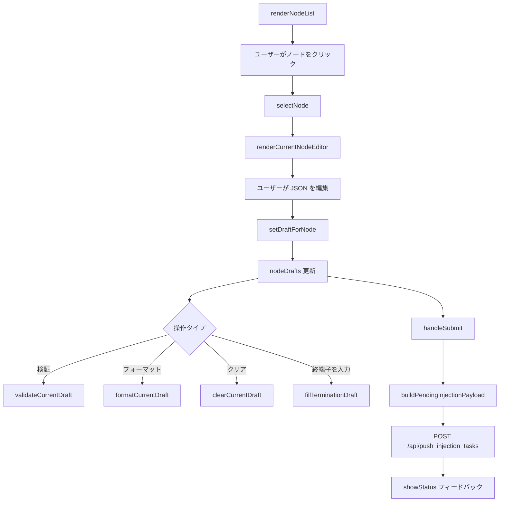

# injection.ts

> 📅 最終更新日: 2026/06/11

タスク手動注入ページのロジックを管理します。**下書き式アーキテクチャ**を採用：ユーザーがノードを選択して JSON 下書きを編集し、編集内容はリアルタイムで `nodeDrafts` にキャッシュされ、最終的に「一括送信」で下書きを一度にバックエンドに送信します。

> ⚠️ **変更済み**: モジュールは大幅に再構築されました。旧版で説明されていた複数ノード選択（`selectedNodes`）、JSON/ファイル入力切り替え（`currentInputMethod`、`uploadedFile`）などのアーキテクチャは、`currentNodeName`+`nodeDrafts` ベースの単一ノード下書きシステムに置き換えられました。エラーログページからの再注入サポート（`preloadInjectionDraftFromError`）が新たに追加されました。

## 型定義

```typescript
type ValidationState = "idle" | "success" | "error" | "neutral";
```

## グローバル変数

| 変数 | 型 | 説明 |
|------|------|------|
| `currentNodeName` | `string \| null` | 現在選択中のノード名；`null` は未選択を示す |
| `nodeDrafts` | `Record<string, string>` | ノード名をキーとする下書きテキストマッピング |
| `statusHideTimer` | `ReturnType<typeof setTimeout> \| null` | 状態メッセージ自動非表示タイマー |

## コアフロー



## 関数

### ノード選択とリスト

#### `renderNodeList(): void`
`nodeStatuses` に基づいて左側の選択可能なノードリストをレンダリングします。検索フィルタリングと「注入可能ノードのみ表示」スイッチをサポートします。ノード状態は `disabled-node` クラスで注入不可ノードのインタラクションを無効化します。

#### `selectNode(nodeName: string): void`
現在選択中のノードを切り替えます。`currentNodeName` を更新し、ノードリストのハイライトと右側エディタを再描画します。

#### `isInjectableNode(nodeName: string): boolean`
ノードが注入可能かどうかを判定します（状態が実行中 `status === 1`）。

#### `syncInjectionStateWithStatuses(): void`
ノード状態が変化したときに注入ページの UI 状態を同期します（例：ノード状態が実行中から停止に変わった場合にエディタを無効化）。

---

### エディタ

#### `renderCurrentNodeEditor(): void`
右側エディタをレンダリングします。現在のノード名、下書き状態タグ（`.node-side-tag`「編集済み」）、JSON テキストエリア、操作ボタングループを含みます。

#### `renderInjectionPage(): void`
注入ページ全体をリフレッシュします：`renderNodeList()`、`renderCurrentNodeEditor()`、`renderDraftList()`、`updateSubmitButtonAvailability()` を呼び出します。

---

### 下書き管理

#### `setDraftForNode(nodeName: string, draftText: string): void`
テキストを `nodeDrafts[nodeName]` に保存します。テキストが空または現在のノードと無関係な場合は下書きエントリを削除します。更新後に下書きプレビューと送信ボタン状態をリフレッシュします。

#### `getJsonTextarea(): HTMLTextAreaElement`
JSON 編集エリアの textarea 要素参照を取得します。

#### `getSearchInput(): HTMLInputElement`
ノード検索入力ボックス参照を取得します。

#### `getInjectableOnlyToggle(): HTMLInputElement`
「注入可能ノードのみ表示」スイッチ参照を取得します。

---

### 検証とフォーマット

#### `validateCurrentDraft(): void`
現在の JSON テキストエリア内の下書き内容を検証し（`parseDraftTaskList()` を呼び出し）、結果を検証メッセージエリアにレンダリングします。

#### `formatCurrentDraft(): void`
現在の JSON をフォーマットし（`JSON.stringify` + `JSON.parse` で再シリアライズ、インデント 2 スペース）、テキストエリアに書き戻します。

#### `parseDraftTaskList(draftText: string): { ok: boolean; taskList?: unknown[]; reason?: string }`
下書きテキストをタスクリストに解析します。`ok: false` を返す場合は失敗理由 `reason` を付加します。

#### `clearCurrentDraft(): void`
現在のノードの下書きをクリアします。

#### `fillTerminationDraft(): void`
現在のテキストエリアに標準終端子タスクテンプレート（`[{"__celestial_termination__": true}]`）を入力します。

---

### プレビューと送信

#### `renderDraftList(): void`
下部の下書きプレビューエリアをレンダリングし、既存の下書きがあるすべてのノードとそのペイロードプレビューを表示します。下書き解析が失敗した場合は対応するエラーメッセージを表示します。

#### `buildPendingInjectionPayload(): { payload: Record<string, unknown[]>; invalidNode?: string; invalidReason?: string }`
送信待ちの注入ペイロードを構築します。すべての `nodeDrafts` を走査してタスクリストに解析し、`{ nodeName: taskList[] }` 構造に集約します。いずれかのノードの解析が失敗した場合は `invalidNode` と `invalidReason` を返します。

#### `updateSubmitButtonAvailability(): void`
下書きの有無に基づいて送信ボタンの `disabled` 状態を制御します。

#### `handleSubmit(): Promise<void>`
送信を実行：`buildPendingInjectionPayload()` を呼び出してペイロードを構築し、`POST /api/push_injection_tasks` で送信します。送信中はボタンに回転インジケーター（`.spinner`）を表示し、完了後に結果フィードバックを表示します。

---

### 状態と国際化

#### `showStatus(messageKey: string, type: "success" | "error"): void`
送信結果の状態メッセージを表示します（3 秒後に自動非表示）。

#### `renderStatusMessage(messageKey: string, type: "success" | "error"): string`
アイコン付きの状態メッセージ HTML を生成します。

#### `setValidationMessage(state: ValidationState, messageKey?: string): void`
検証結果エリアの状態とテキストを設定します。

#### `clearValidationMessage(): void`
検証結果エリアをクリアします。

#### `setButtonLoading(loading: boolean): void`
送信ボタンのローディング状態を制御します（`.spinner` 要素の挿入/削除）。

#### `refreshInjectionLocalizedText(): void`
言語切り替え時に注入ページのすべての動的テキスト（検証メッセージ、状態メッセージ、送信ボタンなど）をリフレッシュします。

---

### モジュール間インタラクション

#### `preloadInjectionDraftFromError(nodeName: string, taskData: unknown, jumpToInjectionAfterRetry?: boolean): void`
`errors.ts` の再注入列から呼び出されます。タスクデータを対応するノードの下書きにマージします（追記であり上書きではありません）。`jumpToInjectionAfterRetry` が `true` の場合、自動的に注入タブに切り替えます。

---

### イベントバインディング

#### `setupEventListeners(): void`
注入ページのすべてのインタラクションイベントを初期化します（モジュールトップレベルで自動実行）：
- **検索ボックス** (`#injection-search`): ノードリストをリアルタイムフィルタリング。
- **検証ボタン** (`#btn-validate`): `validateCurrentDraft()` をトリガー。
- **フォーマットボタン** (`#btn-format`): `formatCurrentDraft()` をトリガー。
- **クリアボタン** (`#btn-clear-draft`): `clearCurrentDraft()` をトリガー。
- **終端子ボタン** (`#btn-fill-termination`): `fillTerminationDraft()` をトリガー。
- **送信ボタン** (`#btn-submit-all`): `handleSubmit()` をトリガー。
- **ノードリスト** (`#injection-node-list`): イベント委譲でノード項目クリックを処理。
- **注入可能のみ表示** (`#injectable-only-toggle`): `renderInjectionPage()` をトリガーして設定を保存。

## 使用例

```typescript
// ノード下書きデータをシミュレート
nodeDrafts["StageA"] = '[{"id": 1, "payload": "data1"}, {"id": 2, "payload": "data2"}]';
nodeDrafts["StageB"] = '[{"id": 3}]';

// ノードを選択してエディタをレンダリング
// selectNode("StageA");  // 自動的に renderCurrentNodeEditor() を呼び出し

// 現在の下書きを検証
// validateCurrentDraft();  // 結果は .validation-message にレンダリング

// JSON をフォーマット
// formatCurrentDraft();

// 送信ペイロードを構築
// const { payload, invalidNode, invalidReason } = buildPendingInjectionPayload();
// payload = { StageA: [{id:1,...}, {id:2,...}], StageB: [{id:3}] }

// 下書きを送信
// await handleSubmit();

// エラーページから下書きを事前入力（errors.ts から呼び出し）
// preloadInjectionDraftFromError("StageA", { id: 999 }, true);
// 自動的に注入タブに切り替え、task_999 を StageA の下書きに事前入力
```

## データフロー

```mermaid
flowchart LR
    subgraph "errors.ts"
        RE[renderErrors]
        RETRY["retry-link クリック"]
    end
    subgraph "injection.ts"
        PIDE[preloadInjectionDraftFromError]
        ND[nodeDrafts]
        BPP[buildPendingInjectionPayload]
        HS[handleSubmit]
    end
    subgraph "API"
        API[POST /api/push_injection_tasks]
    end

    RETRY -->|stage, task| PIDE
    PIDE --> ND
    ND --> BPP
    BPP --> HS
    HS --> API
```
