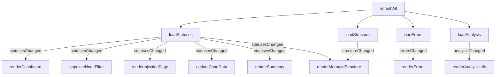
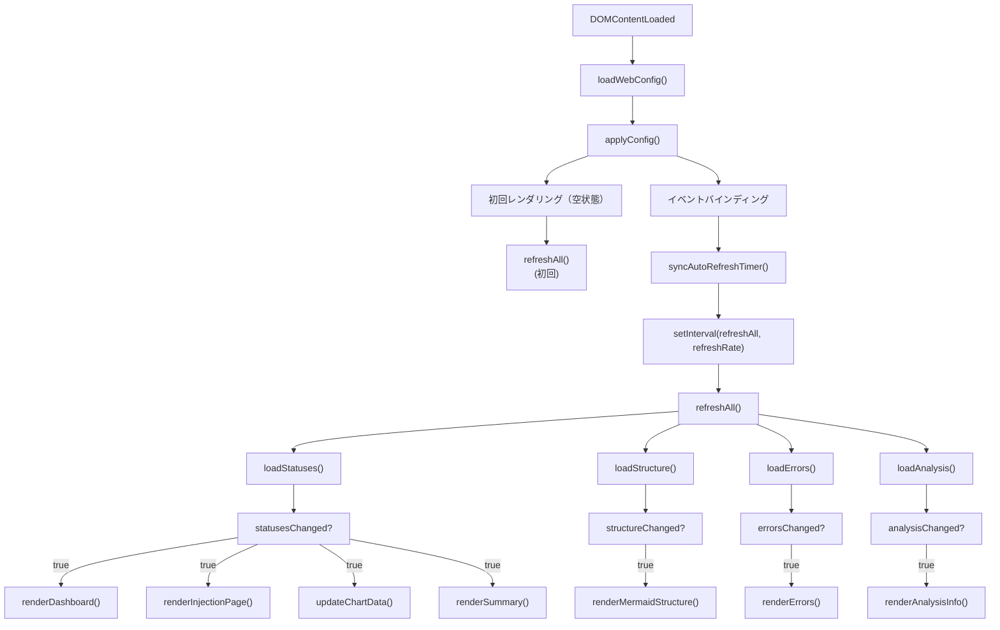

# main.ts

> 📅 最終更新日: 2026/06/11

ダッシュボードメインエントリスクリプト。グローバル初期化、イベントリスナー、およびコアデータポーリングロジックの調整を担当します。

> ⚠️ **変更済み**: 旧版ドキュメントで言及されていた `loadSummary()` と `initSortableDashboard()` は削除されました。`refreshAll()` は現在 4 つのリクエスト（statuses、structure、errors、analysis）を並列実行し、summary は `renderSummary()` が直接 `nodeStatuses` に基づいてフロントエンドで集約します。`updateCurrentPageSettings()`、`activateTab()` などの設定パネル管理関数が新たに追加されました。

## グローバル変数

| 変数 | 型 | 説明 |
|------|------|------|
| `refreshRate` | `number` | ポーリングリフレッシュ間隔（ミリ秒）、デフォルト `5000` |
| `refreshIntervalId` | `ReturnType<typeof setInterval> \| null` | ポーリングタイマー ID |

## DOM 要素参照

| 変数 | DOM セレクタ | 説明 |
|------|-----------|------|
| `refreshSelect` | `#refresh-interval` | リフレッシュ間隔ドロップダウン |
| `autoRefreshToggle` | `#auto-refresh-toggle` | 自動リフレッシュスイッチ |
| `historyLimitSelect` | `#history-limit` | 履歴長ドロップダウン |
| `settingsBtn` | `#settings-btn` | 設定ギアボタン |
| `settingsPanel` | `#settings-panel` | 設定フローティングパネル |
| `themeToggleBtn` | `#theme-toggle` | テーマ切り替えボタン |
| `languageSelect` | `#language-select` | 言語選択ドロップダウン |
| `errorPageSizeSelect` | `#error-page-size` | エラーページあたり件数ドロップダウン |
| `errorJumpToInjectionToggle` | `#error-jump-to-injection-toggle` | エラーページ再注入後ジャンプスイッチ |
| `structureEdgeDeltaToggle` | `#structure-edge-delta` | 構造図エッジ増分表示スイッチ |
| `statusTotalPendingToggle` | `#status-total-pending-toggle` | ノード状態カード待機値モードスイッチ |
| `injectableOnlyToggle` | `#injectable-only-toggle` | 注入ページ「注入可能ノードのみ表示」スイッチ |
| `tabButtons` | `.tab-btn` | タブボタンリスト |
| `tabContents` | `.tab-content` | タブコンテンツリスト |

## コア機能

### ポーリングリフレッシュ (`refreshAll`)

4 つの非同期リクエストを並列実行：`loadStatuses()`、`loadStructure()`、`loadErrors()`、`loadAnalysis()`。各モジュールが返す変更フラグに基づき、必要に応じて DOM レンダリングをトリガーします。



### 設定インタラクション

| 設定項目 | イベント | トリガー動作 |
|-------|------|----------|
| **リフレッシュ間隔** | `change` | `refreshRate` を更新、設定保存、タイマー再構築 |
| **自動リフレッシュ** | `change` | `autoRefreshEnabled` を切り替え、タイマー同期、設定保存 |
| **履歴長** | `change` | `historyLimit` を更新、履歴トリミングして再描画、設定保存 |
| **インターフェース言語** | `change` | `setLang()` + `applyI18nDOM()`、全カードとグラフを全量リフレッシュ |
| **構造図増分** | `change` | `showStructureEdgeDelta` を切り替え、Mermaid 再描画、設定保存 |
| **ノード待機モード** | `change` | `useTotalPendingInStatus` を切り替え、ノードカード再描画、設定保存 |
| **注入ページノードフィルター** | `change` | `showInjectableOnly` を切り替え、注入ページリフレッシュ、設定保存 |
| **エラーページサイズ** | `change` | `pageSize` を更新、エラーリスト再読み込み、設定保存 |
| **エラー再注入ジャンプ** | `change` | `jumpToInjectionAfterRetry` を切り替え、設定保存 |
| **明暗テーマ** | `click` | `dark-theme` クラスを切り替え、グラフテーマ色更新、設定保存 |

### UI 補助関数

#### `toggleDarkTheme(): boolean`
`body` 要素上で `dark-theme` クラスを切り替え、切り替え後にダークモードかどうかを返します。

#### `showSettingsSaveStatus(messageKey: string): void`
設定パネル下部に時間制限付きの状態ヒントを表示します（成功 2 秒、失敗 5 秒後に自動非表示）。

#### `updateSettingsStatusText(): void`
言語切り替え後に設定状態ヒントのテキストを更新します。

#### `syncAutoRefreshTimer(): void`
`webConfig.global.autoRefreshEnabled` に基づいてポーリングタイマーを作成またはクリアします。

#### 設定パネル管理
`isSettingsPanelOpen()` / `openSettingsPanel()` / `closeSettingsPanel(options?)` / `toggleSettingsPanel()` — 設定パネルの表示/非表示とフォーカス復帰を管理します。

#### タブ管理
`getActiveTab(): string` / `activateTab(button): void` / `updateCurrentPageSettings(): void` — 上部タブ切り替えと設定パネル内の「現在のページ専用設定」グループを管理します。

## データフロー図



## 使用例

```typescript
// 手動で完全リフレッシュをトリガー
// await refreshAll();

// ポーリング頻度を変更
// refreshRate = 2000;
// syncAutoRefreshTimer();

// テーマ切り替え
// const isDark = toggleDarkTheme();
// themeToggleBtn.textContent = isDark ? t("theme.light") : t("theme.dark");
// updateChartTheme();
// renderMermaidStructure(nodeStatuses);

// タブ切り替え
// activateTab(document.querySelector('[data-tab="errors"]'));
```
