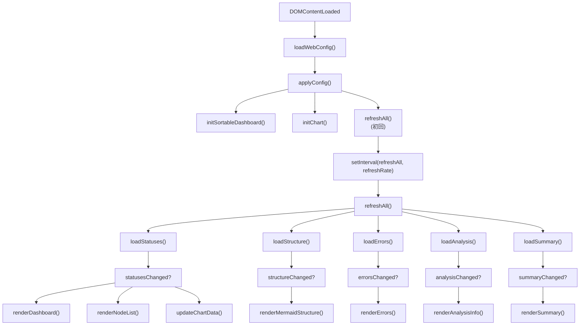

# main.ts

> 📅 最終更新日: 2026/05/24

ダッシュボードのメインエントリポイントスクリプト。グローバル初期化、イベントリスニング、およびコアデータポーリングロジックの調整を担当します。

## 初期化フロー

1. **設定読み込み**: `loadWebConfig()` を呼び出してバックエンドから永続化設定を取得します。
2. **UI 適用**: `applyConfig()` を呼び出してテーマ、言語、リフレッシュ間隔などの設定を適用します。
3. **機能有効化**:
   - `initSortableDashboard()`: ノードカードのドラッグ＆ドロップを有効にします。
   - `initChart()`: Chart.js 履歴グラフを初期化します。
   - ⚠️ `initHistoryMetricSwitcher()` は **main.ts では呼び出されません** — `dashboard_history.ts` のモジュールスコープで自動的に実行されます。
4. **ポーリング開始**: `setInterval` で `refreshAll()` 定期リフレッシュを開始します。

## コア機能

### ポーリングリフレッシュ (`refreshAll`)

複数の非同期リクエストを並列に発行し、最新のノード状態、グラフ構造、エラーログ、トポロジ分析、サマリー統計を取得します。

- **オンデマンドレンダリング**: 対応するデータバージョン番号（`rev`）が変更された場合のみ、DOM 再レンダリングをトリガーします。
- **状態同期**: `loadStatuses()` が成功すると、自動的に `appendStatusSnapshotToHistory()` を駆動してフロントエンド履歴を累積します。

### 設定インタラクション

| 設定項目 | トリガー動作 |
|-------|----------|
| **リフレッシュ間隔** | ポーリングタイマーを更新し、`saveWebConfig()` を呼び出します |
| **履歴長** | 即座に `trimNodeHistories()` を呼び出してローカルシーケンスをトリミングし、グラフを再描画します |
| **画面言語** | `setLang()` + `applyI18nDOM()` を呼び出し、動的にレンダリングされるすべてのカードを全量リフレッシュします |
| **構造図増分** | `showStructureEdgeDelta` を切り替え、即座に Mermaid 図を再描画します |
| **ライト/ダークテーマ** | body クラス名を切り替え、`theme-toggle` のテキストとグラフのテーマカラーを同期的に更新します |

### UI ヘルパー関数

#### `toggleDarkTheme()`
`body` 要素の `dark-theme` クラスを切り替え、切り替え後のブール状態を返します。

#### `showSettingsSaveStatus(messageKey)`
設定パネルの下部に時間制限付きのステータス通知（例：「保存成功」）を表示し、国際化キーマッピングをサポートします。成功時は 2 秒、失敗時は 5 秒後に自動的に非表示になります。

#### `updateSettingsStatusText()`
言語切り替え後、設定ステータス通知テキストを現在の言語の翻訳に更新します。

#### `isSettingsPanelOpen()` / `openSettingsPanel()` / `closeSettingsPanel()` / `toggleSettingsPanel()`
設定パネルの開閉/切り替え管理。以下をサポートします：
- ギアボタンのクリックで切り替え
- 閉じるボタンのクリックでフォーカスを戻す
- 空白領域のクリックで自動的に閉じる
- `Escape` キー押下で閉じる

### フォーカスとアクセシビリティ (a11y)

- **設定パネル**: `Escape` キーで素早く閉じることができ、閉じた後にフォーカスが自動的に設定ボタンに戻ります。
- **状態フィードバック**: 設定保存時に、パネル下部に短時間の「保存成功」または「保存失敗」通知が表示されます（`showSettingsSaveStatus()` によって実装）。

## `toggleDarkTheme()` と `showSettingsSaveStatus()` の所属

| 関数 | 定義場所 | 用途 |
|------|---------|------|
| `toggleDarkTheme()` | **main.ts** | テーマ切り替え |
| `showSettingsSaveStatus()` | **main.ts** | 設定保存状態フィードバック |

> これら 2 つの関数は **`utils.ts` には定義されていません**。

## データフロー図



## 使用例

### `refreshAll` 手動呼び出しとデータフロー駆動の例

以下はブラウザコンソールで手動でデータリフレッシュをトリガーする方法と、コアとなるデータフロー駆動関係を示します：

```typescript
// 1. 手動で完全なデータリフレッシュフローをトリガー
// ブラウザコンソールで実行：
refreshAll().then(() => {
    console.log("全量リフレッシュ完了");
});

// 2. refreshAll の内部フロー概要（main.ts ソースコードに基づく）：
// async function refreshAll() {
//     // 5 種類のデータを並列取得
//     const [statusesChanged, structureChanged, errorsChanged,
//            analysisChanged, summaryChanged] = await Promise.all([
//         loadStatuses(),
//         loadStructure(),
//         loadErrors(),
//         loadAnalysis(),
//         loadSummary(),
//     ]);
//
//     // 依存関係に基づいてレンダリングを駆動：
//     // 構造図は 構造データ + 状態データ に依存
//     // 分析パネルは 分析データ に依存
//     // 状態カード/ノードリスト/折れ線グラフは 状態データ に依存
//     // サマリーパネルは サマリーデータ に依存
//     // エラーテーブルは エラーデータ に依存
// }

// 3. 単一データ読み込み関数の手動呼び出し
async function manualDataFetch() {
    // 状態データのみ取得
    const statusChanged = await loadStatuses();
    if (statusChanged) {
        renderDashboard();           // 状態カードを更新
        populateNodeFilter(nodeStatuses); // エラーフィルターを更新
        renderNodeList();            // 注入ページのノードリストを更新
        updateChartData();           // 折れ線グラフを更新
    }

    // 構造データのみ取得して再描画
    const structChanged = await loadStructure();
    if (structChanged && nodeStatuses) {
        renderMermaidStructure(nodeStatuses);
    }

    // エラーデータのみ取得
    const errChanged = await loadErrors(true);
    if (errChanged) {
        renderErrors();
    }
}

// 4. ポーリング頻度の変更
// デフォルトは webConfig.refreshInterval に保存されます
// ブラウザコンソールで一時的に調整可能：
// clearInterval(refreshIntervalId);
// refreshRate = 2000;  // 2 秒に変更
// refreshIntervalId = setInterval(refreshAll, refreshRate);

// 5. 手動で設定保存をトリガー
// saveWebConfig().then(success => {
//     showSettingsSaveStatus(
//         success ? "settings.saveSuccess" : "settings.saveFailed"
//     );
// });

// 6. テーマ切り替え
function toggleTheme() {
    const isDark = toggleDarkTheme();
    webConfig.theme = isDark ? "dark" : "light";
    themeToggleBtn.textContent = isDark ? t("theme.light") : t("theme.dark");
    renderMermaidStructure(nodeStatuses);
    updateChartTheme();
    saveWebConfig();
}

// toggleTheme();  // テーマ切り替えを実行
```
