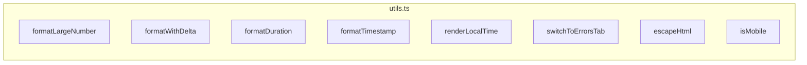

# utils.ts

> 📅 最終更新日: 2026/05/24

Web フロントエンド共通のフォーマットツール、UI ヘルパーロジック、DOM 操作ラッパー、および環境検出関数を含みます。

## 数値と時刻のフォーマット

### `formatLargeNumber(n)`
大きな数値を見やすい形式に変換します。
- `< 10,000,000`: 千の位のカンマ区切りを使用します。
- `>= 10,000,000`: HTML 科学記数法に変換します（例: `~1.23×10⁹`）。

### `formatWithDelta(value, delta, deltaClass, negClass)`
増分付きの数値をフォーマットします。増分がゼロでない場合、主数値の後ろに色付きの `+N` または `-N` を小さく表示します。

### `formatDuration(seconds)`
秒数を `HH:MM:SS` または `MM:SS` 文字列にフォーマットします。

### `formatTimestamp(timestamp)`
Unix タイムスタンプ（秒）を `YYYY-MM-DD HH:MM:SS` のローカル時間文字列にフォーマットします。
```ts
function formatTimestamp(timestamp: number): string {
  const d = new Date(timestamp * 1000);
  // "2026-05-24 14:30:00" のような形式を返します
}
```

### `renderLocalTime(timestamp)`
Unix タイムスタンプをロケールに応じたローカライズ日時文字列に変換します（`toLocaleString()`）。

---

## UI とルーティングのヘルパー

### `switchToErrorsTab(nodeFilter?)`
グローバルルーティングジャンプ関数です。
- 現在のタブを「エラーログ」に切り替えます。
- `nodeFilter` が渡された場合、エラーフィルタードロップダウンを自動入力し、クエリを1回トリガーします。

---

## セキュリティとツール

### `escapeHtml(str)`
基本的な HTML エスケープ関数です。動的テキスト挿入時の XSS リスクを防止します。エスケープ文字: `&` `<` `>` `"` `'` `/`。

### `isMobile()`
UserAgent に基づく簡易モバイル検出です（`Mobi|Android|iPhone|iPad|iPod` にマッチ）。ドラッグソートなどのインタラクションを無効化するために使用します。

---

## ❌ utils.ts に属さない関数

以下の関数は **`utils.ts` には定義されていません**。これらは `main.ts` に属します：

| 関数 | 実際の位置 | 説明 |
|------|---------|------|
| `toggleDarkTheme()` | **main.ts** | ライト/ダークテーマ切り替え |
| `showSettingsSaveStatus()` | **main.ts** | 設定保存状態通知 |

---

## 関数概要



## 使用例

### formatLargeNumber / formatDuration / escapeHtml などの関数の使用例

以下は `utils.ts` 内のすべてのツール関数の使用方法を示します（ブラウザコンソールで直接実行可能）：

```typescript
// ====== 1. formatLargeNumber: 大きな数値のフォーマット ======
console.log("=== formatLargeNumber ===");
console.log(formatLargeNumber(1234));        // "1,234"
console.log(formatLargeNumber(1234567));     // "1,234,567"
console.log(formatLargeNumber(9999999));     // "9,999,999"
console.log(formatLargeNumber(10000000));    // "~1.00×10⁷"
console.log(formatLargeNumber(1234567890));  // "~1.23×10⁹"

// ====== 2. formatWithDelta: 数値 + 増分表示 ======
console.log("\n=== formatWithDelta ===");
const value = 1000;
const delta = 5;
// 主数値の後ろに緑色の +5 小文字を追加
console.log(formatWithDelta(value, delta, "delta-positive", "delta-negative"));
// "1,000<small class="delta-positive" style="margin-left: 4px;">+5</small>"

// 負の増分は赤色表示
console.log(formatWithDelta(value, -3, "delta-positive", "delta-negative"));
// "1,000<small class="delta-negative" style="margin-left: 4px;">-3</small>"

// 増分が 0 の場合は増分を表示しない
console.log(formatWithDelta(value, 0, "", ""));
// "1,000"

// ====== 3. formatDuration: 秒数のフォーマット ======
console.log("\n=== formatDuration ===");
console.log(formatDuration(0));          // "00:00"
console.log(formatDuration(45));         // "00:45"
console.log(formatDuration(120));        // "02:00"
console.log(formatDuration(3661));       // "01:01:01"
console.log(formatDuration(86399));      // "23:59:59"

// ====== 4. formatTimestamp: タイムスタンプのフォーマット ======
console.log("\n=== formatTimestamp ===");
console.log(formatTimestamp(1745400000));
// "2026-05-24 14:40:00" (現在のタイムゾーンに依存)

// 現在時刻
console.log(formatTimestamp(Date.now() / 1000));

// ====== 5. renderLocalTime: ローカライズ時刻 ======
console.log("\n=== renderLocalTime ===");
console.log(renderLocalTime(1745400000));
// "2026/5/24 14:40:00" (ブラウザのロケール設定に依存)

// ====== 6. escapeHtml: HTML エスケープ ======
console.log("\n=== escapeHtml ===");
const userInput = '<script>alert("xss")</script>';
console.log(escapeHtml(userInput));
// "&lt;script&gt;alert(&quot;xss&quot;)&lt;&#x2F;script&gt;"

console.log(escapeHtml('A&B < C > D'));
// "A&amp;B &lt; C &gt; D"

// ====== 7. isMobile: モバイル検出 ======
console.log("\n=== isMobile ===");
console.log(isMobile());
// デスクトップブラウザでは false を返します
// モバイルデバイスでは true を返します

// ====== 8. switchToErrorsTab: エラーページにジャンプ ======
console.log("\n=== switchToErrorsTab ===");
// エラーログタブにジャンプ、ノードフィルターなし
switchToErrorsTab();

// エラーログタブにジャンプし、特定ノードでフィルター
// switchToErrorsTab("StageA");
```
