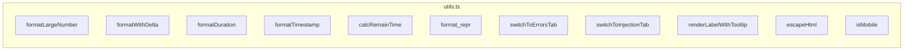

# utils.ts

> 📅 最終更新日: 2026/06/11

Web フロントエンド共通のフォーマットユーティリティ、UI 補助ロジック、DOM 操作ラッパー、環境検出関数を含みます。

> ⚠️ **変更済み**: 旧版ドキュメントで言及されていた `renderLocalTime()` 関数は実際にはこのファイルに存在しません。`renderLabelWithTooltip()`、`switchToInjectionTab()`、`calcRemainTime()`、`format_repr()` の 4 つの関数が新たに追加されました。

## 数値と時間のフォーマット

### `formatLargeNumber(n: number): string`
大きな数値を見やすい HTML 形式に変換します。
- `< 10,000,000`：`toLocaleString('en-US')` で 3 桁区切り。
- `>= 10,000,000`：科学表記 HTML に変換（例：`~1.23×10⁹`）。

### `formatWithDelta(value: number, delta: number, deltaClass: string, negClass: string): string`
増分付きの数値をフォーマットします。増分が非ゼロの場合、メイン数値の後ろに色付きの `+N` または `-N` 小文字 `<small>` タグを追加します。

### `formatDuration(seconds: number): string`
秒数を `HH:MM:SS`（1 時間以上）または `MM:SS`（1 時間未満）文字列にフォーマットします。正数の場合は最低 1 秒を表示します。

### `formatTimestamp(timestamp: number): string`
Unix タイムスタンプ（秒）を `YYYY-MM-DD HH:MM:SS` ローカル時間文字列にフォーマットします。

### `calcRemainTime(processed: number, pending: number, elapsed: number): number`
処理済み数、待機数、経過時間に基づいて残り時間を線形推定します。`processed` または `pending` が 0 の場合は 0 を返します。

### `format_repr(obj: unknown, max_length: number): string`
任意のオブジェクトを文字列にフォーマットし、`max_length` を超える場合は切り詰めます（前半 2/3 + `...` + 後半 1/3）。改行とバックスラッシュの可視形式を保持します。

---

## UI とルーティング補助

### `switchToErrorsTab(nodeFilter?: string): void`
グローバルルーティングジャンプ関数。
- 「エラーログ」タブに切り替えます（`activateTab`）。
- `nodeFilter` が渡された場合、ノードフィルタードロップダウンを設定し `change` イベントをトリガーしてクエリを開始します。

### `switchToInjectionTab(): void`
「タスク注入」タブに切り替えます。

### `renderLabelWithTooltip(labelKey: string, tooltipKey: string): string`
ツールチップ付きのラベル HTML をレンダリングします。`i` ボタン（`.tooltip-trigger`）を含み、ホバーまたはフォーカス時に翻訳されたヒントテキスト（`.tooltip-bubble`）を表示します。

> この関数は `dashboard_statuses.ts` と `dashboard_analysis.ts` で広く使用され、「ステージモード」「スケジュールモード」などの専門用語に即時説明を提供します。

---

## セキュリティとユーティリティ

### `escapeHtml(str: string): string`
基本的な HTML エスケープ関数。動的テキスト挿入時の XSS リスクを防止します。エスケープ対象文字：`&` `<` `>` `"` `'` `/`。

### `isMobile(): boolean`
UserAgent に基づくシンプルなモバイル端末検出（`Mobi|Android|iPhone|iPad|iPod` にマッチ）。

---

## ❌ utils.ts に属さない関数

以下の関数は `utils.ts` では**定義されておらず**、`main.ts` に属します：

| 関数 | 実際の位置 | 説明 |
|------|---------|------|
| `toggleDarkTheme()` | **main.ts** | 明暗テーマ切り替え |
| `showSettingsSaveStatus()` | **main.ts** | 設定保存状態ヒント |

> 旧版ドキュメントで言及されていた `renderLocalTime()` はソースコードに存在せず、旧版の遺留または未実装の可能性があります。

---

## 関数概要



## 使用例

```typescript
// ====== 数値フォーマット ======
formatLargeNumber(1234567);     // "1,234,567"
formatLargeNumber(1234567890);  // "~1.23×10⁹"

// ====== 増分表示 ======
formatWithDelta(1000, 5, "text-delta-success", "text-delta-success");
// "1,000<small class="text-delta-success">+5</small>"

// ====== 時間フォーマット ======
formatDuration(3661);           // "01:01:01"
formatTimestamp(1745400000);    // "2026-04-23 14:40:00"

// ====== 残り時間推定 ======
calcRemainTime(500, 100, 300);  // 60

// ====== 文字列切り詰め ======
format_repr("very long string...", 10);  // "very lo...g..."

// ====== ツールチップラベル ======
renderLabelWithTooltip("status.stageMode", "status.stageModeHelp");
// tooltip-trigger と tooltip-bubble を含む HTML を返す

// ====== タブジャンプ ======
switchToErrorsTab("StageA");    // エラーページにジャンプして StageA でフィルタ
switchToInjectionTab();          // 注入ページにジャンプ

// ====== HTML エスケープ ======
escapeHtml('<script>alert("xss")</script>');
// "&lt;script&gt;alert(&quot;xss&quot;)&lt;&#x2F;script&gt;"

// ====== モバイル検出 ======
isMobile();  // デスクトップ false、モバイル true
```
