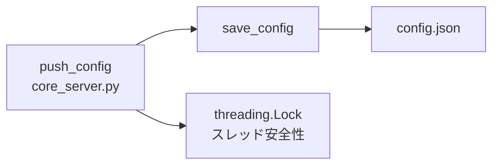

# util_config

> 📅 最終更新日: 2026/05/28

Web モジュールの設定ファイル読み書きユーティリティ。`config.json` の永続化管理を担当します。スレッドロック保護なし — スレッド安全性は上位呼び出し元（`core_server.py` の `push_config`）によって保証されます。

## load_config

```python
def load_config(config_path: str) -> dict[str, Any]:
    """指定パスからフロントエンド設定を読み込み、検証して辞書を返す。"""
```

- **ファイルが存在しない場合**: 直接 `ConfigurationError` を送出し、デフォルトテンプレートからの初期化は行いません。
- `os.path.exists()` でファイルの存在を確認後、UTF-8 エンコーディングで JSON を読み取ります。

## save_config

```python
def save_config(config: dict[str, Any], config_path: str) -> bool:
    """フロントエンド設定を JSON ファイルに保存し、成功したかどうかを返す。"""
```

- `w` モードで書き込み、`indent=4`、`ensure_ascii=False` で可読性と日本語サポートを確保。
- スレッドロック内蔵なし。マルチ並行安全性は呼び出し元 `core_server.py` の `push_config` ルートが処理。
- すべての `Exception` をキャッチし、失敗時にエラー情報を出力して `False` を返します。

## 呼び出し関係



| 関数 | スレッド安全 | 例外処理 |
|------|------------|---------|
| `load_config` | 該当なし（読み取り専用） | ファイル不在 → `ConfigurationError`；JSON 解析失敗 → 上方伝播 |
| `save_config` | ❌ ロックなし、呼び出し元が保証 | 書き込み例外 → エラー出力し `False` を返す |

## 使用例

### load_config / save_config の完全な使用例

```python
from celestialflow.web.util_config import load_config, save_config

# config.json の内容を想定:
# {
#     "theme": "dark",
#     "refreshInterval": 5000,
#     "language": "zh-CN",
#     "dashboard": {
#         "left": ["mermaid"],
#         "middle": ["status"],
#         "right": ["progress"]
#     }
# }

config_path = "/path/to/web/config.json"

# --- 設定の読み込み ---
try:
    config = load_config(config_path)
    print(f"読み込み成功、テーマ: {config.get('theme')}")
    print(f"リフレッシュ間隔: {config.get('refreshInterval')}ms")
    print(f"言語: {config.get('language')}")
    print(f"左パネルカード: {config['dashboard']['left']}")
except Exception as e:
    print(f"設定の読み込みに失敗: {e}")

# --- 設定の変更と保存 ---
config["theme"] = "light"
config["refreshInterval"] = 3000
config["language"] = "en"

success = save_config(config, config_path)
if success:
    print("設定を保存しました")
else:
    print("設定の保存に失敗しました")

# --- 保存結果の確認 ---
reloaded = load_config(config_path)
print(f"再読み込み後のテーマ: {reloaded['theme']}")  # light
print(f"再読み込み後の言語: {reloaded['language']}")  # en
```

### WebConfigModel との併用

```python
from celestialflow.web.util_config import load_config, save_config

# config.json の完全な構造は WebConfigModel Pydantic モデルに準拠
# 保存前/読み取り後に Pydantic モデルを使用した検証を推奨

try:
    raw_config = load_config("/path/to/config.json")

    # Pydantic モデルを使用して検証（core_server.py 内を想定）
    from celestialflow.web.util_models import WebConfigModel
    validated = WebConfigModel(**raw_config)

    print(f"検証通過: テーマ={validated.theme}, リフレッシュ={validated.refreshInterval}ms")

    # 変更して保存
    validated.theme = "dark"
    save_config(validated.model_dump(), "/path/to/config.json")
except Exception as e:
    print(f"設定の処理に失敗: {e}")
```
