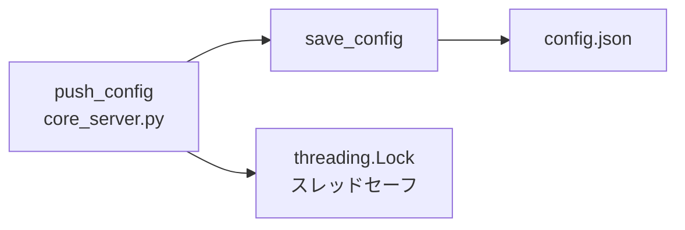

# util_config

> 📅 最終更新日: 2026/06/11

Web モジュールの設定ファイル読み書きツール。`config.json` の永続化管理を担当します。スレッドロック保護なし——スレッドセーフは上位の呼び出し側（`core_server.py` の `push_config`）が保証します。

## load_config

```python
def load_config(config_path: str) -> dict[str, Any]:
    """指定パスからフロントエンド設定を読み込み検証し、辞書を返します。"""
```

- **ファイルが存在しない場合**: 直接 `ConfigurationError` をスローし、デフォルトテンプレートからの初期化は行いません。
- `os.path.exists()` でファイルの存在を確認後、UTF-8 エンコーディングで JSON を読み込みます。

## save_config

```python
def save_config(config: dict[str, Any], config_path: str) -> bool:
    """フロントエンド設定を JSON ファイルに保存し、成功したかどうかを返します。"""
```

- `w` モードで書き込み、`indent=4`、`ensure_ascii=False` で可読性と中国語サポートを保証します。
- 組み込みのスレッドロックなし。複数同時実行の安全性は呼び出し側 `core_server.py` の `push_config` ルートが処理します。
- すべての `Exception` をキャッチし、失敗時にはエラー情報を表示して `False` を返します。

## 呼び出し関係



| 関数 | スレッドセーフ | 例外処理 |
|------|---------|---------|
| `load_config` | 該当なし（読み取り専用） | ファイル不在 → `ConfigurationError`；JSON 解析失敗 → 上位に伝播 |
| `save_config` | ❌ ロックなし、呼び出し側が保証 | 書き込み例外 → エラー表示して `False` を返す |

## 使用例

### load_config / save_config の完全な使用例

```python
from celestialflow.web.util_config import load_config, save_config

# config.json が新しいネストグループ構造であると仮定：
# {
#     "global": {
#         "theme": "dark",
#         "refreshInterval": 5000,
#         "language": "zh-CN"
#     },
#     "dashboard": {
#         "historyLimit": 20,
#         "layout": {
#             "left": ["mermaid"],
#             "middle": ["status"],
#             "right": ["progress"]
#         }
#     }
# }

config_path = "/path/to/web/config.json"

# --- 設定の読み込み ---
try:
    config = load_config(config_path)
    print(f"読み込み成功、テーマ: {config['global']['theme']}")
    print(f"更新間隔: {config['global']['refreshInterval']}ms")
    print(f"言語: {config['global']['language']}")
    print(f"左パネルカード: {config['dashboard']['layout']['left']}")
except Exception as e:
    print(f"設定の読み込みに失敗: {e}")

# --- 設定の変更と保存 ---
config["global"]["theme"] = "light"
config["global"]["refreshInterval"] = 3000
config["global"]["language"] = "en"

success = save_config(config, config_path)
if success:
    print("設定の保存に成功")
else:
    print("設定の保存に失敗")

# --- 保存結果の検証 ---
reloaded = load_config(config_path)
print(f"再読み込み後のテーマ: {reloaded['global']['theme']}")  # light
print(f"再読み込み後の言語: {reloaded['global']['language']}")  # en
```

### WebConfigModel との連携使用

```python
from celestialflow.web.util_config import load_config, save_config

# config.json の完全な構造は WebConfigModel Pydantic モデルに準拠
# 保存前/読み込み後に Pydantic モデルで検証することを推奨

try:
    raw_config = load_config("/path/to/config.json")

    # Pydantic モデルで検証（core_server.py 内で行う想定）
    from celestialflow.web.util_models import WebConfigModel
    validated = WebConfigModel.model_validate(raw_config)

    print(f"検証通過: テーマ={validated.global_.theme}, 更新={validated.global_.refreshInterval}ms")

    # 変更して保存
    validated.global_.theme = "dark"
    save_config(validated.model_dump(by_alias=True), "/path/to/config.json")
except Exception as e:
    print(f"設定処理に失敗: {e}")
```
