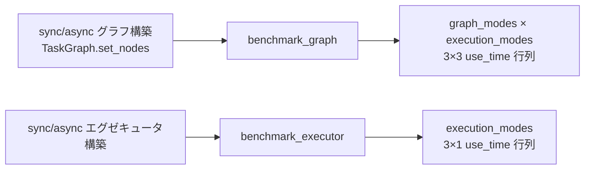

# 性能ベンチマークテスト (test_benchmark.py)

> 📅 最終更新日: 2026/09/09

## 役割

`celestialflow.benchmark.util_benchmark` の `benchmark_graph` と `benchmark_executor` ベンチマーク関数を検証し、`serial` / `thread` / `async` の3つのモードで完全な実行時間行列を出力できることを確認します。

## コアテスト対象

- `benchmark_graph`: 同期と非同期の2つの `TaskGraph` インスタンスを受け取り、両者に対して `graph_mode × execution_mode` の 3×3 組み合わせベンチマークを実行。
- `benchmark_executor`: 同期と非同期の2つの `TaskExecutor` インスタンスを受け取り、`execution_mode` の3つの値に対してベンチマークを実行。
- `TaskGraph`: `set_nodes([TaskExecutor(...)])` で最小可搬グラフを構築。ノード型は `TaskExecutor`（`TaskStage` / `set_stages` は使用しない）。
- `TaskExecutor`: 最小可搬の同期/非同期エグゼキュータを構築。

## テストカバレッジマトリックス

| テストクラス | ケース | カバレッジ対象 |
|------------|------|--------------|
| `TestBenchmarkGraph` | `test_benchmark_graph_covers_all_nine_combinations` | `benchmark_graph` が 3×3 の graph/execution 組み合わせ行列を返すこと |
| `TestBenchmarkExecutor` | `test_benchmark_executor_returns_execution_modes` | `benchmark_executor` が統一された `execution_modes` 列順序を返すこと |

## 主要テストシナリオ

### `test_benchmark_graph_covers_all_nine_combinations`

- 同期グラフ `sync_graph`（`TaskGraph("sync_graph")` + `set_nodes([TaskExecutor("s", add_one, execution_mode="serial")])`）を構築。
- 非同期グラフ `async_graph`（`TaskGraph("async_graph", graph_mode="async")` + `set_nodes([TaskExecutor("s", async_add_one, execution_mode="async")])`）を構築。
- `{"s": [1, 2, 3]}` を初期タスクとして `await benchmark_graph(sync_graph, async_graph, {"s": [1, 2, 3]})` を呼び出す。
- アサート:
  - 返される辞書の `graph_modes` が `["serial", "thread", "async"]` と等しい。
  - `execution_modes` が `["serial", "thread", "async"]` と等しい。
  - `use_time` が 3 行 3 列の2次元リスト。

### `test_benchmark_executor_returns_execution_modes`

- 同期エグゼキュータ `sync_executor`（`execution_mode="serial"`、同期関数 `add_one`）と非同期エグゼキュータ `async_executor`（`execution_mode="async"`、非同期関数 `async_add_one`）を構築。
- `[1, 2, 3]` をタスクリストとして `await benchmark_executor(sync_executor, async_executor, [1, 2, 3])` を呼び出す。
- アサート:
  - 返される辞書の `execution_modes` が `["serial", "thread", "async"]` と等しい。
  - `use_time` が 3 行 1 列の2次元リスト（各 `execution_mode` に1件の結果）。



## 実行方法

```bash
# 全部実行
pytest tests/benchmark/test_benchmark.py -v

# グラフベンチマークテストのみ
pytest tests/benchmark/test_benchmark.py -k "graph" -v

# エグゼキュータベンチマークテストのみ
pytest tests/benchmark/test_benchmark.py -k "executor" -v
```

## 重要な詳細

- `benchmark_graph` は内部で `graph_mode` × `execution_mode` のデカルト積を 9 つの独立した実行組み合わせに展開し、`clone_graph` を使用してグラフ構造を複製し相互干渉を避けます。
- `benchmark_executor` は `execution_mode` 次元のみでデカルト積（3 つの実行モード）を行い、`clone_executor` を使用してエグゼキュータを複製します。
- 両方のテストは `pytest.mark.asyncio` で非同期コルーチンとして装飾されており、`await` がベンチマループをトリガして完了を待ちます。

## 注意事項

- ベンチマークテストは `celestialflow.benchmark` 依存を必要とし、クローンとベンチマークツールの実装はそれぞれ `src/celestialflow/benchmark/util_clone.py` と `src/celestialflow/benchmark/util_benchmark.py` にあります。
- 本ファイルのテストは返される行列の構造整合性のみを検証し、具体的な所要時間値についてはアサートしません。
