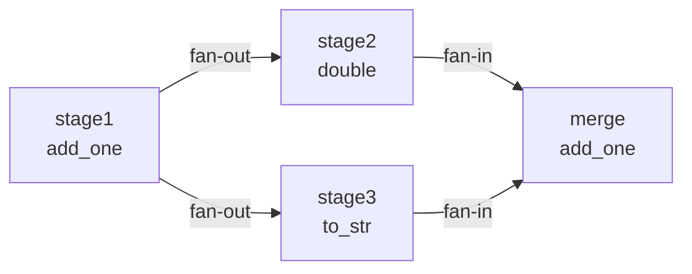

# タスクグラフコア機能テスト (test_graph.py)

> 📅 最終更新日: 2026/07/16

## 役割
`TaskGraph` およびその各種トポロジサブクラス（`TaskChain`、`TaskCross`、`TaskGrid`）のコア機能を包括的に検証し、同期/非同期実行、エラー伝播、トポロジ解析、実行モードマトリクス、ソースノード導出、循環グラフ動作、終了段階の安全検査、ランタイムスナップショット収集をカバーします。

## コアテスト対象
- `TaskGraph`: 汎用タスクグラフコンテナ
- `TaskChain`, `TaskCross`, `TaskGrid`: 事前定義トポロジ構造
- `TaskStage`: グラフノード定義

## テスト範囲

### 集計表

| テストクラス | ケース数 | カバレッジポイント |
|-------------|---------|------------------|
| `TestTaskGraphBasic` | 7 | set_ctree による既存 stage の更新、2ノード DAG、ファンアウト、ファンイン、エラー伝播、start_graph_db、エラータイプフィルタリングリプレイ |
| `TestTaskGraphAsync` | 5 | async モード 2ノード、ファンアウト、ファンイン、エラー伝播、async+thread stage_mode |
| `TestTaskGraphStructure` | 3 | Chain、Cross、Grid 構造 |
| `TestTaskGraphAnalysis` | 2 | DAG 検出、階層計算 |
| `TestTaskGraphFinalize` | 1 | 終了段階スレッド安全検査 |
| `TestTaskGraphRuntimeSnapshot` | 1 | Reporter スナップショット収集の未起動 Stage に対する耐障害性 |
| `TestStageExecutionMatrix` | 6 | serial/thread stage_mode × serial/thread/async execution_mode |
| `TestTaskGraphThread` | 6 | thread モード 2ノード、ファンアウト、ファンイン、エラー伝播、lambda、staged スケジューリング |
| `TestSourceStages` | 5 | 線形グラフ source、ファンイン source、ダイヤモンドグラフ source、単一ソースSCC代表点、複数ソースSCC各1点 |
| `TestCyclicGraph` | 2 | 循環グラフ isDAG 検出、循環内同層 + 尾の階層 |
| **合計** | **38** | |

> **説明**: ここでの統計は `test_graph.py` 内のテストクラスです。`TaskLoop` と `TaskWheel` の専用テストは `test_structure.py` にあります。

### 主要テストフロー

#### 基本トポロジ実行


- **2ノード DAG** (`test_graph_dag_two_nodes`): A→B のデータフローが正しく、2ノードがそれぞれ3つ成功することを検証。
- **ファンアウト** (`test_graph_fan_out`): 1つの上流が複数の下流に分配され、sink_a と sink_b がそれぞれ2つ成功することを検証。
- **ファンイン** (`test_graph_fan_in`): 複数の上流が1つの下流に集約され、merge ノードが4つのタスクを受け取ることを検証。
- **エラー伝播** (`test_graph_error_propagation`): `50` が `ValueError` をトリガーしてもフローが中断されず、下流が成功タスクのみを受け取ることを検証。
- **DB 起動** (`test_graph_start_db`): SQLite から failed/pending タスクをリプレイすることを検証。
- **DB 起動フィルタリング** (`test_graph_start_db_filters_error_type_when_enabled`): 各 stage の `retry_exceptions` に基づいてリプレイタスクをフィルタリングすることを検証。

#### 非同期と並行
- async モードの2ノード、ファンアウト、ファンイン、エラー伝播は同期モードとセマンティクスが一致。
- `test_graph_async_thread_stage_mode`: `stage_mode="thread"` + `execution_mode="async"` の組み合わせを検証。

#### 実行モードマトリクス (`TestStageExecutionMatrix`)
`stage_mode` × `execution_mode` の全 **6 組み合わせ**をカバー：

| ケース | stage_mode | execution_mode |
|--------|-----------|----------------|
| `test_serial_serial` | serial | serial |
| `test_serial_thread` | serial | thread |
| `test_serial_async` | serial | async |
| `test_thread_serial` | thread | serial |
| `test_thread_thread` | thread | thread |
| `test_thread_async` | thread | async |

各ケースは5つの入力タスクを持つ2ノード DAG を使用し、2つの stage がそれぞれ5つ成功することを検証。

#### グラフ構造解析 (`TestTaskGraphAnalysis`)
- **DAG 検出** (`test_dag_detection`): `isDAG` フラグがグラフに循環があるかどうかを正しく反映。
- **階層計算** (`test_layer_computation`): 線形チェーン A→B→C のトポロジ階層が {A:0, B:1, C:2} であることを検証。

#### 終了とスナップショット
- **終了安全検査** (`TestTaskGraphFinalize`): `_finalize_nodes()` が生存スレッドがある場合に `RuntimeStateError` をスローし、危険なクリーンアップを防止することを検証。
- **スナップショット耐障害性** (`TestTaskGraphRuntimeSnapshot`): Reporter がノード未起動（`start_time` なし）時にスナップショットを収集してもクラッシュしないことを検証。

#### 複雑な構造 (`TestTaskGraphStructure`)
| 構造 | ノード数 | スレッド数 | カバーシナリオ |
|------|---------|-----------|--------------|
| Chain | 3 チェーン | 3 | 線形パイプライン |
| Cross | 2×3 グリッド | 4 | 全結合クロス |
| Grid | 2×2 グリッド | 4 | グリッド状結合 |

#### スレッドモード (`TestTaskGraphThread`)
`stage_mode="thread"` における fan-out、fan-in、エラー伝播、lambda 関数サポート、staged スケジューリングを検証。

#### ソースノード導出 (`TestSourceStages`)
5つのケースで以下のシナリオをカバー：

| ケース | トポロジ | 期待される result |
|--------|---------|------------------|
| `test_source_stages_linear` | A→B→C | [A] |
| `test_source_stages_fan_in` | A→C, B→C | [A, B] |
| `test_source_stages_diamond` | A→{B,C}→D | [A] |
| `test_source_stages_cycle_returns_one_source_scc_member` | s1→s2→s3→s1 | 循環内の代表点1つ |
| `test_source_stages_returns_one_member_per_source_scc` | 2つの交わらない循環が s5 に集約 | 各ソースSCCから代表点1つずつ |

#### 循環グラフ (`TestCyclicGraph`)
| ケース | 検証ポイント |
|--------|------------|
| `test_cyclic_isDAG_false` | s1→s2→s3→s1 の `isDAG` が `False` であること |
| `test_cyclic_layers` | 循環内ノード (s1,s2,s3) が同層、尾の s4 が循環階層 + 1 |

### ランタイムスナップショット
`get_graph_summary()` が返すのは前回の `collect_runtime_snapshot()` のスナップショットデータです。`TaskReporter` が有効でないテストでは手動で呼び出す必要があります。

## 重要な詳細

### 終了信号の動作
- 循環グラフはテストの終了を保証するために `put_termination_signal=True` を使用。
- 非 DAG グラフは eager モードで `RuntimeWarning` をトリガーし、テストは緩やかなアサーション（`>= 1`）に調整。

### Lambda サポート
スレッドモードでは lambda をタスク関数として使用可能（`test_graph_thread_with_lambda`）。

## 依存関係

| 依存 | 説明 |
|------|------|
| `pytest` | テストフレームワーク |
| `celestialflow` | `TaskGraph`, `TaskChain`, `TaskCross`, `TaskGrid`, `TaskStage` |

## 実行方法

```bash
# 全テスト実行
pytest tests/graph/test_graph.py -v

# 構造テストのみ（最も時間がかかる、マルチスレッド含む）
pytest tests/graph/test_graph.py::TestTaskGraphStructure -v

# 解析テストのみ（最速、タスク実行なし）
pytest tests/graph/test_graph.py::TestTaskGraphAnalysis -v
```

## パフォーマンス参考

| テスト | 所要時間（Windows / i5） |
|--------|------------------------|
| `TestTaskGraphBasic` | ~2s |
| `TestTaskGraphAsync` | ~3s |
| `TestTaskGraphStructure` | ~5s |
| `TestTaskGraphAnalysis` | ~1s |
| `TestTaskGraphFinalize` | < 0.1s |
| `TestTaskGraphRuntimeSnapshot` | < 0.1s |
| `TestStageExecutionMatrix` | ~5s |
| `TestTaskGraphThread` | ~4s |
| `TestSourceStages` | ~2s |
| `TestCyclicGraph` | ~2s |

## 関連ファイル

- `src/celestialflow/graph/core_graph.py`: `TaskGraph` 実装
- `src/celestialflow/graph/core_structure.py`: グラフ構造サブクラス
- `tests/graph/test_structure.py`: TaskLoop / TaskWheel 専用テスト
