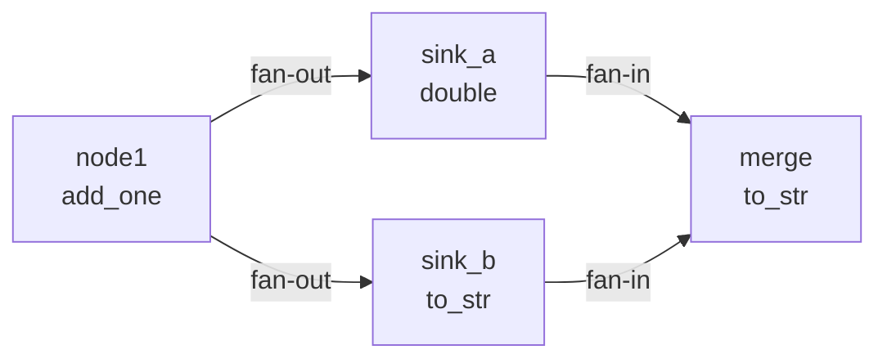

# tests/graph/test_graph.py

> 📅 最終更新日: 2026/09/24

## 役割
`TaskGraph` およびその各種トポロジサブクラス（`TaskChain`、`TaskCross`、`TaskGrid`）のコア機能を全面的に検証し、同期/非同期/スレッド実行、エラー伝播、SQLite リプレイ、ランタイムスナップショットカウント、トポロジ解析、実行モードマトリクス、ソースノード導出（SCC 含む）、循環グラフの動作をカバーします。

## コアテスト対象
- `TaskGraph`: 汎用タスクグラフコンテナ
- `TaskChain`, `TaskCross`, `TaskGrid`: 事前定義トポロジ構造
- `TaskExecutor`: グラフノード定義

## テスト範囲

### 集計表

| テストクラス | ケース数 | カバレッジポイント |
|-------------|---------|------------------|
| `TestTaskGraphBasic` | 10 | set_ctree による既存ノードの更新、未知ノード名検索例外、2ノード DAG、ファンアウト、ファンイン、エラー伝播、DB リプレイ、DB エラータイプフィルタリプレイ、DB での pending 保持、finish 後の例外グループ一括送出 |
| `TestTaskGraphSnapshotCounts` | 3 | fan-in 上流カウント、fan-out 下流カウント、スナップショットによる `tasks_processed`/`tasks_pending` の導出 |
| `TestTaskGraphAsync` | 6 | async モード 2ノード、ファンアウト、ファンイン、エラー伝播、async execution_mode、async finish 後の例外グループ一括送出 |
| `TestTaskGraphStructure` | 3 | Chain、Cross、Grid 構造 |
| `TestTaskGraphAnalysis` | 5 | ノードメタ情報、ゲッターによるオンデマンドな解析構築、構造変更後のキャッシュ自動再構築、DAG 検出、階層計算 |
| `TestNodeExecutionMatrix` | 7 | serial/thread/async graph_mode × serial/thread/async execution_mode |
| `TestTaskGraphThread` | 6 | thread モード 2ノード、ファンアウト、ファンイン、エラー伝播、lambda、線形鎖スケジューリング |
| `TestSourceNodes` | 5 | 線形グラフ source、ファンイン source、ダイヤモンドグラフ source、単一ソース SCC 代表点、複数ソース SCC は各1点を返す |
| `TestCyclicGraph` | 3 | serial モードでの循環グラフ例外送出、循環グラフ isDAG 検出、循環内同層 + 尾の階層 |
| **合計** | **48** | |

> **説明**: ここでの統計は `test_graph.py` 内のテストクラスです。`TaskLoop` と `TaskWheel` の専用テストは `test_structure.py` にあります。

### 主要テストフロー

#### 基本トポロジ実行

```mermaid
graph LR
    A[node1<br/>add_one] -->|fan-out| B[sink_a<br/>double]
    A -->|fan-out| C[sink_b<br/>to_str]
    B -->|fan-in| D[merge<br/>to_str]
    C -->|fan-in| D
```

- **2ノード DAG** (`test_graph_dag_two_nodes`): A→B のデータフローが正しく、2ノードがそれぞれ3つ成功することを検証。
- **ファンアウト** (`test_graph_fan_out`): 1つの上流が複数の下流に分配され、`sink_a` と `sink_b` がそれぞれ2つ成功することを検証。
- **ファンイン** (`test_graph_fan_in`): 複数の上流が1つの下流に集約され、merge ノードが4つのタスクを受け取ることを検証。
- **エラー伝播** (`test_graph_error_propagation`): `50` が `ValueError` をトリガーしてもフローが中断されず、下流が成功タスクのみを受け取ることを検証（node1 は成功 2 / 失敗 1、node2 は成功 2 / 失敗 0）。
- **DB リプレイ** (`test_graph_restore_db`): `restore_db` はデフォルトで `failed` と `pending` のレコードを読み取り、ノード名ごとにグループ化してリプレイします。
- **DB エラータイプフィルタ** (`test_graph_restore_db_filters_error_type_when_enabled`): `restore_db(..., statuses=["failed"], filter_by_error_type=True)` は各ノードの `retry_exceptions` に基づいて `error_type` をフィルタリングします。
- **DB での pending 保持** (`test_graph_restore_db_filter_keeps_pending_records`): フィルタ有効時も `pending` レコードは引き続きリプレイされます。
- **未知ノード名例外** (`test_graph_node_lookup_unknown_node_raises`): ノードを明示指定してタスクを注入する際、存在しないノード名は `NodeNotFoundError` をスローすべきです。
- **set_ctree による既存ノードの更新** (`test_set_ctree_updates_existing_nodes`): 先に `set_nodes` を呼んだ後で `set_ctree` を呼ぶ場合、既存ノードも同じイベントクライアントを共有すべきです。
- **finish 後の例外グループ一括送出** (`test_start_raises_exception_group_after_finish`): 同期 `start` は `_finish_start` 後に収集された `ExceptionGroup` を一括送出します。

#### スナップショット辺カウント (`TestTaskGraphSnapshotCounts`)
- `test_fan_in_upstream_counts`: fan-in ノードの `get_snapshot()["upstream_counts"]` は各上流が提供したタスク数を記録し、上流ノードの `downstream_counts` も対応して一致します。
- `test_fan_out_downstream_counts`: fan-out ノードの `downstream_counts` は各下流へ送信した数を記録します。
- `test_snapshot_restores_processed_and_pending`: スナップショット層は `tasks_processed` / `tasks_pending` / `tasks_succeeded` を導出します。

#### 非同期と並行 (`TestTaskGraphAsync`)
- async モードの2ノード、ファンアウト、ファンイン、エラー伝播は同期モードとセマンティクスが一致。
- `test_graph_async_execution_mode`: `graph_mode="async"` + `execution_mode="async"` の組み合わせを検証。
- `test_start_async_raises_exception_group_after_finish`: 非同期 `start_async` が finish 後に例外グループを一括送出することを検証。

#### 実行モードマトリクス (`TestNodeExecutionMatrix`)
`graph_mode` × `execution_mode` の全 **7 組み合わせ**をカバー：

| ケース | graph_mode | execution_mode |
|--------|-----------|----------------|
| `test_serial_serial` | serial | serial |
| `test_serial_thread` | serial | thread |
| `test_thread_serial` | thread | serial |
| `test_thread_thread` | thread | thread |
| `test_async_serial` | async | serial |
| `test_async_thread` | async | thread |
| `test_async_async` | async | async |

各ケースは5つの入力タスクを持つ2ノード DAG を使用し、2つのノードがそれぞれ5つ成功することを検証。

#### グラフ構造解析 (`TestTaskGraphAnalysis`)
- **ノードメタ情報** (`test_get_node_meta_covers_all_nodes`): `get_node_meta()` は各ノードに対して `class_name`、`execution_mode` などの構築期メタ情報を返します。
- **オンデマンド構築** (`test_getters_build_analysis_on_demand`): 解析と構造のゲッター（`get_graph_analysis`、`get_nodes`、`get_edges`、`get_structure_list`、`get_source_nodes`）は明示的に build しなくても直接利用可能なはずです。
- **キャッシュ自動再構築** (`test_getters_refresh_analysis_after_connect`): `connect` 後、ゲッターは解析キャッシュを自動的に再構築すべきであり、ソースノードと階層もそれに伴って更新されます。
- **DAG 検出** (`test_dag_detection`): `isDAG` フラグがグラフに循環があるかどうかを正しく反映すべきです。
- **階層計算** (`test_layer_computation`): 線形チェーン A→B→C のトポロジ階層が {A:0, B:1, C:2} であることを検証。

#### 複雑な構造 (`TestTaskGraphStructure`)
| 構造 | ノード数 | カバーシナリオ |
|------|--------|---------|
| Chain | 3 チェーン | 線形パイプライン、各ノードが 2 つ成功 |
| Cross | 2×3 階層全結合 | 各 layer2 ノードが 2 つの layer1 ノードからそれぞれ 1 つの結果を受け取る |
| Grid | 2×2 グリッド | 左上のルートが 2 つのタスクを処理し、残りのノードは伝播に従って累積 |

#### スレッドモード (`TestTaskGraphThread`)
`graph_mode="thread"` における 2 ノード直列、fan-out、fan-in、エラー伝播、lambda 関数サポート、線形鎖スケジューリングを検証。

#### ソースノード導出 (`TestSourceNodes`)
5つのケースで以下のシナリオをカバー：

| ケース | トポロジ | 期待される結果 |
|--------|---------|-------------|
| `test_source_nodes_linear` | A→B→C | `[A]` |
| `test_source_nodes_fan_in` | A→C, B→C | `{A, B}` |
| `test_source_nodes_diamond` | A→{B,C}→D | `[A]` |
| `test_source_nodes_cycle_returns_one_source_scc_member` | s1→s2→s3→s1 | 循環内の代表点1つ |
| `test_source_nodes_returns_one_member_per_source_scc` | 2つの交わらない循環が s5 に集約 | 各ソース SCC から代表点1つずつ |

#### 循環グラフ (`TestCyclicGraph`)
| ケース | 検証ポイント |
|--------|------------|
| `test_cyclic_serial_graph_raises` | serial graph_mode 時に `get_source_nodes()` を呼ぶと循環グラフは `ConfigurationError` をスローすべき（`"TaskGraph contains a cycle while graph_mode='serial'"` にマッチ） |
| `test_cyclic_is_dag_false` | s1→s2→s3→s1 の `isDAG` が `False` であること |
| `test_cyclic_layers` | 循環内ノード (s1,s2,s3) が同層、尾の s4 が循環階層 + 1 |

## 重要な詳細

### 終了シグナルの動作
- 循環グラフは `run()` で起動しタスクを注入します（`run` のデフォルトは `if_put_signal=True` で、ソースノードに終了シグナルを自動補完してテストの終了を保証）。
- serial graph_mode 時に循環グラフで `get_source_nodes()` を呼ぶと `ConfigurationError` がトリガーされます（`test_cyclic_serial_graph_raises` 参照）。

### データベースリプレイ
- `restore_db(db_path, statuses=None, *, filter_by_error_type=False, if_put_signal=True)`：`statuses` のデフォルトは `["failed", "pending"]`；`filter_by_error_type` はキーワード引数で、有効にするとノードの `metrics.get_retry_error_type_names()` に基づいて `error_type` をフィルタリングしますが、`pending` レコードは常に保持されます。

### Lambda サポート
スレッドモードでは lambda をタスク関数として使用可能（`test_graph_thread_with_lambda`）。

## 依存関係

| 依存 | 説明 |
|------|------|
| `pytest` | テストフレームワーク |
| `celestialflow` | `TaskGraph`, `TaskChain`, `TaskCross`, `TaskGrid`, `TaskExecutor` |
| `celestialflow.persistence.util_sqlite` | `append_records`（DB リプレイケースでテストレコードを書き込む） |
| `celestialflow.runtime.util_errors` | `ConfigurationError`, `NodeNotFoundError` |
| `celestialflow.runtime.util_event` | `LocalEventClient`（`set_ctree` ケース） |

## 実行方法

```bash
# 全部実行
pytest tests/graph/test_graph.py -v

# 構造テストのみ（マルチスレッド含む）
pytest tests/graph/test_graph.py::TestTaskGraphStructure -v

# 解析テストのみ（最速、タスク実行なし）
pytest tests/graph/test_graph.py::TestTaskGraphAnalysis -v

# スナップショットカウントテストのみ
pytest tests/graph/test_graph.py::TestTaskGraphSnapshotCounts -v
```

## パフォーマンス参考

| テスト | 所要時間 |
|--------|------|
| `TestTaskGraphBasic` | ~2s |
| `TestTaskGraphSnapshotCounts` | < 0.5s |
| `TestTaskGraphAsync` | ~3s |
| `TestTaskGraphStructure` | ~5s |
| `TestTaskGraphAnalysis` | ~1s |
| `TestNodeExecutionMatrix` | ~5s |
| `TestTaskGraphThread` | ~4s |
| `TestSourceNodes` | ~2s |
| `TestCyclicGraph` | ~2s |

## 関連ファイル

- `src/celestialflow/graph/core_graph.py`: `TaskGraph` 実装
- `src/celestialflow/graph/core_structure.py`: グラフ構造サブクラス
- `tests/graph/test_structure.py`: TaskLoop / TaskWheel 専用テスト
