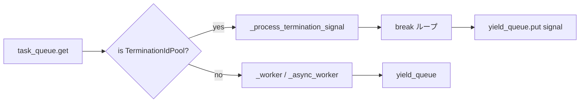

# tests/node/test_dispatch.py

> 📅 最終更新日: 2026/09/24

## 役割

`celestialflow.node.core_dispatch.TaskDispatch` が `serial` / `thread` / `async` の 3 つのスケジューリングモードで示すコア動作を検証します。タスクの正常実行、例外リトライ（成功 / 枯渇）、終了シグナルのマージによる終了、および失敗 / リトライ処理チェーン自体がクラッシュした際のフォールバックロジックを扱います。

## コアテスト対象

| クラス / 関数 | 役割 | 説明 |
|-----------|------|------|
| `TaskDispatch` | 被テスト対象 | タスクスケジューラ。`task_queue` から `TaskEnvelope` / `TerminationIdPool` を取り出し、モードに応じて実行した後に終了シグナルを `yield_queue` へ書き戻す |
| `TaskExecutor` | ホスト | スケジューラのホストとして最小限動作する実行器を構築 |
| `_CtreeStub` / `_SequentialCtreeStub` | モック | `ctree_client.emit` をインクリメンタル整数に置き換え、sqlite のユニーク制約との衝突を回避 |
| `get_log_spout()` / `get_lifecycle_spout()` | グローバルハンドル | `autouse` fixture `_cleanup_global_spouts` 内でケース前後に `stop()` し、バックグラウンドスレッドと永続化状態の干渉を防ぐ |
| `_RecordingLogInlet` / `_CrashRetryLogInlet` | 模擬 LogInlet | `worker_crash` を記録する、または `task_retry` に例外を送出させ、処理チェーンのクラッシュフォールバックを発火させる |
| `_CrashOnFailObserver` | 模擬 Observer | `on_task_fail` 内で例外を投げ、`observer_error` のフォールバックを検証 |
| `_make_executor` / `_put` / `_put_termination` / `_collect_results` / `_run_dispatch` | ユーティリティ関数 | 実行器の構築、タスク / 終了シグナルの注入、結果の収集、モードごとのスケジューラ実行 |

## 主要テストシナリオ

### `TestDispatchSerial` — 直列スケジューリング

| ケース | カバレッジ目標 |
|------|---------|
| `test_single_task` | 直列モードで単一タスクを処理し、結果が 9 になる |
| `test_multiple_tasks` | 直列モードで 5 タスクを処理し、結果数 + 終了シグナル = 6 |
| `test_retry_then_succeed` | 最初の 2 回は `ValueError`、3 回目で成功；最終的に `func.calls == 3` |
| `test_retry_exhausted` | 継続してエラーを送出する場合、出力は終了シグナルのみ |
| `test_termination_single_id` | 単一の終了 ID が結果キューに正しく伝達される |
| `test_termination_multi_id` | 複数の終了 ID をマージし、終了シグナル 1 個のみ出力 |
| `test_success_fanout_creates_distinct_downstream_ids` | 成功 fanout 時に各実際の下流ノードに対して独立した `TaskEnvelope.get_id()` を生成し、永続化された `get_success_pairs()` から結果を読み戻せる |

### `TestDispatchThread` — スレッドスケジューリング

| ケース | カバレッジ目標 |
|------|---------|
| `test_basic_parallel` | 10 タスク・4 スレッドの並列処理、結果数 = 10 |

### `TestDispatchAsync` — 非同期スケジューリング

| ケース | カバレッジ目標 |
|------|---------|
| `test_basic_async` | 10 タスク・4 コルーチンの並列処理、結果数 = 10 |
| `test_async_retry_then_succeed` | 非同期リトライ：最初の 2 回はエラー、3 回目で成功、`func.calls == 3` |

### `TestWorkerCrashKeepsTerminationSignal` — Worker クラッシュフォールバック（3 モードパラメータ化）

| ケース | カバレッジ目標 |
|------|---------|
| `test_fail_handler_crash_keeps_termination` | observer の失敗コールバックが `RuntimeError` を投げた場合、`observer_error` でフォールバック捕捉され、`worker_crash` は **トリガーされず**、終了シグナルは正常に送出される |
| `test_retry_handler_crash_keeps_termination` | `LogInlet.task_retry` が例外を投げた場合、スケジューリングは中断されず、終了シグナルは通常通り送出されるが、`worker_crash` にはその例外が記録される |

### `TestDispatchCoreBehavior` — クロスモードパラメータ化

| ケース | カバレッジ目標 |
|------|---------|
| `test_empty_queue_with_termination` | 空キュー + 終了シグナル時に 3 モードすべてが正常に終了する |
| `test_result_count` | 5 タスクが 3 モードすべてで結果数 5（終了シグナルを含まない）になる |

## 主要データフロー



## テストカバレッジマトリクス

| テストクラス | ケース数 | カバレッジ目標 |
|--------|--------|---------|
| `TestDispatchSerial` | 7 | 単一/複数タスク、リトライ成功、リトライ枯渇、単一/複数 ID 終了シグナル、成功 fanout 時の独立下流 ID |
| `TestDispatchThread` | 1 | 10 タスク並列 |
| `TestDispatchAsync` | 2 | 10 タスク並列、非同期リトライ成功 |
| `TestWorkerCrashKeepsTerminationSignal` | 2 | 失敗処理チェーンのクラッシュ、リトライログのクラッシュ（3 モードパラメータ化 → 6 ケース） |
| `TestDispatchCoreBehavior` | 2 | 空キューでの終了、5 タスクの結果数（3 モードパラメータ化 → 6 ケース） |
| **合計** | **14**（パラメータ化展開後 22） | |

## 実行方法

```bash
# すべて実行
pytest tests/node/test_dispatch.py -v

# 直列スケジューリングテストのみ
pytest tests/node/test_dispatch.py -k "Serial" -v

# スレッドスケジューリングテストのみ
pytest tests/node/test_dispatch.py -k "Thread" -v

# 非同期スケジューリングテストのみ
pytest tests/node/test_dispatch.py -k "Async" -v

# worker クラッシュフォールバックテストのみ
pytest tests/node/test_dispatch.py -k "Crash" -v

# クロスモードパラメータ化テストのみ
pytest tests/node/test_dispatch.py -k "CoreBehavior" -v
```

## パフォーマンス参考

| テストクラス | 所要時間 |
|--------|------|
| `TestDispatchSerial` | < 0.5s |
| `TestDispatchThread` | < 0.5s |
| `TestDispatchAsync` | < 0.5s |
| `TestWorkerCrashKeepsTerminationSignal` | < 1.0s（6 ケース = 2 シナリオ × 3 モード） |
| `TestDispatchCoreBehavior` | < 1.0s（6 ケース = 2 シナリオ × 3 モード） |

## 注意事項

- 各ケースには `autouse` fixture `_cleanup_global_spouts` があり、`LogSpout` / `LifecycleSpout` をケース前後で各 1 回 `stop()` し、バックグラウンドスレッドのリークや永続化状態の干渉を防ぎます。
- `_CtreeStub` の開始 ID はデフォルト 42 で、sqlite のユニーク制約との衝突を避けます。`test_success_fanout_creates_distinct_downstream_ids` では別途 `_SequentialCtreeStub`（開始 100）を使い、各下流の ID を区別します。
- 公開 API（`task_queue.put` / `yield_queue.add_queue`）経由でテストフィクスチャを注入し、`executor` の内部状態を直接変更することを避けます。`metrics.set_downstream_counter` と `yield_queue.add_queue` はペアでバインドされ、`connect_to` の動作を模擬します。
- `_RecordingLogInlet` の `_log` は空操作で、実 spout キューに依存しません。
- `monkeypatch.setattr` で `get_log_inlet` を置き換える際は、`celestialflow.node.core_node` と `celestialflow.node.core_dispatch` の両方を上書きする必要があります（両方から呼ばれるため）。
- 関連実装は `src/celestialflow/node/core_dispatch.py` および `src/celestialflow/node/core_node.py` にあります。
