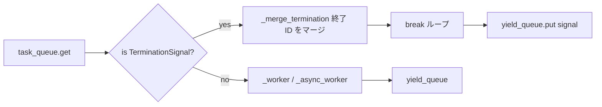

# tests/node/test_dispatch.py

> 📅 最終更新日: 2026/10/09

## 役割

`celestialflow.node.core_dispatch.TaskDispatch` が `serial` / `thread` / `async` の 3 つのスケジューリングモードで示すコア動作を検証します。タスクの正常実行、例外リトライ（成功 / 枯渇）、終了シグナルのマージによる終了、および失敗 / リトライ処理チェーン自体がクラッシュした際に observer hub が分離して終了シグナルを通常通り送出するフォールバックロジックを扱います。

## コアテスト対象

| クラス / 関数 | 役割 | 説明 |
|-----------|------|------|
| `TaskDispatch` | 被テスト対象 | タスクスケジューラ。`task_queue` から `TaskEnvelope` / `TerminationSignal` を取り出し、モードに応じて実行した後に終了シグナルを `yield_queue` へ書き戻す |
| `TaskExecutor` | ホスト | スケジューラのホストとして最小限動作する実行器を構築 |
| `_CtreeStub` / `_SequentialCtreeStub` | モック | `ctree_client.emit` をインクリメンタル整数に置き換え、sqlite のユニーク制約との衝突を回避 |
| `MetricsObserver` | 指標オブザーバー | `_make_executor` が `e.observers.add_observer(...)` で登録、指標はイベントに追従して更新。テストは `metrics_of(executor)` で読み取り |
| `_CrashOnFailObserver` | 模擬 Observer | `on_task_fail` 内で例外を投げ、observer hub の異常分離を検証 |
| `_CrashOnRetryObserver` | 模擬 Observer | `on_task_retry` 内で例外を投げ、リトライ処理チェーンクラッシュのフォールバックを検証 |
| `_RecordingCrashObserver` | 模擬 Observer | `on_worker_crash` イベントを記録し、クラッシュが worker 層に上浮しないことを検証 |
| `_make_executor` / `_put` / `_put_termination` / `_collect_results` / `_run_dispatch` | ユーティリティ関数 | 実行器の構築、タスク / 終了シグナルの注入、結果の収集、モードごとのスケジューラ実行 |

`_make_executor` の主要構成：
- `TaskExecutor(name, func, max_retries=...)` + `set_retry_exceptions(ValueError)`
- `e.ctree_client = _CtreeStub()`
- 単一ノードの `MetricsObserver` を登録（`node.run` パスを模擬）
- 公開 API `e.yield_queue.add_queue("test_collector", collector)` で結果収集キューを登録。結果は `_RESULT_COLLECTORS[e]` の弱参照マッピングで遡及

## 主要テストシナリオ

### `TestDispatchSerial` — 直列スケジューリング

| ケース | カバレッジ目標 |
|------|---------|
| `test_single_task` | 直列モードで単一タスクを処理し、結果が 9 になる |
| `test_multiple_tasks` | 直列モードで 5 タスクを処理し、結果数 + 終了シグナル = 6 |
| `test_retry_then_succeed` | 最初の 2 回は `ValueError`、3 回目で成功；最終的に `func.calls == 3` |
| `test_retry_exhausted` | 継続してエラーを送出する場合、出力は終了シグナルのみ |
| `test_termination_single_id` | 単一の終了 ID が結果キューに正しく伝達される |
| `test_termination_multi_id` | 複数の終了 ID をマージし、終了シグナル 1 個のみ出力 |
| `test_success_fanout_creates_distinct_downstream_ids` | 成功 fanout 時に各実際の下流ノードに対して独立した `TaskEnvelope.get_id()` を生成し、`LifecycleSpout` で永続化後に `get_success_pairs()` から結果を読み戻せる |

### `TestDispatchThread` — スレッドスケジューリング

| ケース | カバレッジ目標 |
|------|---------|
| `test_basic_parallel` | 10 タスク・4 スレッドの並列処理、結果数 = 10 |

### `TestDispatchAsync` — 非同期スケジューリング

| ケース | カバレッジ目標 |
|------|---------|
| `test_basic_async` | 10 タスク・4 コルーチンの並列処理、結果数 = 10 |
| `test_async_retry_then_succeed` | 非同期リトライ：最初の 2 回はエラー、3 回目で成功、`func.calls == 3` |

### `TestWorkerCrashKeepsTerminationSignal` — Worker クラッシュフォールバック（3 モードパラメータ化）

| ケース | カバレッジ目標 |
|------|---------|
| `test_fail_handler_crash_keeps_termination` | `on_task_fail` observer コールバック内で `RuntimeError` を投げた場合、observer hub が異常を分離し、`on_worker_crash` は **トリガーされず**、終了シグナルは正常に送出され、失敗カウント == 1 |
| `test_retry_handler_crash_keeps_termination` | `on_task_retry` observer コールバック内で例外を投げた場合、スケジューリングは中断されず、終了シグナルは通常通り送出され、`on_worker_crash` はトリガーされず、最終的に 1 回の失敗として計上される |

### `TestDispatchCoreBehavior` — クロスモードパラメータ化

| ケース | カバレッジ目標 |
|------|---------|
| `test_empty_queue_with_termination` | 空キュー + 終了シグナル時に 3 モードすべてが正常に終了する |
| `test_result_count` | 5 タスクが 3 モードすべてで結果数 5（終了シグナルを含まない）になる |

## 主要データフロー


```mermaid
flowchart LR
    In[task_queue.get] --> Sig{is TerminationSignal?}
    Sig -- yes --> Merge[_merge_termination 終了 ID をマージ]
    Merge --> Break[break ループ]
    Sig -- no --> Worker[_worker / _async_worker]
    Worker --> Out[yield_queue]
    Break --> Put[yield_queue.put signal]
```

## テストカバレッジマトリクス

| テストクラス | ケース数 | カバレッジ目標 |
|--------|--------|---------|
| `TestDispatchSerial` | 7 | 単一/複数タスク、リトライ成功、リトライ枯渇、単一/複数 ID 終了シグナル、成功 fanout 時の独立下流 ID |
| `TestDispatchThread` | 1 | 10 タスク並列 |
| `TestDispatchAsync` | 2 | 10 タスク並列、非同期リトライ成功 |
| `TestWorkerCrashKeepsTerminationSignal` | 2 | 失敗処理チェーンのクラッシュ、リトライ処理チェーンのクラッシュ（3 モードパラメータ化 → 6 ケース） |
| `TestDispatchCoreBehavior` | 2 | 空キューでの終了、5 タスクの結果数（3 モードパラメータ化 → 6 ケース） |
| **合計** | **14**（パラメータ化展開後 22） | |

## 実行方法

```bash
# すべて実行
pytest tests/node/test_dispatch.py -v

# 直列スケジューリングテストのみ
pytest tests/node/test_dispatch.py -k "Serial" -v

# スレッドスケジューリングテストのみ
pytest tests/node/test_dispatch.py -k "Thread" -v

# 非同期スケジューリングテストのみ
pytest tests/node/test_dispatch.py -k "Async" -v

# worker クラッシュフォールバックテストのみ
pytest tests/node/test_dispatch.py -k "Crash" -v

# クロスモードパラメータ化テストのみ
pytest tests/node/test_dispatch.py -k "CoreBehavior" -v
```

## パフォーマンス参考

| テストクラス | 所要時間 |
|--------|------|
| `TestDispatchSerial` | < 0.5s |
| `TestDispatchThread` | < 0.5s |
| `TestDispatchAsync` | < 0.5s |
| `TestWorkerCrashKeepsTerminationSignal` | < 1.0s（6 ケース = 2 シナリオ × 3 モード） |
| `TestDispatchCoreBehavior` | < 1.0s（6 ケース = 2 シナリオ × 3 モード） |

## 注意事項

- 終了シグナルは公開 API `executor.task_queue.put(TerminationSignal(_id=..., source="input"))` で注入され、スケジューラの `_merge_termination()` が自然にマージしてループを終了します。内部の終了 ID プールを直接操作しません。
- `_CtreeStub` の開始 ID はデフォルト 42 で、sqlite のユニーク制約との衝突を避けます。`test_success_fanout_creates_distinct_downstream_ids` では別途 `_SequentialCtreeStub`（開始 100）を使い、各下流の ID を区別します。
- `test_success_fanout_creates_distinct_downstream_ids` は dispatch を（`node.run` を経由せず）直接駆動するため、`LifecycleSpout` / `LifecycleInlet` を手動で組み立て、executor に登録して永続化のリグレッションを模擬します。
- 公開 API（`task_queue.put` / `yield_queue.add_queue`）経由でテストフィクスチャを注入し、`executor` の内部状態を直接変更することを避けます。結果収集キューは弱参照辞書で遡及します。
- 失敗 / リトライ observer が投げた例外は observer hub 層で分離されます。`_RecordingCrashObserver` の `on_worker_crash` がトリガーされないこと、つまりエラーが worker スレッドへ漏れないことを検証します。
- 関連実装は `src/celestialflow/node/core_dispatch.py` および `src/celestialflow/node/core_node.py` にあります。