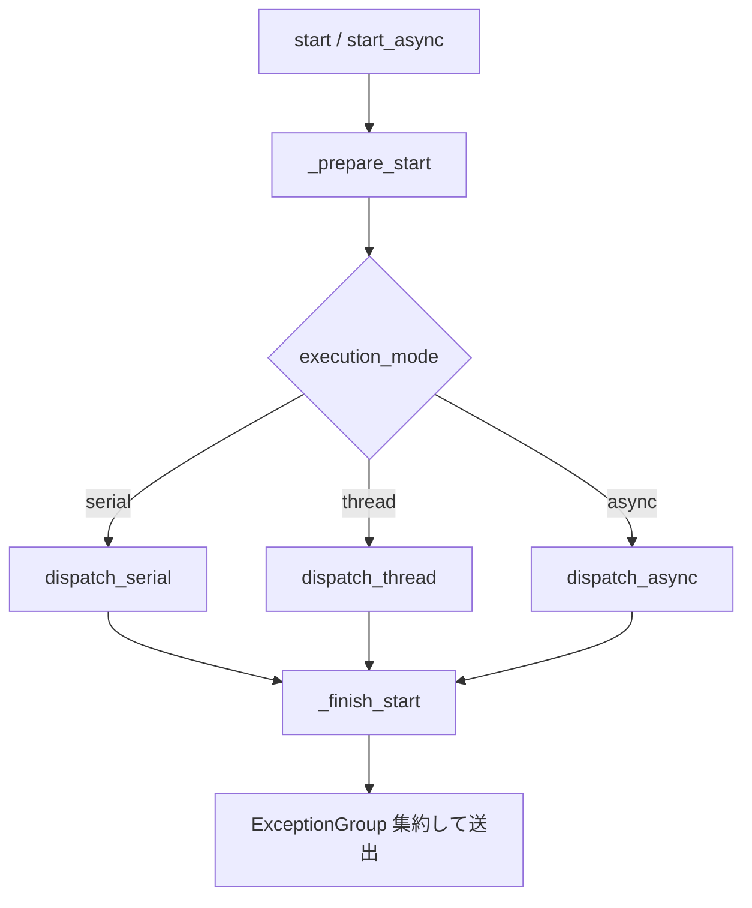

# tests/node/test_node.py

> 📅 最終更新日: 2026/09/24

## 役割

`celestialflow.node.core_node.BaseTaskNode`（公開サブクラス `TaskExecutor` を介して間接的にカバー）が提供する汎用設定、紐付け、起動時例外集約の振る舞いを検証します。`get_snapshot` / `get_meta` のフィールド区分、および `connect_to` が確立するカウントバインドが実行モード切替後も安定していることを含みます。

## コアテスト対象

| クラス / 関数 | 役割 | 説明 |
|-----------|------|------|
| `add_one(x)` | テストコールバック | 同期加算関数 |
| `async_add_one(x)` | テストコールバック | 非同期加算コルーチン関数 |
| `TestBaseTaskNodeConfig` | ケースクラス | 名称、実行モード、スナップショット / メタ情報、モード切替時の下流バインド保持をカバー |
| `TestBaseTaskNodeStartErrors` | ケースクラス | `start` / `start_async` の例外集約挙動をカバー |

## 主要テストシナリオ

### `TestBaseTaskNodeConfig` — 設定と紐付け

| ケース | カバレッジ目標 |
|------|---------|
| `test_node_name_identity` | ノード名がコンストラクタ引数 `name` から直接取得される |
| `test_node_name_changes_with_name` | `set_name(...)` で名称変更後、`get_name()` も同期更新される |
| `test_valid_execution_mode_serial` | `execution_mode="serial"` に対応 |
| `test_valid_execution_mode_thread` | `execution_mode="thread"` に対応 |
| `test_valid_execution_mode_async` | `execution_mode="async"` に対応（`async_add_one` を使用） |
| `test_invalid_execution_mode` | 不正なモードで `InvalidOptionError` が送出される |
| `test_snapshot_excludes_build_time_fields` | `get_snapshot()` は構築期フィールド `name` / `class_name` / `execution_mode` / `max_workers` を含まなくなる |
| `test_get_meta_reports_build_time_fields` | `get_meta()` は `class_name` / `execution_mode` / `max_workers` のみを返す |
| `test_snapshot_tolerates_not_started_node` | ノード未起動時に `get_snapshot()` が `start_time` の欠落でクラッシュしない（`status == 0`、`start_time == 0.0`、`elapsed_time == 0`） |
| `test_connect_to_binding_survives_execution_mode_switch` | `connect_to` が確立した下流 / 上流の共有カウンタが `set_execution_mode("thread")` 後も同一オブジェクトを保ち、カウントが加算され続ける |

### `TestBaseTaskNodeStartErrors` — 起動例外の集約

| ケース | カバレッジ目標 |
|------|---------|
| `test_start_raises_exception_group_after_finish` | `monkeypatch` で `_prepare_start` が `ValueError("prepare failed")` を投げ、`_finish_start` が `[RuntimeError("finish failed")]` を返すように細工する。同期 `start()` が最終的に `ExceptionGroup` を投げ、内部の 2 つの例外が "prepare → finish" の順で格納される |
| `test_start_async_raises_exception_group_after_finish` | 非同期バージョンも同様に prepare 例外と finish 例外を集約して `ExceptionGroup` を投げる |

## 主要データフロー



## テストカバレッジマトリクス

| テストクラス | ケース数 | カバレッジ目標 |
|--------|--------|---------|
| `TestBaseTaskNodeConfig` | 10 | 名称の識別と変更、3 種の合法的な実行モード、不正モードでのエラー、スナップショット / メタ情報のフィールド区分、未起動スナップショットの耐障害性、モード切替で下流バインドが破壊されないこと |
| `TestBaseTaskNodeStartErrors` | 2 | 同期 / 非同期 `start*` の例外集約 |
| **合計** | **12** | |

## 実行方法

```bash
# すべて実行
pytest tests/node/test_node.py -v

# 設定関連ケースのみ
pytest tests/node/test_node.py -k "Config" -v

# 起動例外集約ケースのみ
pytest tests/node/test_node.py -k "StartErrors" -v

# 実行モード関連ケースのみ
pytest tests/node/test_node.py -k "execution_mode" -v
```

## パフォーマンス参考

| テストクラス | 所要時間 |
|--------|------|
| `TestBaseTaskNodeConfig` | < 0.5s |
| `TestBaseTaskNodeStartErrors` | < 0.5s |

## 注意事項

- `test_connect_to_binding_survives_execution_mode_switch` は回帰テストで、過去の「`TaskMetrics` が実行モード切替時にカウンタを再構築し、下流バインドが無効化される」問題をカバーします。現在のバージョンでは `connect_to` が `metrics.set_downstream_counter` / `set_upstream_counter` を介して上流と下流が同一のカウンタオブジェクトを共有するようにします。
- `get_snapshot()` は実行期フィールド（`start_time` / `status` / `elapsed_time` / カウント / `upstream_counts` / `downstream_counts`）のみを収集し、構築期フィールドは `get_meta()` がグラフ構造とともに一度に報告するようになり、状態プッシュのたびに重複転送することを避けます。
- `TestBaseTaskNodeStartErrors` は `monkeypatch.setattr` で `_prepare_start` と `_finish_start` という **内部フック** を置き換えます。これはテストと実装が同じパッケージ内に存在することを必要としますが、`celestialflow.node` からの公開エクスポートにより保証されています。
- `ExceptionGroup` は Python 3.11+ でのみ利用可能です。本リポジトリは Python 3.14 をベースにしているため要件を満たします。
- 関連実装は `src/celestialflow/node/core_node.py` にあります。
