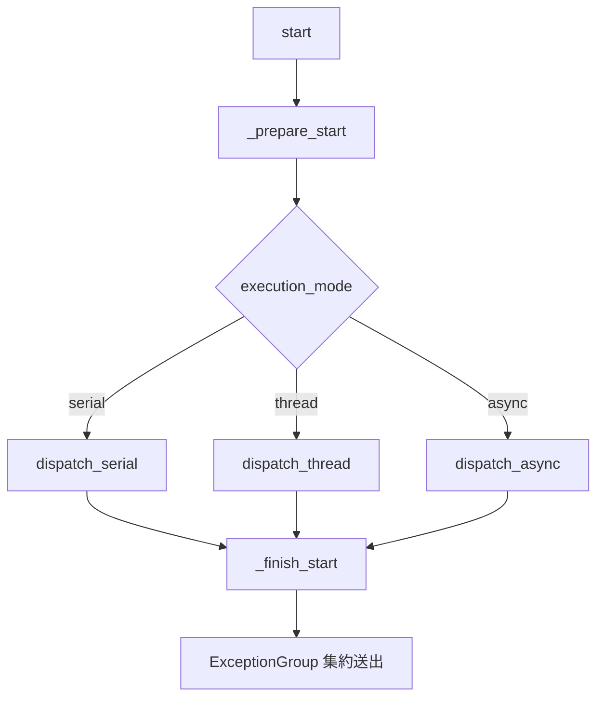

# ノード基底クラステスト (test_node.py)

> 📅 最終更新日: 2026/09/10

## 役割

`celestialflow.node.core_node.BaseTaskNode`（公開サブクラス `TaskExecutor` を介して間接的にカバー）が提供する汎用設定、紐付け、起動時例外集約の振る舞いを検証します。

## コアテスト対象

| クラス / 関数 | 役割 | 説明 |
|-----------|------|------|
| `add_one(x)` | テストコールバック | 同期加算関数 |
| `async_add_one(x)` | テストコールバック | 非同期加算コルーチン関数 |
| `TestBaseTaskNodeConfig` | ケースクラス | 名称、実行モード、スナップショット、モード切替時の前駆バインド保持をカバー |
| `TestBaseTaskNodeStartErrors` | ケースクラス | `start` / `start_async` の例外集約挙動をカバー |

## 主要テストシナリオ

### `TestBaseTaskNodeConfig` — 設定と紐付け

| ケース | カバレッジ目標 |
|------|---------|
| `test_node_name_identity` | ノード名がコンストラクタ引数 `name` から直接取得される |
| `test_node_name_changes_with_name` | `set_name(...)` で名称変更後、`get_name()` も同期更新される |
| `test_valid_execution_mode_serial` | `execution_mode="serial"` に対応 |
| `test_valid_execution_mode_thread` | `execution_mode="thread"` に対応 |
| `test_valid_execution_mode_async` | `execution_mode="async"` に対応（`async_add_one` を使用） |
| `test_invalid_execution_mode` | 不正なモードで `InvalidOptionError` が送出される |
| `test_snapshot_contains_execution_mode` | `snapshot(interval=0.1)` が返す dict に `execution_mode` フィールドが含まれる |
| `test_prev_binding_survives_execution_mode_switch` | `prev_binding` で前駆をバインド後、`set_execution_mode("thread")` を呼んでも既存のカウンタ関係が破壊されない（`metrics.get_task_count()` が前後で一致） |

### `TestBaseTaskNodeStartErrors` — 起動例外の集約

| ケース | カバレッジ目標 |
|------|---------|
| `test_start_raises_exception_group_after_finish` | `monkeypatch` で `_prepare_start` が `ValueError("prepare failed")` を投げ、`_finish_start` が `[RuntimeError("finish failed")]` を返すように細工する。同期 `start()` が最終的に `ExceptionGroup` を投げ、内部の 2 つの例外が "prepare → finish" の順で格納される |
| `test_start_async_raises_exception_group_after_finish` | 非同期バージョンも同様に prepare 例外と finish 例外を集約して `ExceptionGroup` を投げる |

## 主要データフロー



## テストカバレッジマトリクス

| テストクラス | ケース数 | カバレッジ目標 |
|--------|--------|---------|
| `TestBaseTaskNodeConfig` | 8 | 名称の識別と変更、3 種の合法的な実行モード、不正モードでのエラー、スナップショットフィールド、モード切替で前駆バインドが破壊されないこと |
| `TestBaseTaskNodeStartErrors` | 2 | 同期 / 非同期 `start*` の例外集約 |
| **合計** | **10** | |

## 実行方法

```bash
# すべて実行
pytest tests/node/test_node.py -v

# 設定関連ケースのみ
pytest tests/node/test_node.py -k "Config" -v

# 起動例外集約ケースのみ
pytest tests/node/test_node.py -k "StartErrors" -v

# 実行モード関連ケースのみ
pytest tests/node/test_node.py -k "execution_mode" -v
```

## パフォーマンス参考

| テストクラス | 所要時間 |
|--------|------|
| `TestBaseTaskNodeConfig` | < 0.5s |
| `TestBaseTaskNodeStartErrors` | < 0.5s |

## 注意事項

- `test_prev_binding_survives_execution_mode_switch` は回帰テストで、過去の「`TaskMetrics` が実行モード切替時にカウンタを再構築し、前駆バインドが無効化される」問題をカバーします。現在のバージョンでは `TaskMetrics` が同一の `threading.Lock` を使い続けることで統計オブジェクトの安定性を保証しています。
- `TestBaseTaskNodeStartErrors` は `monkeypatch.setattr` で `_prepare_start` と `_finish_start` という **内部フック** を置き換えます。これはテストと実装が同じパッケージ内に存在することを必要としますが、`celestialflow.node` からの公開エクスポートにより保証されています。
- `ExceptionGroup` は Python 3.11+ でのみ利用可能です。本リポジトリは Python 3.14 をベースにしているため要件を満たします。
- 関連実装は `src/celestialflow/node/core_node.py` にあります。
