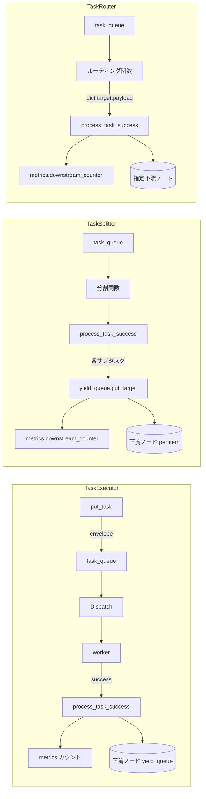

# tests/node/test_nodes.py

> 📅 最終更新日: 2026/09/24

## 役割

`celestialflow.node.core_nodes` 内の 3 つの具象ノードクラス `TaskExecutor` / `TaskSplitter` / `TaskRouter` の実行・分割・ルーティング挙動を検証します。直列 / スレッド / 非同期の 3 つの実行モード、sqlite からの永続化リプレイ、ノード初期化制約、ルーティングの未知 target エラー、バインドカウンタの安定ロックをカバーします。

## コアテスト対象

| クラス / 関数 | 役割 | 説明 |
|-----------|------|------|
| `TaskExecutor` | 被テスト対象 | 汎用エグゼキュータ。`serial` / `thread` / `async`、例外処理、retry、restore_db、結果永続化を検証 |
| `TaskSplitter` | 被テスト対象 | 1→N スプリッタ。`metrics.downstream_counter`、空イテラブル、ジェネレータ、カスタム分割関数を検証 |
| `TaskRouter` | 被テスト対象 | ルータ。`func` は `dict[str, Y]` マッピングを返す；`metrics.downstream_counter`、未知 target で `InvalidOptionError`、安定ロックを検証 |
| `append_records` | ユーティリティ | `celestialflow.persistence.util_sqlite` を介して failed / pending レコードを直接書き込み、リプレイテストに使用 |
| `build_result_dict` | ユーティリティ | `get_success_pairs` と `get_error_pairs` を集約して `{task: result_or_error_str}` を構築 |

## 主要テストシナリオ

### `TestTaskExecutor` — エグゼキュータ（14 ケース）

| ケース | カバレッジ目標 |
|------|---------|
| `test_serial_basic` | 直列実行 5 タスク、succeeded=5、failed=0、pending=0 |
| `test_serial_with_errors` | 直列実行 `[1,-1,2,-2,3]`、`PersistedError.error_type == "ValueError"`、succeeded=3 / failed=2 |
| `test_serial_retry` | `RuntimeError` をリトライ可能として登録；最初の 2 回失敗後、3 回目で `x+100` を返却、`call_count == 3` |
| `test_serial_no_retry_for_unmatched_exception` | 未登録のリトライ可能例外はリトライをトリガせず、直接 failed になる |
| `test_thread_basic` | スレッドモード（4 worker）で 5 タスクを正常処理 |
| `test_async_basic` | 非同期モードで 3 タスクを正常処理 |
| `test_async_double` | 非同期モードで 20 タスクを連続処理 |
| `test_restore_db` | デフォルトでは自ノード `stage == self.get_name()` の failed / pending のみ読み取り、3 件の成功をリプレイ |
| `test_restore_db_filters_error_type_when_enabled` | `filter_by_error_type=True` + `set_retry_exceptions(RuntimeError)` 時、RuntimeError のみリプレイ |
| `test_restore_db_filter_keeps_pending_records` | フィルタ有効時でも `pending` レコードは常に保持される |
| `test_success_persist` | 成功結果が `LifecycleSpout` キャッシュに書き込まれ、`get_success_pairs()` から読み戻せる |
| `test_rejects_zero_argument_func` | 0 引数関数は `ConfigurationError` を送出する |
| `test_rejects_multi_argument_func` | 多引数関数は `ConfigurationError` を送出する |
| `test_name_and_execution_mode` | `get_name()` と `execution_mode` が正しく公開される |

### `TestTaskSplitter` — スプリッタ（5 ケース）

| ケース | カバレッジ目標 |
|------|---------|
| `test_splitter_init` | デフォルト `execution_mode="serial"`、`metrics.downstream_counter == {}` |
| `test_splitter_process_success` | `TaskGraph` 直列接続後の下流 `tasks_succeeded == 3`、`downstream_counter["A"].get() == 3` |
| `test_splitter_allows_empty_iterable` | 空イテラブルは例外を投げず、下流 succeeded=0、送信カウント=0 |
| `test_splitter_supports_generator_input` | 一度きりジェネレータも完全に分割される（送信カウント=3） |
| `test_splitter_custom_func_transforms_items` | カスタム分割関数（`lambda task: (item.strip() for item in task)`）がサブタスクを変換してから分配し、下流の結果が `["a", "b", "c"]` になる |

### `TestTaskRouter` — ルータ（6 ケース）

| ケース | カバレッジ目標 |
|------|---------|
| `test_router_init` | デフォルト `serial`、`metrics.downstream_counter == {}` |
| `test_router_func_returns_target_payload_map` | `func(task)` が `{target: payload}` マッピングを返す |
| `test_router_process_success` | `TaskGraph` 内の 2 つの下流 `target1` / `target2` がそれぞれ 1 件ずつ受信、`downstream_counter` もそれぞれ = 1 |
| `test_router_unknown_target_fails_with_hint` | 接続済み target へは正常に配送；未接続 target は失敗としてカウントされ、エラーメッセージに `Unknown target: ghost` と許可 target の一覧が含まれる |
| `test_router_dispatch_targets_receive_own_payload` | 1 回のルーティングで複数 target を返す場合、各下流はルータの入力ではなく自身のペイロードを受け取る |
| `test_router_binding_counter_stable_across_mode_switch` | ルーティングカウンタは生成時から `metrics` にバインドされ、`execution_mode` を切り替えても同一カウンタオブジェクトが変わらない |

## 主要データフロー



## テストカバレッジマトリクス

| テストクラス | ケース数 | カバレッジ目標 |
|--------|--------|---------|
| `TestTaskExecutor` | 14 | 3 つの実行モード、retry ヒット / 非ヒット、sqlite リプレイ（error_type フィルタ含む）、永続化、コールバックシグネチャ検証 |
| `TestTaskSplitter` | 5 | デフォルトパラメータ、グラフ統合、空イテラブル、ジェネレータ、カスタム分割関数 |
| `TestTaskRouter` | 6 | デフォルトパラメータ、`func` の返すマッピング、グラフ統合、未知 target エラー、ペイロード別配送、安定ロック |
| **合計** | **25** | |

## 実行方法

```bash
# すべて実行
pytest tests/node/test_nodes.py -v

# TaskExecutor テストのみ
pytest tests/node/test_nodes.py -k "TaskExecutor" -v

# TaskSplitter テストのみ
pytest tests/node/test_nodes.py -k "TaskSplitter" -v

# TaskRouter テストのみ
pytest tests/node/test_nodes.py -k "TaskRouter" -v

# sqlite リプレイケースのみ
pytest tests/node/test_nodes.py -k "restore_db" -v
```

## パフォーマンス参考

| テストクラス | 所要時間 |
|--------|------|
| `TestTaskExecutor` | < 2.0s（sqlite 永続化とリプレイを含む） |
| `TestTaskSplitter` | < 1.0s |
| `TestTaskRouter` | < 1.0s |

## 注意事項

- `test_restore_db*` ケースは `append_records` で sqlite に直接書き込み、`load_tasks_grouped_by_stage` のリプレイロジックを検証します。レコードの `stage` フィールドはノード名（`TaskGraph` の `set_nodes` と一致）です。
- `test_router_unknown_target_fails_with_hint` は、`TaskRouter.process_task_success` が `connect_to` でバインドされていない target に対して `InvalidOptionError` を送出し、エラーメッセージに `Unknown target: <name>` と現在許可されている target の一覧が含まれることをアサートします。
- `test_router_binding_counter_stable_across_mode_switch` は回帰テストで、過去にバインドカウンタがモードの違いにより `TaskMetrics` の再構築で参照を失う問題をカバーします。現在のバージョンでは `connect_to` によって上流と下流が同一のカウンタオブジェクトを共有します。
- 非同期ケースには `pytest-asyncio` プラグインが必要です（プロジェクトで `pytest.mark.asyncio` を設定済み）。
- 永続化関連ケースはグローバルの `LifecycleSpout` / `LogSpout` に依存します。分離したい場合はカスタム fixture で明示的に `start()` / `stop()` してください。
- 関連実装は `src/celestialflow/node/core_nodes.py` にあります。
