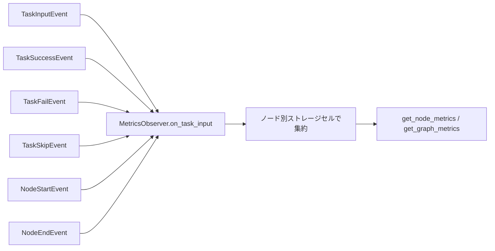

# tests/observer/test_metrics.py

> 📅 最終更新日: 2026/10/09

## 役割

`celestialflow.observer.MetricsObserver` のイベント駆動型の指標集約ロジックを検証します。外部 / 上流入力のカウント、成功 / 失敗 / スキップのカウント、ノード実行状態の維持、ノード別に隔離されたグラフレベルの指標ビューを検証します。リファクタリング後、`MetricsObserver` は旧来の `core_report` 報告ロジックに取って代わり、指標オブザーバーとしてイベントに応じて更新されます。

## コアテスト対象

| クラス / 関数 | ソース | 説明 |
|-----------|------|------|
| `MetricsObserver` | `celestialflow.observer` | 指標オブザーバー。`NodeStartEvent` / `NodeEndEvent` / `TaskInputEvent` / `TaskSuccessEvent` / `TaskFailEvent` / `TaskSkipEvent` イベントを消費し指標を集約 |
| `get_node_metrics(name)` | MetricsObserver | 単一ノードの指標を返す。未登録ノードは `None` を返す |
| `get_graph_metrics()` | MetricsObserver | 登録済み全ノードの指標スナップショットマップを返す |
| `NodeStatus` | `celestialflow.runtime.util_types` | ノード状態の列挙（`RUNNING` / `STOPPED`） |
| `_external_input` / `_upstream_input` | ユーティリティ関数 | 外部入力 / 上流配信の `TaskInputEvent` を構築 |

## テストカバレッジマトリックス

### `TestMetricsObserverStorage` — 保存と読み取り

| ケース | カバレッジ対象 |
|------|---------|
| `test_unknown_node_returns_none` | 未登録ノードの `get_node_metrics("ghost")` が `None` を返す |

### `TestMetricsObserverEvents` — イベント集約

| ケース | カバレッジ対象 |
|------|---------|
| `test_external_input_counted` | 外部入力は受信側のカウントのみ増加：`external_input == 1`、`input_total == 1` |
| `test_upstream_input_updates_both_sides` | 上流配信は同時に受信側の上流カウント `upstream_counts` とソース側の下流カウント `downstream_counts` に書き込む |
| `test_success_fail_skip_counts` | 成功 / 失敗 / スキップイベントがそれぞれ `succeeded` / `failed` / `skipped` に書き込まれ、`processed` はこの三者合計 |
| `test_node_status_transitions` | `on_node_start` で状態が `RUNNING` かつ `start_time > 0` に、`on_node_end` で状態が `STOPPED` に設定される |

### `TestMetricsObserverGraphView` — グラフレベルビュー

| ケース | カバレッジ対象 |
|------|---------|
| `test_cells_are_isolated_between_nodes` | ノード間のストレージセルは互いに影響しない：操作されたノードの `succeeded` のみ変化 |
| `test_graph_metrics_covers_all_registered_nodes` | `get_graph_metrics()` が登録済み全ノード（`{"a", "b"}`）をカバー |

## 主要データフロー



> 指標はノード別に隔離して保存されます。`downstream_counts` / `upstream_counts` はノード間の実際のデータ配信方向と回数を記録します。

## 実行方法

```bash
# 全部実行
pytest tests/observer/test_metrics.py -v

# 保存 / 読み取りテストのみ実行
pytest tests/observer/test_metrics.py -k "Storage" -v

# イベント集約テストのみ実行
pytest tests/observer/test_metrics.py -k "Events" -v

# グラフレベルビューテストのみ実行
pytest tests/observer/test_metrics.py -k "GraphView" -v
```

## 注意事項

- `MetricsObserver` は純粋なイベント駆動で指標を更新します。テストは `on_*` イベントメソッドを直接呼び出してライフサイクルをシミュレートするため、実際のタスクグラフを実行する必要はありません。
- 上流配信は一方で受信側（`upstream_counts` / `upstream_input`）、もう一方でソース側（`downstream_counts`）に書き込み、両者は同一イベント内で完了します。
- 関連実装は `src/celestialflow/observer/core_metrics.py` にあります。