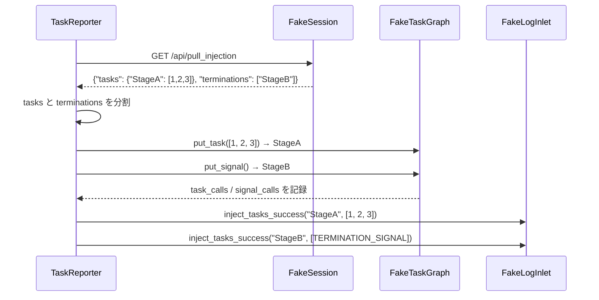

# tests/observability/test_reporter.py

> 📅 最終更新日: 2026/09/24

## 役割

`celestialflow.observability.core_report` の `TaskReporter` におけるタスク注入、エラープッシュ、グラフメタ情報プッシュ、状態プッシュのロジックを検証します。Reporter がリモートから分割済みのタスクと終了シグナルのペイロードを取得した後、ノードごとに正しく `put_task` / `put_signal` を呼び出して注入できるかどうか。同時に、エラープッシュのエンドポイント選択とサーバ側水位線に基づく増分プッシュ、グラフメタ情報の一括プッシュ、および状態スナップショットの重複排除とコンテキスト切替時の強制プッシュ挙動を検証します。

## コアテスト対象

| クラス | 種類 | 説明 |
|----|------|------|
| `FakeResponse` / `FakePostResponse` | Mock | HTTP GET/POST レスポンスをシミュレート |
| `FakeSession` / `FakePushSession` | Mock | `requests.Session` の GET/POST メソッドをシミュレートし、呼び出しを記録 |
| `FakeTaskGraph` / `FakeErrorGraph` | Mock | グラフ注入インターフェースとエラークエリインターフェースをシミュレート |
| `FakeNode` | Mock | 単一ノードの `put_task` / `put_signal` 呼び出しを記録 |
| `FakeStatusNode` / `FakeStatusGraph` | Mock | 手動で変更可能な `get_snapshot()` と `get_graph_id()` を提供 |
| `FakeLogInlet` | Mock | 注入成功/失敗、取得失敗、エラープッシュ失敗、状態プッシュ失敗のログを記録 |
| `TaskReporter` | 被テストクラス | `celestialflow.observability` 内の注入・レポーター |

## 主要テストシナリオ

### `test_reporter_accepts_split_task_and_termination_payload`

**カバレッジ目標**: `TaskReporter._pull_injection()` がサーバーから返された分割ペイロード `{"tasks": {...}, "terminations": [...]}` を消費し、タスクと終了シグナルをそれぞれ `put_task` / `put_signal` 経由で対応するノードに注入できることを検証。

**アサーションの意図**:

- `StageA` の `task_calls` にタスクバッチ `[1, 2, 3]` を含み、`signal_calls` は 0。
- `StageB` の `task_calls` は空だが、`signal_calls` は 1（終了シグナルのみが注入される）。
- `log_inlet.successes` に2件の成功ログを記録：StageA のタスク注入 `(StageA, [1, 2, 3])` と StageB の終了シグナル注入 `(StageB, [TERMINATION_SIGNAL])`。
- 失敗ログなし（`failures`、`pull_failures` がともに空）。
- `monkeypatch.setattr` で `celestialflow.observability.core_report.get_log_inlet` を `log_inlet` を返す関数に差し替え、グローバルなログインジェクタを隔離する。



### `test_reporter_merges_tasks_and_termination_for_same_stage`

**カバレッジ目標**: 同一ノードが `tasks` と `terminations` の両方に同時に現れた場合、タスクリストを保持しつつ当該ノードで追加の `put_signal()` を呼び出し、互いに上書きしないことを検証。

**アサーションの意図**:

- `StageA` の `task_calls` は `[1, 2, 3]` のみを含み（タスクと終了シグナルはそれぞれ `put_task` / `put_signal` で呼び出し）、`signal_calls` は 1。
- `log_inlet.successes` に2件の記録が含まれる：先に `(StageA, [1, 2, 3])`（タスク注入）、続いて `(StageA, [TERMINATION_SIGNAL])`（終了シグナル注入）。

### `test_reporter_pushes_errors_via_push_errors_endpoint_only`

**カバレッジ目標**: `TaskReporter._push_errors()` が `/api/push_errors` エンドポイントのみを通じてエラーをプッシュすることを検証。

- sqlite エラーレコードを 1 件書き込む。
- `_server_has_current_graph = False` を設定（全量プッシュをトリガー）。
- POST 先 URL の末尾が `/api/push_errors` であることをアサート。
- ペイロードに `graph_id` と `errors` フィールドが含まれ、エラーレコードのフィールドが sqlite レコードと一致することをアサート（`id` / `event_id` / `stage` / `status` / `error_type` / `error_message` / `ts` / `task_json` / `result_json` / `retry_times` を含む）。

### `test_reporter_pushes_only_errors_after_server_max_event_id`

**カバレッジ目標**: Reporter が failed レコードのうち、`event_id` がサーバー側の水位線より大きいもののみをプッシュすることを検証。

- 3 件のエラーレコードを書き込む（`event_id=1,5,7`）。
- `_server_has_current_graph = True`、`_server_max_event_id_in_fail = 3` を設定。
- `event_id` が 5 と 7 のレコードのみがプッシュされることをアサート。

### `test_reporter_pushes_graph_meta_in_one_request`

**カバレッジ目標**: グラフ構造、ノードメタ情報、解析結果が単一の `_push_graph_meta()` でプッシュされ、状態プッシュと互いに重ならないことを検証。

- `StageA`（`thread`、`max_workers=3`）と `StageB`（デフォルト `serial`）を含む `TaskGraph` を構築。
- `_push_graph_meta()` と `_push_status()` を順に呼び出し、合計 2 回の POST（`/api/push_graph_meta` と `/api/push_status`）が発生することをアサート。
- メタ情報ペイロードの `nodes == ["StageA", "StageB"]`、`analysis["graphId"]` と `analysis["layersDict"]` が存在することをアサート。
- `node_meta["StageA"] == {"class_name": "TaskExecutor", "execution_mode": "thread", "max_workers": 3}`、`StageB` が `serial` であることをアサート。
- 状態ペイロードの各ノードのフィールドが `node_meta` の対応項目と **相互排他**（構築期フィールドが重複して出現しない）であることをアサート。

### `test_reporter_pushes_status_only_when_snapshot_changes`

**カバレッジ目標**: 状態スナップショットが変化しない場合は再プッシュせず、変化後にのみ新しいスナップショットをプッシュすることを検証。

- `_server_has_current_graph = True` を設定し、`_push_status()` を連続 2 回呼び出し、POST が 1 回のみ発生することをアサート。
- `FakeStatusNode.snapshot` を変更してから再度プッシュし、2 回目の POST が発生し、ペイロードが最新スナップショットであることをアサート。
- 再度同じスナップショットでプッシュし、依然として POST が 2 回のままである（再び沈黙状態に戻る）ことをアサート。

### `test_reporter_forces_status_push_on_context_switch`

**カバレッジ目標**: サーバーがちょうどグラフコンテキストを切り替えた場合、スナップショットが変化していなくても 1 回は強制プッシュしなければならないことを検証。

- `_push_status()` の初回プッシュ後に 1 回の POST をアサート。
- `_server_has_current_graph` を `False` に設定（サーバーがちょうど本グラフに切り替わり、キャッシュがクリアされた状態を模擬）してから再度 `_push_status()` を呼び出し、2 回目の POST が発生することをアサート。

## テストカバレッジマトリクス

| テスト関数 | カバレッジ目標 |
|----------|--------------|
| `test_reporter_accepts_split_task_and_termination_payload` | 分割ペイロード解析、タスクと終了シグナルの分割注入、注入成功ログ |
| `test_reporter_merges_tasks_and_termination_for_same_stage` | 同一ノードにおけるタスクと終了シグナルのマージルール |
| `test_reporter_pushes_errors_via_push_errors_endpoint_only` | エラープッシュエンドポイントの `/api/push_errors` への統一、全量プッシュペイロード構造 |
| `test_reporter_pushes_only_errors_after_server_max_event_id` | サーバー側水位線に基づく増分エラープッシュ |
| `test_reporter_pushes_graph_meta_in_one_request` | グラフ構造 / ノードメタ情報 / 解析結果の単一リクエストプッシュ、状態プッシュとの責務の相互排他 |
| `test_reporter_pushes_status_only_when_snapshot_changes` | 状態スナップショットの重複排除プッシュ |
| `test_reporter_forces_status_push_on_context_switch` | グラフコンテキスト切替後の強制状態プッシュ |

## 実行方法

```bash
# すべての注入・レポートテストを実行
pytest tests/observability/test_reporter.py -v

# 注入ペイロード解析テストのみ実行
pytest tests/observability/test_reporter.py -k "accepts_split" -v

# マージルールテストのみ実行
pytest tests/observability/test_reporter.py -k "merges" -v

# エラープッシュテストのみ実行
pytest tests/observability/test_reporter.py -k "push_errors" -v

# グラフメタ情報と状態プッシュテストのみ実行
pytest tests/observability/test_reporter.py -k "graph_meta or status" -v
```

## 注意事項

- テストは Fake オブジェクトを使用してネットワーク依存を完全に分離します。`TaskReporter` の実際の HTTP 動作は他のテストで検証されます。
- タスクペイロードと終了シグナルはリモート側で既に分割されており、Reporter 側はそれぞれ `put_task` / `put_signal` を呼び出す役割を担い、ログには終了シグナルを `[TERMINATION_SIGNAL]` のシングルトンリストとして記録します。
- `FakePushSession` は毎回の POST の URL、JSON ペイロード、タイムアウトを記録し、実際のネットワークに依存せずにプッシュ内容をアサートできます。
- 状態プッシュは `_last_status_dict` の比較によって重複排除されます。`_server_has_current_graph` が `False` の場合は重複排除を迂回して強制プッシュを 1 回行い、グラフコンテキスト切替後の初回同期に使用されます。
- 関連実装は `src/celestialflow/observability/core_report.py` にあります。
