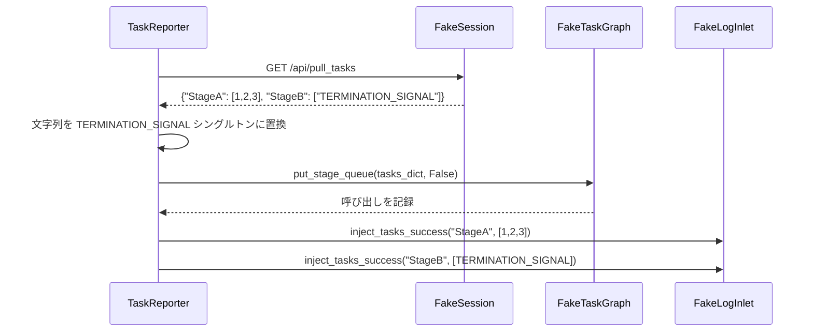

# インジェクターテスト (test_reporter_injection.py)

> 📅 最終更新日: 2026/06/11

## 役割

`TaskReporter` のタスク注入機構を検証します——Reporter がリモートから `{node_name: [tasklist]}` 形式のマッピングを取得した後、グラフキューに正しく注入し、注入ログを記録できることを確認します。

## コアテスト対象

| クラス | 種類 | 説明 |
|----|------|------|
| `FakeResponse` | Mock | HTTP レスポンスをシミュレートし、事前設定された JSON ペイロードを返す |
| `FakeSession` | Mock | `requests.Session` をシミュレートし、`get` メソッドのみをオーバーライド |
| `FakeTaskGraph` | Mock | `put_stage_queue` の呼び出しパラメータを記録 |
| `FakeLogInlet` | Mock | 注入成功/失敗および取得失敗のログを記録 |
| `TaskReporter` | 被テストクラス | `celestialflow.observability` 内のインジェクター |

## 主要テストシナリオ

### test_reporter_accepts_node_to_tasklist_mapping

**カバレッジ目標**: `TaskReporter._pull_and_inject_tasks()` が `{StageA: [1, 2, 3], StageB: [TERMINATION_SIGNAL]}` 形式のマッピングを正しく処理し、タスクの一括パッケージを一度に注入できることを検証。

**アサーションの意図**:

- `graph.put_stage_queue` が 1 回呼び出され、パラメータはマージされたタスク辞書（終了シグナル文字列が `TERMINATION_SIGNAL` シングルトンに置換される）、かつ `put_termination_signal=False`。
- `log_inlet.inject_tasks_success` が 2 回呼び出され、それぞれ StageA と StageB の注入成功を記録。
- 失敗ログなし（`failures` および `pull_failures` がともに空）。



## 実行方法

```bash
# すべての注入テストを実行
pytest tests/observability/test_reporter_injection.py -v

# ノードマッピング注入テストのみ実行
pytest tests/observability/test_reporter_injection.py -k "node_to_tasklist" -v
```

## 注意事項

- テストは Fake オブジェクトを使用してネットワーク依存を完全に分離します。`TaskReporter` の実際の HTTP 動作は他のテストで検証されます。
- `TERMINATION_SIGNAL` 文字列は注入時にグローバルシングルトンオブジェクトに置換されます。これがコアロジックであり、テストは `assert graph.calls` を通じてこの置換動作を検証します。
- `FakeResponse` と `FakeSession` は軽量 Mock であり、`unittest.mock` や `responses` ライブラリに依存しません。
