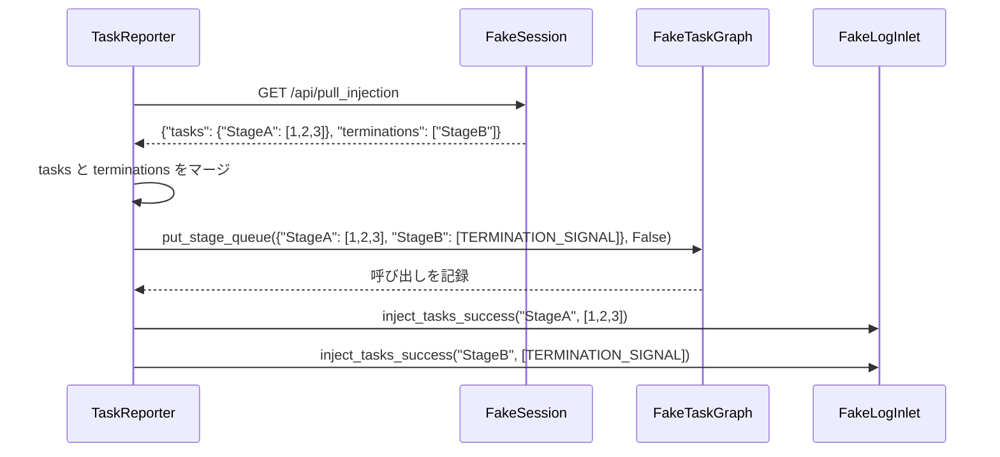

# Reporter 注入とレポートテスト (test_reporter_injection.py)

> 📅 最終更新日: 2026/06/28

## 役割

`celestialflow.observability.core_report` の `TaskReporter` におけるタスク注入とエラープッシュロジックを検証します——Reporter がリモートから分割されたタスクと終了シグナルペイロードを取得した後、正しくマージしてグラフキューに注入できるかどうか、またエラープッシュのエンドポイント選択、重複排除、増分プッシュ動作を検証します。

## コアテスト対象

| クラス | 種類 | 説明 |
|----|------|------|
| `FakeResponse` / `FakePostResponse` | Mock | HTTP GET/POST レスポンスをシミュレート |
| `FakeSession` / `FakePushSession` | Mock | `requests.Session` の GET/POST メソッドをシミュレートし、呼び出しを記録 |
| `FakeTaskGraph` / `FakeErrorGraph` | Mock | グラフ注入インターフェースとエラークエリインターフェースをシミュレート |
| `FakeLogInlet` | Mock | 注入成功/失敗、取得失敗、プッシュ失敗のログを記録 |
| `TaskReporter` | 被テストクラス | `celestialflow.observability` 内の注入・レポーター |

## 主要テストシナリオ

### `test_reporter_accepts_split_task_and_termination_payload`

**カバレッジ目標**: `TaskReporter._pull_injection()` がサーバーから返された分割ペイロード `{"tasks": {...}, "terminations": [...]}` を消費し、タスクと終了シグナルをまとめてグラフキューに注入できることを検証。

**アサーションの意図**:

- `graph.put_stage_queue` が 1 回呼び出され、パラメータはマージされたタスク辞書（終了シグナルノードが `TERMINATION_SIGNAL` シングルトンにマッピングされる）、かつ `put_termination_signal=False`。
- `log_inlet.inject_tasks_success` が StageA のタスク注入と StageB の終了シグナル注入をそれぞれ記録。
- 失敗ログなし（`failures`、`pull_failures` がともに空）。



### `test_reporter_merges_tasks_and_termination_for_same_stage`

**カバレッジ目標**: 同一ノードが `tasks` と `terminations` の両方に同時に現れた場合、タスクリストを保持しつつ末尾に終了シグナルを追加し、互いに上書きしないことを検証。

**アサーションの意図**:

- `graph.put_stage_queue` が 1 回呼び出され、StageA のタスクリストが `[1, 2, 3, TERMINATION_SIGNAL]` であること。
- `log_inlet.successes` に StageA の注入記録が 1 件のみ含まれていること。

### `test_reporter_pushes_errors_via_push_errors_endpoint_only`

**カバレッジ目標**: `TaskReporter._push_errors()` が `/api/push_errors` エンドポイントのみを通じてエラーをプッシュすることを検証（古い `/api/push_errors_meta` は使用しない）。

- sqlite エラーレコードを 1 件書き込む。
- `_server_has_current_graph = False` を設定（全量プッシュをトリガー）。
- POST 先 URL の末尾が `/api/push_errors` であることをアサート。
- ペイロードに `graph_id` と `errors` フィールドが含まれ、エラーレコードのフィールドが sqlite レコードと一致することをアサート。

### `test_reporter_pushes_only_errors_after_server_max_event_id`

**カバレッジ目標**: Reporter が failed レコードのうち、`event_id` がサーバー側の水位線より大きいもののみをプッシュすることを検証。

- 3 件のエラーレコードを書き込む（`event_id=1,5,7`）。
- `_server_has_current_graph = True`、`_server_max_event_id_in_fail = 3` を設定。
- `event_id` が 5 と 7 のレコードのみがプッシュされることをアサート。

## テストカバレッジマトリクス

| テスト関数 | カバレッジ目標 |
|----------|----------|
| `test_reporter_accepts_split_task_and_termination_payload` | 分割ペイロード解析、タスクと終了シグナルのマージ注入、注入成功ログ |
| `test_reporter_merges_tasks_and_termination_for_same_stage` | 同一ノードにおけるタスクと終了シグナルのマージルール |
| `test_reporter_pushes_errors_via_push_errors_endpoint_only` | エラープッシュエンドポイントの `/api/push_errors` への統一、全量プッシュペイロード構造 |
| `test_reporter_pushes_only_errors_after_server_max_event_id` | サーバー側水位線に基づく増分エラープッシュ |

## 実行方法

```bash
# すべての注入・レポートテストを実行
pytest tests/observability/test_reporter_injection.py -v

# 注入ペイロード解析テストのみ実行
pytest tests/observability/test_reporter_injection.py -k "accepts_split" -v

# マージルールテストのみ実行
pytest tests/observability/test_reporter_injection.py -k "merges" -v

# エラープッシュテストのみ実行
pytest tests/observability/test_reporter_injection.py -k "push_errors" -v
```

## 注意事項

- テストは Fake オブジェクトを使用してネットワーク依存を完全に分離します。`TaskReporter` の実際の HTTP 動作は他のテストで検証されます。
- タスクペイロードと終了シグナルはリモート側で既に分割されており、Reporter 側で再マージし、終了シグナルを `TERMINATION_SIGNAL` シングルトンに置換します。
- `FakePushSession` は毎回の POST の URL、JSON ペイロード、タイムアウトを記録し、実際のネットワークに依存せずにプッシュ内容をアサートできます。
- 関連実装は `src/celestialflow/observability/core_report.py` にあります。
