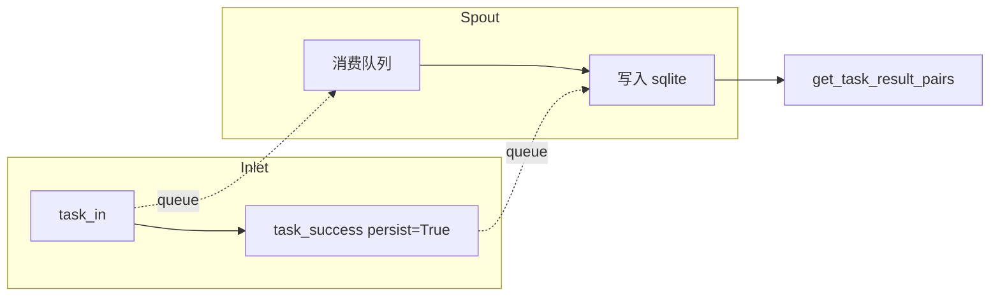

# フォールトトレランス永続化テスト (test_fallback.py)

> 最終更新日: 2026/06/18

## 目的

`celestialflow.persistence.core_fallback` の `FallbackInlet` と `FallbackSpout` のペアコンポーネントを検証し、タスクエラーと成功結果がバックグラウンドスレッドを通じて sqlite データベースに書き込まれ、stage 次元で task-error ペアと task-result ペアを読み取れることを確認します。

## コアテスト対象

- `FallbackInlet`: `task_in()` / `task_retry()` / `task_fail()` / `task_success()` / `task_duplicate()` などのメソッドでライフサイクルイベントをキューに入れます。
- `FallbackSpout`: バックグラウンドスレッドでキュー内のイベントを消費し、sqlite ファイルに永続化します。`get_task_error_pairs()` / `get_task_result_pairs()` によるクエリをサポートします。

## テストカバレッジマトリックス

| テストクラス | ケース数 | カバレッジ対象 |
|--------|--------|---------|
| `TestFailPersistence` | 2 | 完全なライフサイクル永続化、成功結果永続化 |

## 主要テストシナリオ

### `test_fallback_lifecycle_persistence`

`task_in` → `task_retry` → `task_fail` および `task_in` → `task_success` → `task_duplicate` の完全な永続化チェーンをカバーします。

- sqlite ファイルの作成を検証（`.sqlite3` 拡張子）
- `get_task_error_pairs("s1")` が正しい task-error ペアを返すことを検証
- records テーブルを直接クエリし、`event_id`、`stage`、`status`、`error_type`、`error_message`、`task_json`、`result_json` フィールドが期待通りであることを検証
- リトライで生成された中間 event_id は最終レコードに現れないことを確認（最終的な `failed` 状態のみ保持）

### `test_success_persistence`

タスク成功後に `persist=True` を呼び出すシナリオをカバーします。

- `get_task_result_pairs("s1")` が `(task, result)` タプルリストを返すことを検証
- 複数回の success の読み取り順序が書き込み順序と一致することを検証



## 実行方法

```bash
# 全部执行
pytest tests/persistence/test_fallback.py -v

# 按关键字匹配
pytest tests/persistence/test_fallback.py -k "lifecycle" -v
pytest tests/persistence/test_fallback.py -k "success" -v
```

## 注意事項

- テストは `monkeypatch.chdir(tmp_path)` で作業ディレクトリを一時ディレクトリに切り替え、テスト終了後に sqlite ファイルが自動クリーンアップされます。
- 旧版の `FailInlet`/`FailSpout`（JSONL 形式）とは異なり、現在の実装は sqlite ストレージを使用し、`util_sqlite` モジュールによって管理されます。
- 関連実装は `src/celestialflow/persistence/core_fallback.py` にあります。
