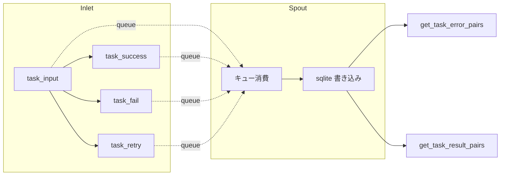

# tests/persistence/test_lifecycle.py

> 📅 最終更新日: 2026/09/24

## 役割

`celestialflow.persistence.core_lifecycle` の `LifecycleInlet` と `LifecycleSpout` のペアコンポーネントを検証し、タスクライフサイクルイベント（`task_input` / `task_success` / `task_fail` / `task_retry`）がバックグラウンドスレッドを通じて sqlite ファイルに書き込まれ、stage 次元で task-error ペアと task-result ペアを読み取れることを確認します。同時に、リトライ回数の永続化と旧ライブラリの自動カラム追加を検証します。

## コアテスト対象

- `LifecycleInlet`: `task_input()` / `task_success()` / `task_fail()` / `task_retry()` でライフサイクルイベントを `_funnel()` 経由で内部キューに投入します。
- `LifecycleSpout`: バックグラウンドスレッドでキュー内のイベントを消費し sqlite ファイルに永続化します。`get_task_error_pairs()` / `get_task_result_pairs()` によるクエリをサポートします。
- `connect_db`（`celestialflow.persistence.util_sqlite`）: 接続を確立し、テーブル構造のアップグレード（旧ライブラリへの `retry_times` カラム追加など）を担当します。

## テストカバレッジマトリックス

| テストクラス | ケース数 | カバレッジ対象 |
|------------|---------|------------|
| `TestLifecyclePersistence` | 4 | 完全なライフサイクル永続化、成功結果の永続化、リトライ回数の永続化、旧ライブラリへのカラム追加 |

## 主要テストシナリオ

### `test_lifecycle_persistence`

`task_input` → `task_fail` と `task_input` → `task_success` の 2 つのライフサイクル連鎖（s1 / s2 の 2 つの stage）をカバーします。

- `task_input(stage_name, event_id, task)` で `LifecycleInlet` に pending レコードを注入。
- `task_fail(event_id=1, error_id=21, error=ValueError("oops"))` は s1 の pending レコードを failed に昇格させ、最終レコードは `error_id`（21）を永続化 `event_id` とし、エラータイプとエラーメッセージをバインドします。
- `task_success(event_id=2, result="ok2")` は s2 の pending レコードを success に昇格させ、元の `event_id`（2）を保持して結果を書き込みます。
- sqlite ファイルが作成される（`./lifecycles/<日付>/flow_lifecycle(<時間>).sqlite3`）ことをアサートし、`get_task_error_pairs("s1")` が `[("data1", ("ValueError", "oops"))]` を返すことを検証。
- records テーブルを直接クエリして `id` でソートし、`event_id` シーケンスが `[21, 2]` であることを検証し、`stage` / `status` / `error_type` / `error_message` / `task_json` / `result_json` をフィールドごとに照合し、2 件のレコードの `ts` がどちらも 0 より大きいことを確認。

### `test_success_persistence`

成功結果の永続化と読み戻しをカバーします。

- s1、s2 に対してそれぞれ `task_input` + `task_success`（結果 100 / 200）を実行。
- `get_task_result_pairs("s1")` が `[("task1", 100)]` を返し、task-result ペアが stage 別に正確に読み戻されることをアサート。

### `test_retry_persistence`

リトライ回数の永続化と最終昇格をカバーします。

- s1 について：`task_input` → 2 回の `task_retry` → `task_success`。success に昇格する際にエラー情報がクリアされ、`retry_times == 2` が保持されることをアサート。
- s2 について：`task_input` → 2 回の `task_retry` → `task_fail(error_id=22)`。failed レコードが最新のエラー情報（`ValueError` / `final boom`）を保持し、`retry_times == 2` であることをアサート。
- records テーブル内の `(event_id, status, retry_times)` が `[(1, "success", 2), (22, "failed", 2)]` であることをアサート。

### `test_old_db_gets_retry_times_column`

旧ライブラリの構造アップグレードをカバーします。

- `retry_times` カラムを含まない `records` テーブルを手動で作成。
- `connect_db(db_path)` を呼び出した後、`PRAGMA table_info(records)` を通じて `retry_times` カラムが自動補完されたことをアサート。



## 実行方法

```bash
# 全部実行
pytest tests/persistence/test_lifecycle.py -v

# キーワードでマッチ
pytest tests/persistence/test_lifecycle.py -k "lifecycle" -v
pytest tests/persistence/test_lifecycle.py -k "success" -v
pytest tests/persistence/test_lifecycle.py -k "retry" -v
```

## 注意事項

- テストは `monkeypatch.chdir(tmp_path)` で作業ディレクトリを一時ディレクトリに切り替え、sqlite ファイル（`./lifecycles/<日付>/flow_lifecycle(<時間>).sqlite3`）はテスト終了後に自動クリーンアップされます。
- 失敗レコードの `event_id` は `task_fail()` に渡された `error_id` に置き換えられ、当該 stage の後続のエラークエリ/プッシュセマンティクスとの一貫性を保ちます。
- `LifecycleInlet` と `LifecycleSpout` はテスト隔離されたローカルインスタンスであり、`get_lifecycle_inlet()` / `get_lifecycle_spout()` グローバルシングルトンは **使用しません**。これにより他のテストへの汚染を防ぎます。
- 関連実装は `src/celestialflow/persistence/core_lifecycle.py` にあります。
