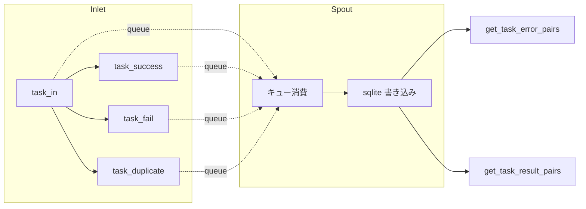

# ライフサイクル永続化テスト (test_lifecycle.py)

> 📅 最終更新日: 2026/08/26

## 役割

`celestialflow.persistence.core_lifecycle` の `LifecycleInlet` と `LifecycleSpout` のペアコンポーネントを検証し、タスクライフサイクルイベント（進入、成功、失敗、重複）がバックグラウンドスレッドを通じて sqlite ファイルに書き込まれ、stage 次元で task-error ペアと task-result ペアを読み取れることを確認します。

## コアテスト対象

- `LifecycleInlet`: `task_in()` / `task_success()` / `task_fail()` / `task_duplicate()` でライフサイクルイベントを `_funnel()` 経由でキューに入れます。
- `LifecycleSpout`: バックグラウンドスレッドでキュー内のイベントを消費し、sqlite ファイルに永続化します。`get_task_error_pairs()` / `get_task_result_pairs()` によるクエリをサポートします。

## テストカバレッジマトリックス

| テストクラス | ケース数 | カバレッジ対象 |
|------------|---------|------------|
| `TestLifecyclePersistence` | 2 | 完全なライフサイクル永続化、成功結果の永続化 |

## 主要テストシナリオ

### `test_lifecycle_persistence`

3 つのライフサイクル連鎖 `task_in` → `task_fail`、`task_in` → `task_success`、`task_in` → `task_duplicate`（s1 / s2 / s3 の 3 つの stage）をカバーします。

- `task_fail(event_id=1, error_id=21, error=ValueError("oops"))` は s1 の pending レコードを failed に昇格させ、最終レコードは `error_id`（21）を永続化 `event_id` とし、エラータイプとエラーメッセージをバインドします。
- `task_success(event_id=2, result="ok2")` は s2 の pending レコードを success に昇格させ、元の `event_id`（2）を保持して結果を書き込みます。
- `task_duplicate(event_id=3)` は s3 の pending レコードを削除し、最終的にデータベースに残存しません。
- sqlite ファイルの作成成功（`.sqlite3` 拡張子）をアサートし、`get_task_error_pairs("s1")` が `[("data1", ("ValueError", "oops"))]` を返すことを検証。
- records テーブルを直接クエリして `id` でソートし、`event_id` シーケンスが `[21, 2]` であることを検証し、`stage` / `status` / `error_type` / `error_message` / `task_json` / `result_json` をフィールドごとに照合し、2 件のレコードの `ts` がどちらも 0 より大きいことを確認。

### `test_success_persistence`

成功結果の永続化と読み戻しをカバーします。

- s1、s2 に対してそれぞれ `task_in` + `task_success`（結果 100 / 200）を実行。
- `get_task_result_pairs("s1")` が `[("task1", 100)]` を返し、task-result ペアが stage 別に正確に読み戻されることをアサート。



## 実行方法

```bash
# 全部実行
pytest tests/persistence/test_lifecycle.py -v

# キーワードでマッチ
pytest tests/persistence/test_lifecycle.py -k "lifecycle" -v
pytest tests/persistence/test_lifecycle.py -k "success" -v
```

## 注意事項

- テストは `monkeypatch.chdir(tmp_path)` で作業ディレクトリを一時ディレクトリに切り替え、sqlite ファイル（`./lifecycles/<日付>/flow_lifecycle(<時間>).sqlite3`）はテスト終了後に自動クリーンアップされます。
- 失敗レコードの `event_id` は `task_fail()` に渡された `error_id` に置き換えられ、当該 stage の後続のエラークエリ/プッシュセマンティクスとの一貫性を保ちます。
- 関連実装は `src/celestialflow/persistence/core_lifecycle.py` にあります。
