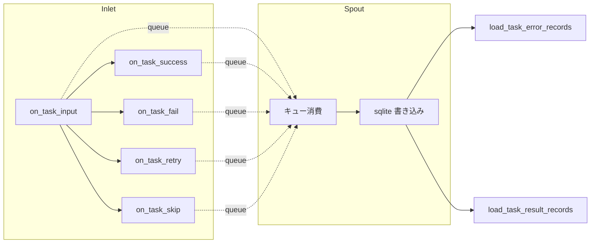

# tests/persist/test_lifecycle.py

> 📅 最終更新日: 2026/10/09

## 役割

`celestialflow.persist.core_lifecycle` の `LifecycleInlet` と `LifecycleSpout` のペアコンポーネントを検証し、タスクライフサイクルイベント（`on_task_input` / `on_task_success` / `on_task_fail` / `on_task_retry` / `on_task_skip`）がバックグラウンドスレッドを通じて sqlite ファイルに書き込まれ、ノード別に task-error ペアと task-result ペアを読み取れることを確認します。同時に、リトライ回数の永続化と旧ライブラリの自動カラム追加を検証します。

## コアテスト対象

| クラス / オブジェクト | ソース | 説明 |
|-----------|------|------|
| `LifecycleInlet` | `celestialflow.persist.core_lifecycle` | ライフサイクルイベントを `bind_spout` 経由で内部キューに投入 |
| `LifecycleSpout` | `celestialflow.persist.core_lifecycle` | バックグラウンドスレッドでキュー内のイベントを消費し sqlite ファイルに永続化。`db_path` は生成されたデータベースを指す |
| `load_task_error_records` / `load_task_result_records` | `celestialflow.persist.util_sqlite` | ノード別に task-error / task-result ペアを読み取り |
| `connect_db` | `celestialflow.persist.util_sqlite` | 接続を確立し、テーブル構造のアップグレード（旧ライブラリへの `retry_times` カラム追加など）を担当 |
| イベント型 | `celestialflow.observer` | `TaskInputEvent` / `TaskSuccessEvent` / `TaskFailEvent` / `TaskRetryEvent` / `TaskSkipEvent` |

## テストカバレッジマトリックス

| テストクラス | ケース数 | カバレッジ対象 |
|--------|--------|---------|
| `TestLifecyclePersistence` | 5 | 完全なライフサイクル永続化、成功結果の永続化、リトライ回数の永続化、スキップの永続化、旧ライブラリへのカラム追加 |

## 主要テストシナリオ

### `test_lifecycle_persistence`

`on_task_input` → `on_task_fail` と `on_task_input` → `on_task_success` の 2 つのライフサイクル連鎖（s1 / s2 の 2 つのノード）をカバーします。

- `on_task_input` で `LifecycleInlet` に pending レコードを注入。
- `on_task_fail` は s1 の pending レコードを failed に昇格させ、最終レコードは失敗イベントが保持する `event_id`（21）を永続化 ID とし、エラータイプとエラーメッセージをバインドします。
- `on_task_success` は s2 の pending レコードを success に昇格させ、元の `event_id`（2）を保持して結果を書き込みます。
- `.sqlite3` ファイルが作成されることをアサートし、`load_task_error_records(db_path, "s1")` が `[("data1", ("ValueError", "oops"))]` を返すことを検証。
- records テーブルを直接クエリして `id` でソートし、`event_id` シーケンスが `[21, 2]` であることを検証（`node` / `status` / `error_type` / `error_message` / `task_json` / `result_json` をフィールドごとに照合）、2 件のレコードの `ts` がどちらも 0 より大きいことを確認。

### `test_success_persistence`

成功結果の永続化と読み戻しをカバーします。

- s1、s2 に対してそれぞれ `on_task_input` + `on_task_success`（結果 100 / 200）を実行。
- `load_task_result_records(db_path, "s1")` が `[("task1", 100)]` を返すことをアサート。

### `test_retry_persistence`

リトライ回数の永続化と最終昇格をカバーします。

- s1 について：`on_task_input` → 2 回の `on_task_retry` → `on_task_success`。success に昇格する際にエラー情報がクリアされ、`retry_times == 2` が保持されることをアサート。
- s2 について：`on_task_input` → 2 回の `on_task_retry` → `on_task_fail`。failed レコードが最新のエラー情報（`ValueError` / `final boom`）を保持し、`retry_times == 2` であることをアサート。
- records テーブル内の `(event_id, status, retry_times)` が `[(1, "success", 2), (22, "failed", 2)]` であることをアサート。

### `test_skip_persistence`

スキップの永続化をカバーします。

- s1 に対して `on_task_input` + `on_task_skip` を実行。`on_task_skip` は pending を `skipped` に昇格させ、スキップイベントが保持する `event_id`（31）に切り替えます。

### `test_old_db_gets_retry_times_column`

旧ライブラリの構造アップグレードをカバーします。

- `retry_times` カラムを含まない `records` テーブルを手動で作成。
- `connect_db(db_path)` を呼び出した後、`PRAGMA table_info(records)` を通じて `retry_times` カラムが自動補完されたことをアサート。


```mermaid
flowchart LR
    subgraph Inlet
        A[on_task_input] --> B[on_task_success]
        A --> C[on_task_fail]
        A --> D[on_task_retry]
        A --> E[on_task_skip]
    end
    subgraph Spout
        F[キュー消費] --> G[sqlite 書き込み]
    end
    A -.->|queue| F
    B -.->|queue| F
    C -.->|queue| F
    D -.->|queue| F
    E -.->|queue| F
    G --> H[load_task_error_records]
    G --> I[load_task_result_records]
```

## 実行方法

```bash
# 全部実行
pytest tests/persist/test_lifecycle.py -v

# キーワードでマッチ
pytest tests/persist/test_lifecycle.py -k "lifecycle" -v
pytest tests/persist/test_lifecycle.py -k "success" -v
pytest tests/persist/test_lifecycle.py -k "retry" -v
pytest tests/persist/test_lifecycle.py -k "skip" -v
```

## 注意事項

- テストは `monkeypatch.chdir(tmp_path)` で作業ディレクトリを一時ディレクトリに切り替え、sqlite ファイルはテスト終了後に自動クリーンアップされます。
- 失敗 / スキップレコードの永続化 `event_id` は最終状態イベントが保持するイベント ID（失敗イベント ID / スキップイベント ID）に置き換えられ、後続のエラークエリ / プッシュセマンティクスとの一貫性を保ちます。
- `LifecycleInlet` と `LifecycleSpout` はテスト隔離されたローカルインスタンスであり、グローバルシングルトンに依存しないため、他のテストへの汚染を防ぎます。
- 関連実装は `src/celestialflow/persist/core_lifecycle.py` にあります。