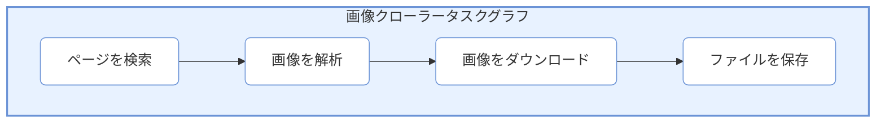

# チュートリアル（Tutorial）：画像クローラーの構築

> 📅 最終更新日: 2026/06/18

本チュートリアルでは、完全な実践プロジェクト——**Baidu 画像クローラー**を通じて、CelestialFlow の使用方法をゼロから学ぶ。

## プロジェクト目標

Baidu 画像検索結果をクロールし、指定したキーワードの画像をローカルにダウンロードする。以下を学ぶ：
1. タスクフローの分析と分解
2. 各ステージの処理関数の作成
3. タスクグラフの組み立てと実行
4. Web UI による実行状態の監視

---

## ステップ 1：タスクの分析と分解

コーディングを始める前に、クローラーの実行フローを分析する必要がある：

```
ユーザーがキーワードを入力 → ページを検索 → 画像リストを解析 → 画像をダウンロード → ファイルを保存
```

### タスク階層設計

| 階層 | 機能 | 入力 | 出力 |
|------|------|------|------|
| **Layer 1: 検索** | 検索結果ページを取得 | キーワード | ページ HTML |
| **Layer 2: 解析** | 画像 URL リストを抽出 | HTML | 画像 URL リスト |
| **Layer 3: ダウンロード** | 画像コンテンツをダウンロード | 画像 URL | 画像バイナリデータ |
| **Layer 4: 保存** | ローカルに保存 | 画像データ | ファイルパス |

### タスクグラフ構造



---

## ステップ 2：処理関数の作成

まず、各ステージの処理関数を作成し、個別にテスト検証する。

### 2.1 ページ検索

```python
import requests
from urllib.parse import quote

def search_images(keyword: str) -> str:
    """
    キーワードに基づいて Baidu 画像を検索し、ページ HTML を返す。
    
    :param keyword: 検索キーワード
    :return: ページ HTML コンテンツ
    """
    url = f"https://image.baidu.com/search/index?tn=baiduimage&word={quote(keyword)}"
    headers = {
        "User-Agent": "Mozilla/5.0 (Windows NT 10.0; Win64; x64) AppleWebKit/537.36"
    }
    response = requests.get(url, headers=headers, timeout=10)
    response.raise_for_status()
    return response.text

# 単独テスト
if __name__ == "__main__":
    html = search_images("猫咪")
    print(f"{len(html)} 文字の HTML を取得しました")
```

### 2.2 画像 URL の解析

```python
import re
import json

def parse_image_urls(html: str) -> list[str]:
    """
    HTML から画像 URL リストを解析する。
    
    :param html: ページ HTML
    :return: 画像 URL リスト
    """
    # Baidu 画像のデータは JavaScript に埋め込まれている
    pattern = r'"hoverURL":"(https?://[^"]+)"'
    urls = re.findall(pattern, html)
    # エスケープ文字を処理
    urls = [url.replace("\\/", "/") for url in urls]
    return urls[:20]  # 数量を制限

# 単独テスト
if __name__ == "__main__":
    html = search_images("猫咪")
    urls = parse_image_urls(html)
    print(f"{len(urls)} 個の画像 URL を解析しました")
    for url in urls[:3]:
        print(f"  - {url}")
```

### 2.3 画像のダウンロード

```python
import time

def download_image(url: str) -> bytes | None:
    """
    画像コンテンツをダウンロードする。
    
    :param url: 画像 URL
    :return: 画像バイナリデータ、失敗時は None
    """
    headers = {
        "User-Agent": "Mozilla/5.0 (Windows NT 10.0; Win64; x64) AppleWebKit/537.36",
        "Referer": "https://image.baidu.com/"
    }
    try:
        response = requests.get(url, headers=headers, timeout=15)
        response.raise_for_status()
        return response.content
    except Exception as e:
        print(f"ダウンロード失敗: {url}, エラー: {e}")
        return None

# 単独テスト
if __name__ == "__main__":
    html = search_images("猫咪")
    urls = parse_image_urls(html)
    if urls:
        data = download_image(urls[0])
        if data:
            print(f"ダウンロード成功、サイズ: {len(data)} バイト")
```

### 2.4 ファイルの保存

```python
import os
import hashlib

def save_image(image_data: bytes, keyword: str) -> str:
    """
    画像をローカルに保存する。
    
    :param image_data: 画像バイナリデータ
    :param keyword: キーワード（ディレクトリ作成に使用）
    :return: 保存されたファイルパス
    """
    # ディレクトリを作成
    save_dir = os.path.join("images", keyword)
    os.makedirs(save_dir, exist_ok=True)
    
    # データハッシュをファイル名として使用
    file_hash = hashlib.md5(image_data).hexdigest()[:12]
    file_path = os.path.join(save_dir, f"{file_hash}.jpg")
    
    # 重複ダウンロードを回避
    if not os.path.exists(file_path):
        with open(file_path, "wb") as f:
            f.write(image_data)
    
    return file_path

# 単独テスト
if __name__ == "__main__":
    html = search_images("猫咪")
    urls = parse_image_urls(html)
    if urls:
        data = download_image(urls[0])
        if data:
            path = save_image(data, "猫咪")
            print(f"保存成功: {path}")
```

---

## ステップ 3：タスクグラフの組み立て

処理関数の検証が完了したら、それぞれを `TaskStage` に割り当て、`TaskGraph` で構造を整理する。

### 3.1 ノードの作成

```python
from celestialflow import TaskStage, TaskSplitter

# 検索ステージ：キーワードを入力、HTML を出力
stage_search = TaskStage(
    "ページを検索",
    func=search_images,
    execution_mode="serial",  # キーワードは1つだけ、シリアルで十分
    max_retries=2,
)

# 解析ステージ：HTML を入力、複数の画像 URL を出力（分割が必要）
# URL リストを個別タスクに分割するためにカスタム Splitter が必要
class URLSplitter(TaskSplitter):
    """URL リストを複数の独立タスクに分割する。"""
    
    def _split(self, html: str):
        urls = parse_image_urls(html)
        print(f"{len(urls)} 個の画像 URL を解析しました")
        return tuple(urls)

stage_parse = URLSplitter("画像を解析")

# ダウンロードステージ：URL を入力、画像データを出力
stage_download = TaskStage(
    "画像をダウンロード",
    func=download_image,
    execution_mode="thread",  # ネットワーク IO 集中、スレッドプールを使用
    max_workers=10,           # 10 枚を並行ダウンロード
    max_retries=3,
)

# 保存ステージ：画像データを入力、ファイルパスを出力
stage_save = TaskStage(
    "ファイルを保存",
    func=lambda data: save_image(data, "猫咪") if data else None,
    execution_mode="serial",
    enable_duplicate_check=False,  # 重複データの保存を許可（リトライ用）
)
```

### 3.2 タスクグラフの構築

```python
from celestialflow import TaskGraph

# タスクグラフを作成
graph = TaskGraph(schedule_mode="eager", log_level="SUCCESS")

# ノードを設定
graph.set_stages(stages=[stage_search, stage_parse, stage_download, stage_save])

# ノード間の接続関係を設定
graph.connect([stage_search], [stage_parse])
graph.connect([stage_parse], [stage_download])
graph.connect([stage_download], [stage_save])
```

### 3.3 Web 監視の起動（オプション）

```python
# Web 監視を有効化
graph.set_reporter(True, host="127.0.0.1", port=5005)
```

Web サービスを起動：
```bash
celestialflow-web --port 5005
```

http://localhost:5005 にアクセスしてリアルタイム状態を確認する。

### 3.4 タスクグラフの実行

```python
# 初期タスクを準備
init_tasks = {
    stage_search.get_name(): ["猫咪", "小狗", "风景"]
}

# 起動
print("画像のクロールを開始...")
graph.start_graph(init_tasks)

# 統計を取得
snapshot = graph.get_status_snapshot()
status = snapshot["status"]
total_succeeded = sum(
    s.get("total_succeeded", 0) for s in status.values()
)
total_failed = sum(
    s.get("total_failed", 0) for s in status.values()
)
print(f"成功: {total_succeeded}")
print(f"失敗: {total_failed}")
```

---

## ステップ 4：完全なコード

すべてのコードを 1 つのファイルに統合する：

```python
# crawler.py
import os
import re
import hashlib
import requests
from urllib.parse import quote

from celestialflow import (
    TaskStage, 
    TaskSplitter, 
    TaskGraph,
)

# ========== 処理関数 ==========

def search_images(keyword: str) -> str:
    """Baidu 画像を検索する。"""
    url = f"https://image.baidu.com/search/index?tn=baiduimage&word={quote(keyword)}"
    headers = {"User-Agent": "Mozilla/5.0 (Windows NT 10.0; Win64; x64) AppleWebKit/537.36"}
    response = requests.get(url, headers=headers, timeout=10)
    response.raise_for_status()
    return response.text

def parse_image_urls(html: str) -> list[str]:
    """画像 URL を解析する。"""
    pattern = r'"hoverURL":"(https?://[^"]+)"'
    urls = re.findall(pattern, html)
    return [url.replace("\\/", "/") for url in urls][:20]

def download_image(url: str) -> bytes | None:
    """画像をダウンロードする。"""
    headers = {
        "User-Agent": "Mozilla/5.0 (Windows NT 10.0; Win64; x64) AppleWebKit/537.36",
        "Referer": "https://image.baidu.com/"
    }
    try:
        response = requests.get(url, headers=headers, timeout=15)
        response.raise_for_status()
        return response.content
    except Exception:
        return None

def save_image(image_data: bytes, keyword: str) -> str | None:
    """画像を保存する。"""
    if not image_data:
        return None
    save_dir = os.path.join("images", keyword)
    os.makedirs(save_dir, exist_ok=True)
    file_hash = hashlib.md5(image_data).hexdigest()[:12]
    file_path = os.path.join(save_dir, f"{file_hash}.jpg")
    if not os.path.exists(file_path):
        with open(file_path, "wb") as f:
            f.write(image_data)
    return file_path

# ========== カスタムノード ==========

class URLSplitter(TaskSplitter):
    """URL リスト分割器。"""
    
    def _split(self, html: str):
        urls = parse_image_urls(html)
        print(f"{len(urls)} 個の画像 URL を解析しました")
        return tuple(urls)

# ========== タスクグラフの構築 ==========

def build_crawler_graph(keyword: str) -> TaskGraph:
    """クローラータスクグラフを構築する。"""
    
    # ノードを作成
    stage_search = TaskStage(
        "ページを検索",
        func=search_images,
        execution_mode="serial",
        max_retries=2,
    )
    
    stage_parse = URLSplitter("画像を解析")
    
    stage_download = TaskStage(
        "画像をダウンロード",
        func=download_image,
        execution_mode="thread",
        max_workers=10,
        max_retries=3,
    )
    
    # クロージャで keyword を渡す
    stage_save = TaskStage(
        "ファイルを保存",
        func=lambda data: save_image(data, keyword),
        execution_mode="serial",
        enable_duplicate_check=False,
    )
    
    # 接続を設定
    graph = TaskGraph(schedule_mode="eager", log_level="SUCCESS")
    graph.set_stages(stages=[stage_search, stage_parse, stage_download, stage_save])
    graph.connect([stage_search], [stage_parse])
    graph.connect([stage_parse], [stage_download])
    graph.connect([stage_download], [stage_save])
    
    return graph

# ========== メインプログラム ==========

if __name__ == "__main__":
    # 設定
    KEYWORDS = ["猫咪", "小狗", "风景"]
    
    # グラフを構築
    graph = build_crawler_graph(KEYWORDS[0])
    graph.set_reporter(True, host="127.0.0.1", port=5005)
    
    # 実行
    print("画像のクロールを開始...")
    graph.start_graph({
        graph.source_stages[0].get_name(): KEYWORDS
    })
    
    # 統計
    snapshot = graph.get_status_snapshot()
    status = snapshot["status"]
    total_succeeded = sum(
        s.get("total_succeeded", 0) for s in status.values()
    )
    total_failed = sum(
        s.get("total_failed", 0) for s in status.values()
    )
    print(f"\nクロール完了!")
    print(f"成功: {total_succeeded}")
    print(f"失敗: {total_failed}")
```

---

## ステップ 5：実行とデバッグ

### 5.1 Web サービスの起動

```bash
# ターミナル 1: Web サービスを起動
celestialflow-web --port 5005
```

### 5.2 クローラーの実行

```bash
# ターミナル 2: クローラーを実行
python crawler.py
```

### 5.3 Web UI の確認

http://localhost:5005 を開くと、以下を確認できる：

1. **Dashboard**: 各ノードの処理進捗をリアルタイム表示
2. **Structure**: タスクグラフの可視化構造
3. **Errors**: ダウンロードに失敗した画像 URL とエラー情報
4. **Task Injection**: 新しいキーワードを動的に注入

### 5.4 結果の確認

```bash
# ダウンロードした画像を確認
ls images/猫咪/
ls images/小狗/
ls images/风景/
```

---

## 拡張：動的タスク注入

Web UI を通じて新しいキーワードを動的に注入できる：

```python
# またはコードで注入
from celestialflow import TerminationSignal

# 新しいキーワードを注入
graph.put_stage_queue({
    stage_search.get_name(): ["汽车", "美食"]
})

# 終了信号を注入（クロールを停止）
graph.put_stage_queue({
    stage_search.get_name(): [TerminationSignal()]
})
```

---

## まとめ

本チュートリアルでは CelestialFlow の完全な使用フローを示した：

1. **タスク分析**: 複雑なタスクを独立した階層に分解
2. **関数作成**: 各階層の処理関数を作成し個別にテスト
3. **ノード作成**: 関数を `TaskStage` にラップ
4. **グラフ組み立て**: `TaskGraph` でノード関係を整理
5. **監視実行**: Web UI で実行状態をリアルタイム監視

### 主要概念の復習

| 概念 | 説明 |
|------|------|
| `TaskStage` | タスクノード、処理関数をラップ |
| `TaskSplitter` | 分割器、1 つのタスクを複数に分割 |
| `TaskGraph` | タスクグラフ、ノード関係と実行フローを整理 |
| `stage_mode` | ノード実行モード（serial/thread） |
| `execution_mode` | ノード内部実行モード（serial/thread/async） |

### 次のステップ

- `TaskRouter` を使用した条件分岐を試す
- `demo/demo_redis.py` を参考に、通常の `TaskStage` で Redis / Go Worker 協力に接続する方法を学ぶ
- 他の [API リファレンス](https://github.com/Mr-xiaotian/CelestialFlow/blob/main/docs/ja/src/stage/core_executor.md) を読んでさらに多くの機能を学ぶ
