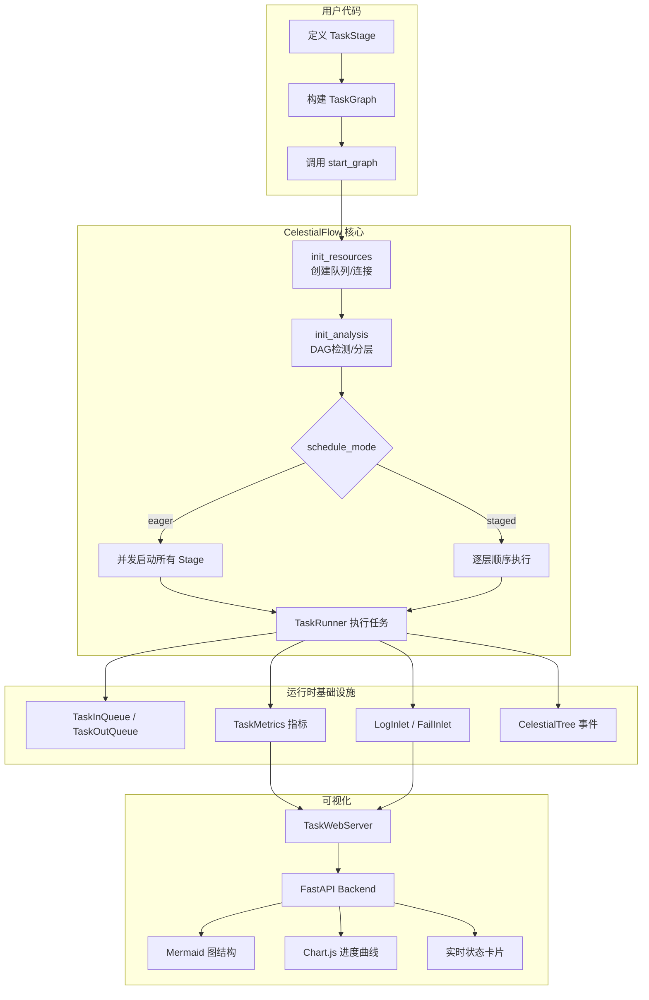
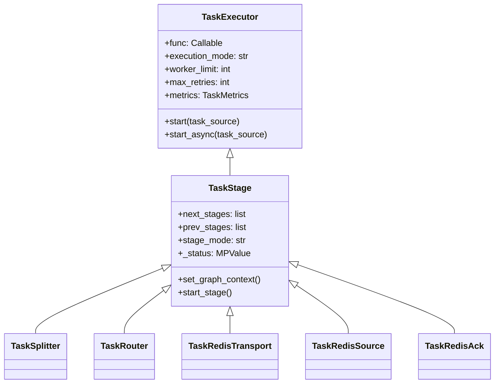
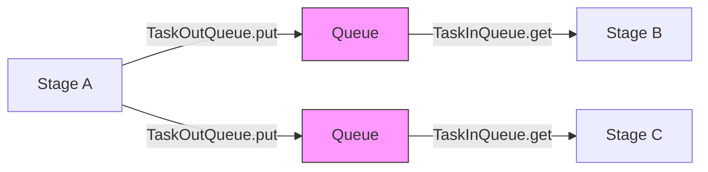
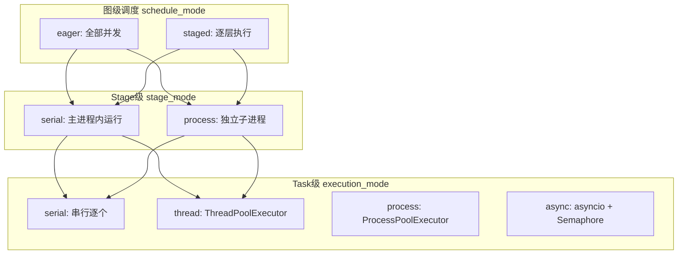
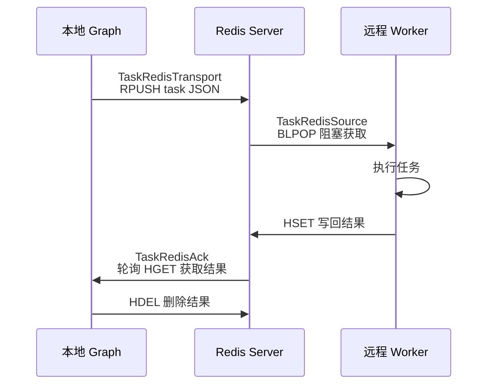
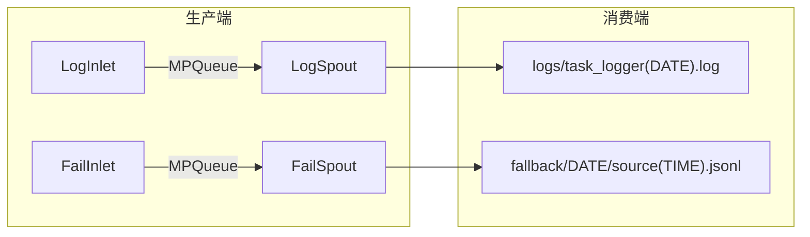
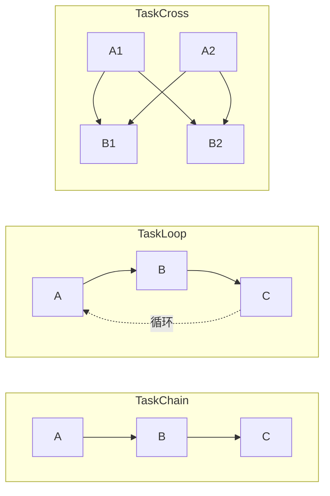
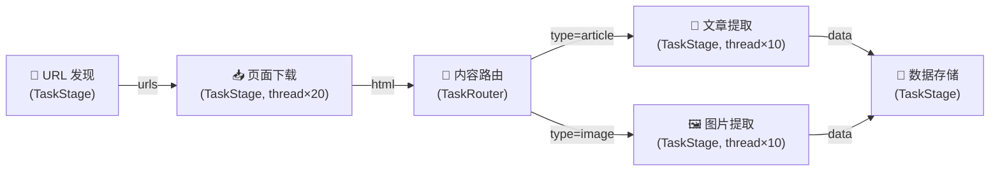
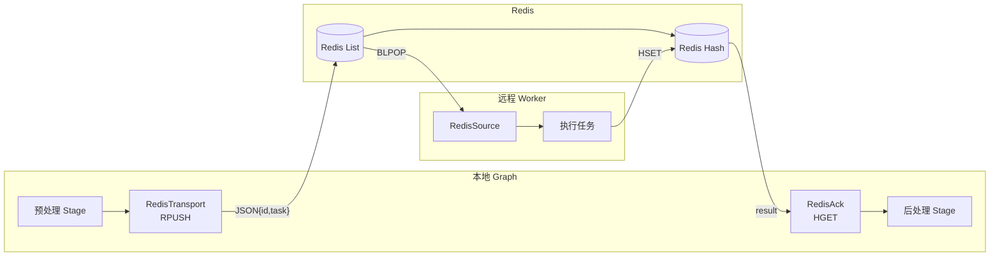

# CelestialFlow 技术分享

---

## Slide 1: 封面

# CelestialFlow

**下一代 Python 任务编排引擎**

- 轻量级 · 图驱动 · 高性能 · 可观测
- 版本 3.1.4 | Python 3.10+
- 支持 DAG / 环形图 / 分布式执行 / 实时可视化

---

## Slide 2: 项目背景与动机

### 为什么需要 CelestialFlow？

- **现有框架的痛点**：Airflow 依赖数据库调度、部署重；Prefect 偏云端 SaaS 模式；Ray 面向计算密集而非任务编排
- **真实需求驱动**：需要一个可嵌入 Python 程序、零外部依赖即可运行的任务图引擎
- **灵活性要求**：不仅支持 DAG，还要支持环形图（循环任务流）
- **高性能场景**：数据采集、ETL pipeline、批处理任务的并发编排
- **可观测性内建**：不是事后加监控，而是框架层面原生提供 metrics、日志、事件溯源

备注：
从实际工程场景出发——需要一个"像写代码一样自然"的任务编排工具，而非一个需要单独部署运维的平台。

---

## Slide 3: CelestialFlow 是什么

### 一句话定义

> 基于 Python 的轻量级图驱动任务编排框架，支持 DAG/环形图拓扑、多执行模式、Redis 分布式、事件溯源与实时可视化。

### 核心特性

- **图拓扑丰富**：Chain / Cross / Grid / Loop / Wheel / Complete 六种预置结构
- **多维执行模型**：Stage 级 (serial/process) × Task 级 (serial/thread/process/async) 组合
- **Redis 分布式**：Transport → Source → Ack 三阶段分布式任务传输
- **事件溯源**：集成 CelestialTree，任务全生命周期可追踪
- **Web 仪表盘**：FastAPI + ECharts + Mermaid 实时监控
- **零平台依赖**：`pip install celestialflow`，一行代码即可运行

---

## Slide 4: 核心设计理念

### 设计哲学

- **图即程序 (Graph as Program)**
  - 以 `TaskGraph` 为执行单元，节点 (`TaskStage`) 为处理逻辑，边为数据流
  - 编排逻辑与业务逻辑彻底分离

- **信封模式 (Envelope Pattern)**
  - `TaskEnvelope` 封装任务 + 哈希 + 事件 ID + 来源信息
  - 透明地提供去重、溯源、路由能力

- **终止信号协议 (Termination Protocol)**
  - `TerminationSignal` → `TerminationIdPool` 逐级合并
  - 确保 DAG 和环形图均能正确终止

- **指标即公民 (Metrics as First-Class)**
  - 每个 Stage 内建 `TaskMetrics`，跨进程安全的实时计数

---

## Slide 5: 架构总览

### 系统架构图



备注：
自上而下：用户定义图结构 → 框架初始化资源和分析 → 按调度模式执行 → 运行时基础设施提供队列、指标、日志 → Web 层消费数据做可视化。

---

## Slide 6: 核心组件 — TaskGraph

### TaskGraph：图执行引擎

```python
TaskGraph(
    root_stages: list[TaskStage],
    schedule_mode: str = "eager",   # "eager" | "staged"
    log_level: str = "SUCCESS"
)
```

- **初始化流水线**：`init_state()` → `init_listener()` → `init_sinker()` → `init_resources()` → `init_analysis()`
- **调度模式**：
  - `eager`：所有 Stage 并发启动，依赖关系由队列自然保证
  - `staged`：仅 DAG 可用，逐层执行，层间同步阻塞
- **状态管理**：`stage_runtime_dict`、`status_dict`、`stage_history`（最近 20 快照）
- **图分析**：基于 NetworkX 构建有向图，检测 DAG 性质，计算拓扑层级

---

## Slide 7: 核心组件 — TaskStage / TaskExecutor

### 继承关系



- **TaskExecutor**：任务执行核心，管理重试、去重、缓存、并发策略
- **TaskStage**：图节点，携带上下游连接信息和进程级状态
- **`set_graph_context()`** 绑定图上下文（下游节点、执行模式、名称）

---

## Slide 8: 核心组件 — 流控节点

### TaskSplitter & TaskRouter

| 特性 | TaskSplitter | TaskRouter |
|------|-------------|------------|
| 语义 | 1 → N（一对多拆分） | 1 → 1（条件路由） |
| 输入 | 单任务 | 单任务 |
| 输出 | tuple 中的每个元素成为独立任务 | `(target_tag, task)` 路由到指定下游 |
| 计数器 | `split_counter` 传播至下游 `task_counter` | `route_counters[tag]` 分别传播 |
| 执行模式 | 仅 serial | 仅 serial |
| 重试 | 无（`max_retries=0`） | 无（`max_retries=0`） |

- **计数器传播**是确保 `is_tasks_finished()` 正确判断的关键设计
- Splitter/Router 均不支持并发，保证拆分/路由的确定性

---

## Slide 9: 核心组件 — 队列与信封

### 数据流基础设施



- **TaskEnvelope**：`task` + `hash`(SHA1) + `id`(CelestialTree 事件) + `source`(来源)
- **TaskInQueue**：
  - 多上游汇聚，按 `source_tag` 追踪终止信号
  - 所有上游均发送 `TerminationSignal` 后，合并为 `TerminationIdPool` 返回
- **TaskOutQueue**：
  - 广播模式 `put()` → 所有下游
  - 定向模式 `put_target(item, tag)` → 指定下游（Router 使用）
- **终止协议**：保证无论 DAG 还是环形图，所有 Stage 都能优雅退出

---

## Slide 10: 执行模型

### 三层执行维度



| 层级 | 选项 | 说明 |
|------|------|------|
| 图级 `schedule_mode` | `eager` / `staged` | 控制 Stage 间并发 vs 顺序 |
| Stage 级 `stage_mode` | `serial` / `process` | Stage 是否在独立进程中运行 |
| Task 级 `execution_mode` | `serial` / `thread` | Stage 内任务的并发策略 |

备注：
注意在 TaskGraph 模式下，task 级的 `process` 和 `async` 不可用（仅 standalone `TaskExecutor.start()` 支持）。这是因为进程-in-进程和异步-in-子进程存在技术限制。

---

## Slide 11: 指标与去重系统

### TaskMetrics — 跨进程安全的实时计数

- **四大核心计数器**：
  - `task_counter`：总输入任务数（含 Splitter/Router 追加）
  - `success_counter`：成功处理数
  - `error_counter`：最终失败数（超出重试次数）
  - `duplicate_counter`：去重拦截数

- **终止判定**：`is_tasks_finished()` = `total == success + error + duplicate`

- **去重机制**：
  - `TaskEnvelope.hash` = `SHA1(pickle.dumps(task))`
  - `processed_set` 记录已处理哈希
  - 零成本去重——哈希在封装阶段一次性计算

- **SumCounter 聚合**：支持 Splitter/Router 场景下多来源计数器的准确合并

- **进程安全**：`MPValue("i")` 在 process 模式下提供原子操作

---

## Slide 12: 分布式能力 — Redis 集成

### 三阶段 Redis 任务传输



| 组件 | 角色 | Redis 操作 | 执行模式 |
|------|------|-----------|---------|
| `TaskRedisTransport` | 序列化并推送任务 | `RPUSH` | thread, worker_limit=4 |
| `TaskRedisSource` | 阻塞拉取任务 | `BLPOP` | serial |
| `TaskRedisAck` | 等待远程结果 | `HGET` → `HDEL` | serial |

- **JSON 序列化**：任务 → `{id, task, emit_ts}` JSON 字符串
- **At-most-once 语义**：结果读取后立即删除
- **超时机制**：Source/Ack 均支持 `timeout` 参数，超时抛出 `TimeoutError`

---

## Slide 13: 与 CelestialTree 的集成

### 事件溯源与任务血缘

- **CelestialTree**：层次化事件追踪系统（独立项目 `celestialtree>=0.1.2`）
- **集成点**：
  - `TaskExecutor.set_ctree(host, http_port, grpc_port)` 启用追踪
  - `TaskExecutor.set_nullctree()` 关闭追踪（使用 NullClient）
  - `TaskEnvelope.id` 存储 CelestialTree 事件 ID
  - `TerminationSignal.id` / `TerminationIdPool.ids` 传播终止事件

- **追踪粒度**：
  - 每个任务封装时获得唯一事件 ID
  - Splitter 拆分 → 子事件关联父事件
  - 终止信号合并 → 事件 ID 池聚合
  - 全链路从输入到完成可回溯

- **设计取舍**：事件追踪为可选依赖，关闭后零开销（NullClient 模式）

---

## Slide 14: 持久化与错误处理

### Persistence 模块



- **Spout-Inlet 模式**：
  - Inlet 端（多进程安全）：格式化记录，写入共享队列
  - Spout 端（守护线程）：从队列消费，写入文件
  - 通过 `TerminationSignal` 优雅停止

- **日志分级**：`TRACE(0) → DEBUG(10) → SUCCESS(20) → INFO(30) → WARNING(40) → ERROR(50) → CRITICAL(60)`

- **错误持久化**：JSONL 格式，含 `timestamp`、`stage`、`error_repr`、`task_repr`、完整序列化的 `error` 和 `task`

- **错误分析工具**：`load_task_by_stage()`、`load_task_by_error()` 按维度聚合失败任务

---

## Slide 15: 异常体系

### 结构化异常层次

```
CelestialFlowError (基类)
├── ConfigurationError
│   └── InvalidOptionError
│       ├── ExecutionModeError    (serial/process/thread/async)
│       ├── StageModeError        (serial/process)
│       └── LogLevelError         (TRACE~CRITICAL)
├── RemoteWorkerError             (Redis 远程执行失败)
├── UnconsumedError               (未消费的队列任务)
└── PickleError                   (不可序列化对象)
```

- **InvalidOptionError**：自动生成 "field=value, allowed=[...]" 提示信息
- **PickleError**：通过 `find_unpickleable(obj)` 在构建阶段即发现问题
- **快速反馈**：配置级错误在图启动前就抛出，而非运行时

---

## Slide 16: Web 可视化系统 — 架构

### 技术栈

| 层 | 技术 | 用途 |
|----|------|------|
| Backend | FastAPI + Uvicorn | REST API，默认端口 5000 |
| Template | Jinja2 | HTML 模板渲染 |
| 图结构 | Mermaid.js v10 | 任务图有向图可视化 |
| 时序图表 | Chart.js | 节点完成进度折线图 |
| 交互增强 | Sortable.js | Dashboard 卡片拖拽排序 |
| 主题 | CSS Variables | 深色/浅色主题动态切换 |

- **CLI 入口**：`celestialflow-web --port 5000`
- **前端模块化**：9 个独立 JS 模块，各司其职
- **高效更新**：`JSON.stringify` 对比检测变更，只渲染差异部分

---

## Slide 17: Web 可视化系统 — 功能

### 三大核心页面

**1. 仪表盘 (Dashboard)**
- 三栏布局：左（Mermaid 图 + 拓扑信息）| 中（状态卡片）| 右（进度曲线 + 总体摘要）
- 状态卡片：运行/停止/未启动 徽标、成功/待处理/失败/去重计数、进度条、耗时估算
- 卡片拖拽重排，布局持久化至 `config.json`

**2. 错误日志 (Error Logs)**
- 分页表格：error_id / 错误信息 / 节点 / 任务 / 时间戳
- 关键词搜索 + 节点筛选
- 从仪表盘点击失败计数可直接跳转并过滤

**3. 任务注入 (Task Injection)**
- 可搜索节点列表（标注运行状态，已停止节点不可选）
- JSON 文本输入或文件上传
- 一键注入 `TerminationSignal`

---

## Slide 18: Web API 一览

### REST 接口设计

| 方向 | 端点 | 数据 |
|------|------|------|
| Pull | `/api/pull_config` | 前端配置 |
| Pull | `/api/pull_structure` | 图结构 JSON |
| Pull | `/api/pull_status` | 节点实时状态 |
| Pull | `/api/pull_errors` | 错误日志（带缓存） |
| Pull | `/api/pull_topology` | DAG/调度模式/层级信息 |
| Pull | `/api/pull_summary` | 全局汇总统计 |
| Pull | `/api/pull_history` | 历史快照（进度曲线数据源） |
| Push | `/api/push_status` | 更新状态 |
| Push | `/api/push_structure` | 更新图结构 |
| Push | `/api/push_injection_tasks` | 运行时注入任务 |
| Push | `/api/push_config` | 保存前端配置 |

- **Pydantic 验证**：所有 Push 接口使用强类型模型
- **错误缓存**：`push_errors_meta` 缓存文件路径和版本号，避免重复读取 JSONL

---

## Slide 19: 性能设计与优化

### 关键性能决策

- **零拷贝终止检测**
  - `is_tasks_finished()` = 原子计数器比较，无需遍历队列或扫描状态

- **哈希一次、去重终身**
  - `TaskEnvelope.hash` 在封装阶段计算一次 SHA1，后续去重仅 set lookup (O(1))

- **工厂化队列后端**
  - `make_queue_backend()` 根据 stage_mode 自动选择 `ThreadQueue` / `MPQueue` / `AsyncQueue`
  - 串行模式零同步开销；进程模式使用 OS 级管道

- **指标计数器分级**
  - serial/async：`ValueWrapper` 普通 int
  - thread：`ValueWrapper` + `threading.Lock`
  - process：`MPValue("i")` 共享内存原子操作
  - 按需选择最轻量的同步机制

- **前端增量渲染**
  - `JSON.stringify` 对比蜘蛛侠式变更检测，仅 re-render 变化的 DOM 区域

---

## Slide 20: 预置图结构

### 六种开箱即用的拓扑模板



| 结构 | 拓扑类型 | 说明 |
|------|---------|------|
| `TaskChain` | DAG (线性) | 顺序串联 A→B→C |
| `TaskCross` | DAG (全连接) | 层间全连接 |
| `TaskGrid` | DAG (网格) | 向右+向下连接 |
| `TaskLoop` | 环形 | 尾节点回连头节点 |
| `TaskWheel` | 环形+Hub | 中心节点连接环上所有节点 |
| `TaskComplete` | 全连接 | 所有节点互连 |

- **强制 DAG**：Chain 和 Grid 构造时设置 `schedule_mode="staged"` 可用
- **环形图**：Loop / Wheel / Complete 必须使用 `schedule_mode="eager"`

---

## Slide 21: 与其他框架对比

### CelestialFlow vs 主流框架

| 特性 | CelestialFlow | Airflow | Prefect | Ray |
|------|--------------|---------|---------|-----|
| **核心定位** | 嵌入式任务图引擎 | 平台级调度系统 | 云原生工作流 | 分布式计算框架 |
| **安装复杂度** | `pip install` 即用 | 需要数据库 + 调度器 | 需要 Server/Cloud | 需要 Ray Cluster |
| **图类型** | DAG + 环形图 | 仅 DAG | 仅 DAG | 无限制（Actor 模型） |
| **环形任务支持** | 原生支持（Loop/Wheel） | 不支持 | 不支持 | 手动实现 |
| **执行模式** | serial/thread/process/async | Celery/K8s/Local | Dask/K8s | Ray Worker |
| **进程级隔离** | Stage 级 `process` 模式 | Executor 级 | Runner 级 | 默认隔离 |
| **实时可视化** | 内置 Web UI | 内置 Web UI | 内置 Cloud UI | Ray Dashboard |
| **事件溯源** | CelestialTree 集成 | 无原生支持 | 无原生支持 | 无原生支持 |
| **任务去重** | 内置 SHA1 哈希去重 | 无原生支持 | 无原生支持 | 无原生支持 |
| **学习曲线** | 低（纯 Python API） | 中高 | 中 | 中高 |
| **部署形态** | 库 / CLI | 独立平台 | 独立平台/SaaS | 独立集群 |

---

## Slide 22: 使用场景

### 适合 CelestialFlow 的场景

- **数据采集 Pipeline**
  - 多阶段爬虫：URL 发现 → 页面下载 → 内容提取 → 数据入库
  - 天然去重能力避免重复请求

- **ETL / 数据处理**
  - Splitter 拆分大批量 → 多 Worker 并发处理 → Router 分流结果
  - JSONL 失败日志 → 精准重试

- **批量 API 调用**
  - `thread` 模式高并发调用外部 API
  - 内置重试 + 错误缓存

- **实时流处理（轻量级）**
  - Loop 结构实现持续拉取 → 处理 → 回写
  - Redis 分布式横向扩展

- **机器学习 Pipeline**
  - 数据预处理 → 特征工程 → 模型训练 → 评估
  - process 模式利用多核，避免 GIL

---

## Slide 23: Demo 数据流

### 典型 Pipeline 示例



**执行配置示例**：
```python
from celestialflow import TaskStage, TaskRouter, TaskGraph

discover = TaskStage(discover_urls, execution_mode="serial")
download = TaskStage(download_page, execution_mode="thread", worker_limit=20)
router   = TaskRouter(classify_content)
extract_article = TaskStage(extract_article, execution_mode="thread", worker_limit=10)
extract_image   = TaskStage(extract_image, execution_mode="thread", worker_limit=10)
store    = TaskStage(save_to_db, execution_mode="serial")

discover.set_graph_context(next_stages=[download])
download.set_graph_context(next_stages=[router])
router.set_graph_context(next_stages=[extract_article, extract_image])
extract_article.set_graph_context(next_stages=[store])
extract_image.set_graph_context(next_stages=[store])

graph = TaskGraph(root_stages=[discover], schedule_mode="eager")
graph.start_graph({"discover": [seed_urls]})
```

---

## Slide 24: 分布式 Demo 数据流

### Redis 分布式执行示例



- 本地 Graph 通过 `TaskRedisTransport` 推送任务到 Redis List
- 远程 Worker 通过 `TaskRedisSource` 阻塞拉取任务
- 结果写回 Redis Hash，本地 `TaskRedisAck` 轮询获取
- **横向扩展**：启动多个 Worker 实例即可并行消费

---

## Slide 25: 设计权衡 (Trade-offs)

### 关键设计决策

| 决策 | 选择 | 取舍 |
|------|------|------|
| 环形图支持 | 信号合并协议 | 增加终止逻辑复杂度，换取拓扑灵活性 |
| Graph 内 execution_mode | 仅 serial/thread | 避免进程-in-进程嵌套问题 |
| 日志架构 | Queue + Spout 线程 | 增加一个守护线程，换取多进程安全写入 |
| 去重策略 | SHA1(pickle) | pickle 不稳定性风险，换取通用对象哈希能力 |
| Redis 结果获取 | 轮询 HGET (0.1s) | 简单可靠，但非实时推送 |
| Web 变更检测 | JSON.stringify 比较 | O(n) 字符串比较成本，换取实现简洁性 |
| CelestialTree 集成 | 可选依赖 + NullClient | 不追踪时零开销，但需要额外配置 |

备注：
每个设计决策都有取舍。CelestialFlow 优先选择"简洁 + 可靠 + 零部署依赖"的方案，在复杂性和功能性之间取平衡。

---

## Slide 26: 可扩展性设计

### 模块解耦思想

- **Stage 即插件**
  - 实现一个 `func` → 包装为 `TaskStage` → 接入任意图
  - 内置 Splitter / Router / Redis 系列均是 Stage 的特化

- **Queue 后端可替换**
  - `make_queue_backend(mode)` 工厂方法统一接口
  - ThreadQueue / MPQueue / AsyncQueue 按需切换

- **指标后端可扩展**
  - `ValueWrapper` / `MPValue` 按执行模式适配
  - `SumCounter` 透明聚合多来源计数器

- **持久化可定制**
  - Spout-Inlet 模式，只需实现 `_handle_record()` 即可自定义输出目标

- **Web 前端配置化**
  - `config.json` 控制布局、主题、刷新间隔
  - Dashboard 卡片可拖拽重排

---

## Slide 27: 未来规划 (Roadmap)

### 演进方向

- **调度增强**
  - 基于优先级的任务调度
  - 动态资源感知（CPU/内存）自动调节 worker_limit

- **分布式增强**
  - Kafka / RabbitMQ 作为可选传输后端
  - 分布式一致性保障（exactly-once 语义）

- **可观测性增强**
  - OpenTelemetry 集成
  - Prometheus metrics 导出
  - 告警规则配置

- **开发者体验**
  - 装饰器语法定义 Stage（`@stage(mode="thread")`）
  - 图可视化编辑器（Web IDE）
  - 更丰富的内置 Stage 模板

- **生态系统**
  - CelestialTree 深度集成（因果推断、影响分析）
  - 插件市场机制

---

## Slide 28: 总结

### CelestialFlow — 核心价值

- **轻量嵌入**：`pip install` 即用，无外部服务依赖，嵌入任意 Python 项目
- **拓扑灵活**：DAG + 环形图，六种预置结构，自定义任意拓扑
- **执行模型丰富**：三层维度组合（图级 × Stage 级 × Task 级），适配任意并发场景
- **分布式就绪**：Redis 三阶段传输，横向扩展无需改代码
- **全链路追踪**：CelestialTree 事件溯源 + JSONL 错误持久化
- **可视化内建**：Mermaid 图结构 + Chart.js 进度曲线 + 实时状态面板

### 一句话

> **用写 Python 的方式，编排任意复杂的任务流。**

---

## Slide 29: Q&A

# 感谢聆听

**CelestialFlow** — 图驱动 · 轻量级 · 高性能 · 可观测

- 版本：3.1.4
- Python：3.10+
- 依赖：`pip install celestialflow`
- Web：`celestialflow-web`

---
