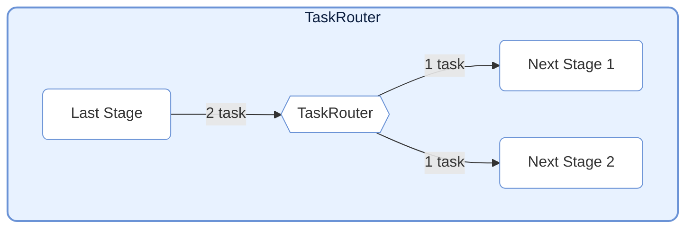
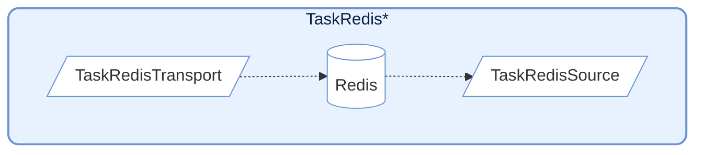
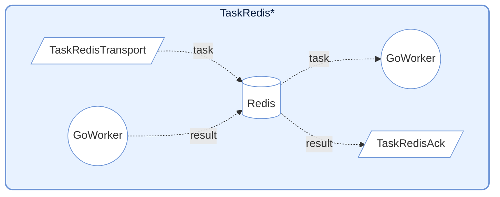

# TaskNodes

TaskNodes 模块提供了多种特殊功能的 `TaskStage` 实现，用于流控制、外部系统交互等场景。

## TaskSplitter (分裂器)


将单个输入任务分裂为多个输出任务。适用于一对多的场景。

### 初始化

```python
class TaskSplitter(TaskStage):
    def __init__(self):
        """
        初始化 TaskSplitter。
        默认：execution_mode="serial", max_retries=0, unpack_task_args=True
        """
```

### 使用方式

```python
class MySplitter(TaskSplitter):
    def _split(self, *task):
        # 将输入数据分裂为多个部分
        return task[0], task[1]  # 返回元组，每个元素成为独立任务
```

### 特性

- **机制**: 输入一个任务，返回一个元组/列表。每个元素会被包装成独立的 `TaskEnvelope` 发送给下游。
- **计数**: 内部维护 `split_counter` 统计分裂出的总任务数。
- **默认配置**: `execution_mode="serial"`, `max_retries=0`, `unpack_task_args=True`

---

## TaskRouter (路由器)



根据条件将任务分发到不同的下游路径。

### 初始化

```python
class TaskRouter(TaskStage):
    def __init__(self):
        """
        初始化 TaskRouter。
        默认：execution_mode="serial", max_retries=0
        """
```

### 使用方式

路由任务需要返回 `(target_tag, data)` 格式的元组：

```python
# 定义上游任务生成路由元组
def route_logic(data):
    if data > 0:
        return ("positive_stage", data)
    else:
        return ("negative_stage", data)

# 创建路由节点
router = TaskRouter()

# 连接下游（target 必须与路由逻辑中的 tag 匹配）
router.set_graph_context([pos_stage, neg_stage], stage_mode="process", stage_name="Router")
```

### 特性

- **机制**: 接收 `(target_tag, data)` 形式的元组。根据 `target_tag` 将 `data` 发送到对应的下游 Stage。
- **计数**: 为每个目标维护独立的计数器 `route_counters`。
- **错误处理**: 如果 `target_tag` 不存在于下游列表中，会抛出 `InvalidOptionError`。

---

## Redis Integration



提供与 Redis 交互的节点，常用于跨语言/跨进程协作（如配合 Go Worker）。

### TaskRedisTransport

将任务推送到 Redis List。

```python
class TaskRedisTransport(TaskStage):
    def __init__(
        self,
        key: str,                       # Redis List 名称
        host: str = "localhost",        # Redis 主机地址
        port: int = 6379,               # Redis 端口
        db: int = 0,                    # Redis 数据库编号
        password: str | None = None,    # Redis 密码
        unpack_task_args: bool = False, # 是否解包任务参数
    ):
        ...
```

**行为**: 将任务序列化为 JSON 并 `rpush` 到 Redis List。内部使用 `execution_mode="thread"` 和 `max_workers=4` 并发写入。

### TaskRedisSource

从 Redis List 拉取任务作为输入源。

```python
class TaskRedisSource(TaskStage):
    def __init__(
        self,
        key: str,                    # Redis List 名称
        host: str = "localhost",     # Redis 主机地址
        port: int = 6379,            # Redis 端口
        db: int = 0,                 # Redis 数据库编号
        password: str | None = None, # Redis 密码
        timeout: int = 10,           # 阻塞超时时间（秒），0 表示无限等待
    ):
        ...
```

**行为**: 使用 `blpop` 阻塞式拉取任务。内部使用 `execution_mode="serial"`，适合作为流水线入口节点。

### TaskRedisAck



等待远端 Worker 的执行结果。

```python
class TaskRedisAck(TaskStage):
    def __init__(
        self,
        key: str,                    # Redis Hash 名称（存储结果）
        host: str = "localhost",     # Redis 主机地址
        port: int = 6379,            # Redis 端口
        db: int = 0,                 # Redis 数据库编号
        password: str | None = None, # Redis 密码
        timeout: int = 10,           # 等待超时时间（秒），0 表示无限等待
    ):
        ...
```

**行为**: 轮询 Redis Hash 等待对应的 `task_id` 结果。支持处理成功结果或抛出 `RemoteWorkerError`。

---

## 前期设置

### 1. 启动 Redis 服务

在运行 `TaskRedis*` 系节点时，需要先启动 Redis 服务。

### 2. 设置环境变量（可选）

在项目根目录创建 `.env` 文件：

```env
# .env
# Redis 服务地址
REDIS_HOST=127.0.0.1
# Redis 服务端口
REDIS_PORT=6379
# Redis 服务密码，没有则留空
REDIS_PASSWORD=your_redis_password
```

### 3. 配置节点

```python
import os
from dotenv import load_dotenv
from celestialflow import TaskRedisTransport, TaskRedisAck, TaskRedisSource

# 加载环境变量
load_dotenv()

redis_host = os.getenv("REDIS_HOST", "127.0.0.1")
redis_password = os.getenv("REDIS_PASSWORD", "")

# Transport + Ack 组合（推送到 Redis 并等待结果）
redis_sink = TaskRedisTransport(
    key="testFibonacci:input",
    host=redis_host,
    password=redis_password
)
redis_ack = TaskRedisAck(
    key="testFibonacci:output",
    host=redis_host,
    password=redis_password
)

# Source 组合（从 Redis 拉取任务）
redis_source = TaskRedisSource(
    key="test_redis",
    host=redis_host,
    password=redis_password
)
```

---

## Redis 数据格式

### TaskRedisTransport 推送格式

```json
{
    "id": 12345678,
    "task": ["arg1", "arg2"],
    "emit_ts": 1703001234.567
}
```

### TaskRedisAck 期望结果格式

```json
{
    "status": "success",
    "result": "computed_value"
}
```

或错误格式：
```json
{
    "status": "error",
    "error": "Error message"
}
```

---

## 注意事项

1. **连接管理**: Redis 客户端在首次使用时延迟初始化。
2. **超时处理**: `TaskRedisSource` 和 `TaskRedisAck` 支持超时配置，超时会抛出 `TimeoutError`。
3. **错误传播**: 远端 Worker 返回的错误会通过 `RemoteWorkerError` 传播。
4. **幂等性**: `TaskRedisAck` 获取结果后会删除 Redis 中的记录，保证一次性消费。