# TaskNodes

TaskNodes 模块提供了多种特殊功能的 `TaskStage` 实现，用于流控制、外部系统交互等场景。

## TaskSplitter (分裂器)



将单个输入任务分裂为多个输出任务。适用于一对多的场景。

- **机制**: 输入一个任务，返回一个元组/列表。每个元素会被包装成独立的 `TaskEnvelope` 发送给下游。
- **计数**: 内部维护 `split_counter` 统计分裂出的总任务数。

```python
class MySplitter(TaskSplitter):
    def _split(self, data):
        # 将输入数据分裂为两部分
        return part1, part2
```

## TaskRouter (路由器)



根据条件将任务分发到不同的下游路径。

- **机制**: 接收 `(target_tag, data)` 形式的元组。根据 `target_tag` 将 `data` 发送到对应的下游 Stage。
- **配置**: 下游 Stage 在连接时需指定 `target` 参数。

```python
# 路由函数
def route_logic(data):
    if data > 0:
        return "positive", data
    else:
        return "negative", data

router = TaskRouter()
router.set_source(route_logic)

# 连接下游
router.connect(pos_stage, target="positive")
router.connect(neg_stage, target="negative")
```

## Redis Integration



提供与 Redis 交互的节点，常用于跨语言/跨进程协作（如配合 Go Worker）。

### TaskRedisSink

将任务推送到 Redis List。

- **参数**: `key` (List名称), `host`, `port`, `db`, `password`
- **行为**: 将任务序列化为 JSON 并 `rpush` 到 Redis。

### TaskRedisSource

从 Redis List 拉取任务作为输入源。

- **参数**: `key`, `host`, `port`, `db`, `password`, `timeout`
- **行为**: 使用 `blpop` 阻塞式拉取任务。

### TaskRedisAck



等待远端 Worker 的执行结果。

- **参数**: `key` (结果Hash表名), `host`, `port`, ...
- **行为**: 轮询或阻塞等待 Redis Hash 中出现对应的 `task_id` 结果。支持处理成功结果或抛出 `RemoteWorkerError`。

## 前期设置

1. 启动 Redis 服务
在运行`TaskRedis*`系节点时, 需要先启动 Redis 服务

2. 设置环境变量(可选)
然后在根目录下建立一个.env文件, 按以下格式填入:

```env
# .env
# Redis 服务地址
REDIS_HOST=127.0.0.1
# Redis 服务端口
REDIS_PORT=6379
# Redis 服务密码, 没有则留空
REDIS_PASSWORD=your_redis_password
```

3. 设置 TaskRedis*节点

然后直接通过读取.env中内容来设置 `TaskRedis*` 中 Redis 端口 节点名称与密码。

```python
import os
from dotenv import load_dotenv

# 如果没有.env文件, 则使用默认值
load_dotenv()
redis_host = os.getenv("REDIS_HOST", "127.0.0.1")
redis_password = os.getenv("REDIS_PASSWORD", "")

# test_redis_ack_0
redis_sink = TaskRedisSink(key="testFibonacci:input", host=redis_host, password=redis_password)
redis_ack = TaskRedisAck(key="testFibonacci:output", host=redis_host, password=redis_password)

# test_redis_source_0
redis_sink = TaskRedisSink("test_redis", host=redis_host, password=redis_password)
redis_source = TaskRedisSource("test_redis", host=redis_host, password=redis_password)
```

