# TaskNodes

## TaskSplitter


## TaskRouter




## TaskRedis*系列节点

### TaskRedisSink & TaskRedisSource




### TaskRedisAck




### 前期设置

1. 启动 Redis 服务
在运行`TaskRedis*`系节点时, 需要先启动 Redis 服务

2. 设置环境变量
然后在根目录下建立一个.env文件, 按以下格式填入:

```env
# .env
# Redis 服务地址
REDIS_HOST=127.0.0.1
# Redis 服务端口
REDIS_PORT=6379
# Redis 服务密码, 没有则留空
REDIS_PASSWORD=your_redis_password
```

3. 设置 TaskRedis*节点

然后直接通过读取.env中内容来设置 `TaskRedis*` 中 Redis 端口 节点名称与密码。

```python
import os
from dotenv import load_dotenv

load_dotenv()
redis_host = os.getenv("REDIS_HOST")
redis_password = os.getenv("REDIS_PASSWORD")

# test_redis_ack_0
redis_sink = TaskRedisSink(key="testFibonacci:input", host=redis_host, password=redis_password)
redis_ack = TaskRedisAck(key="testFibonacci:output", host=redis_host, password=redis_password)

# test_redis_source_0
redis_sink = TaskRedisSink("test_redis", host=redis_host, password=redis_password)
redis_source = TaskRedisSource("test_redis", host=redis_host, password=redis_password)
```

## 下一步扩展方向
| 模块                     | 功能                                                        |
|--------------------------|-------------------------------------------------------------|
| 🔄 TaskRouter（分支控制）| 根据条件将任务路由到不同的 stage                            |
| 📦 TaskFanInr            | 将多个结果聚合后处理（fan-in）                              |
| 🔍 TaskTracer / Inspector| 给每个任务标记 trace_id、路径                               |

