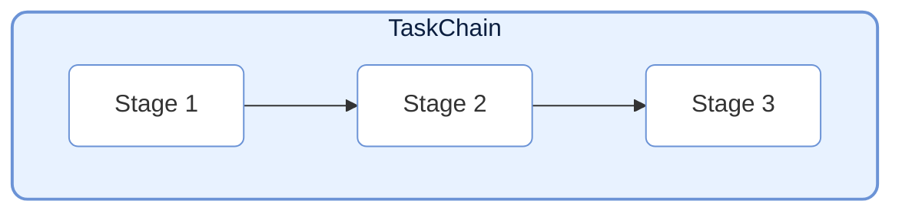
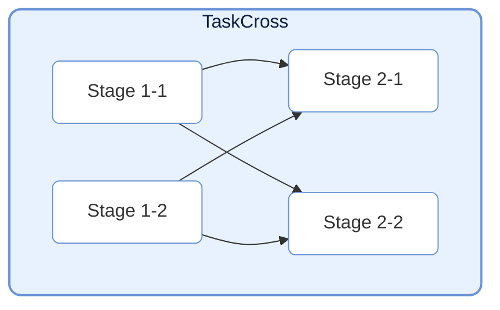
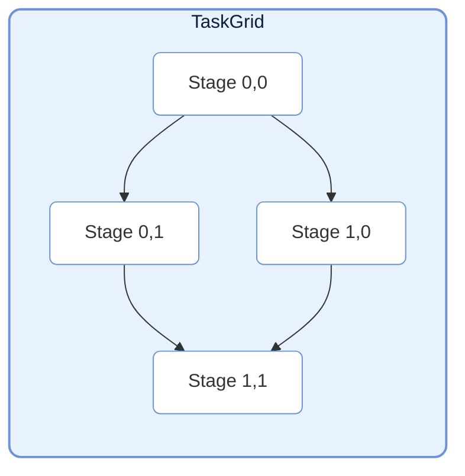
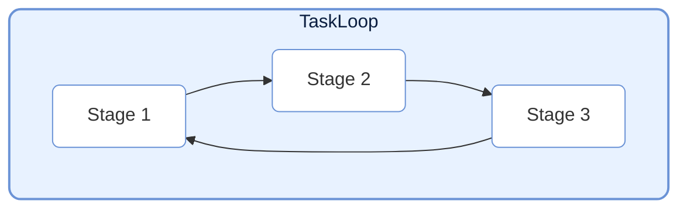
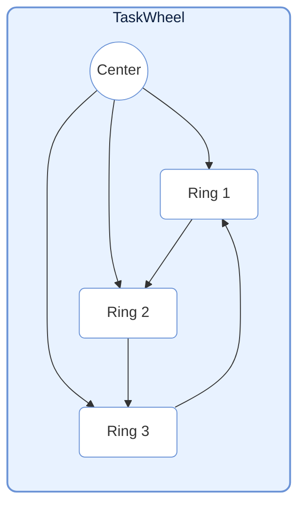
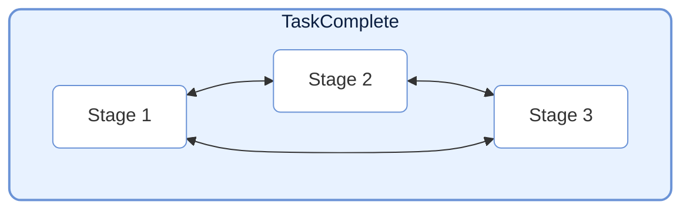

# TaskStructure

TaskStructure 模块提供了多种预定义的任务图结构，帮助用户快速构建复杂的任务流。所有的结构都继承自 `TaskGraph`。

## Chain (线性链)



`TaskChain` 是最简单的任务结构，将多个 `TaskStage` 按顺序连接，形成线性的数据流。

```python
from celestialflow import TaskChain, TaskStage

# 定义阶段
stage1 = TaskStage(func=func1)
stage2 = TaskStage(func=func2)
stage3 = TaskStage(func=func3)

# 创建链
chain = TaskChain(
    stages=[stage1, stage2, stage3],
    chain_mode="serial",  # serial: 依次运行; process: 同时运行
    log_level="SUCCESS"
)

# 启动
chain.start_chain(init_tasks_dict={stage1: [data]})
```

## Cross (交叉层)



`TaskCross` 将任务按“层”组织。每层包含多个并行执行的节点。相邻层之间的节点建立全连接依赖（上一层每个节点都连接到下一层所有节点）。

```python
from celestialflow import TaskCross

# 定义层
layer1 = [stage_1_1, stage_1_2]
layer2 = [stage_2_1, stage_2_2]

# 创建交叉结构
cross = TaskCross(
    layers=[layer1, layer2],
    schedule_mode="eager"
)
```

## Grid (网格)



`TaskGrid` 将任务节点组织成二维网格。每个节点连接其**右侧**和**下方**的节点。

```python
from celestialflow import TaskGrid

# 定义网格
grid_layout = [
    [stage_00, stage_01],
    [stage_10, stage_11]
]

# 创建网格结构
grid = TaskGrid(
    grid=grid_layout,
    schedule_mode="eager"
)
```

## Loop (环形)



`TaskLoop` 将节点首尾相连形成闭环。由于环的特性，强制使用 `eager` 调度模式。
注意：环结构通常需要外部干预来停止，或者设置特定的退出条件。

```python
from celestialflow import TaskLoop

# 创建环
loop = TaskLoop(
    stages=[stage1, stage2, stage3]  # stage3 -> stage1
)
```

## Wheel (轮形)



`TaskWheel` 包含一个中心节点和一个环形结构。中心节点连接向环上的每个节点，环上节点首尾相连。

```python
from celestialflow import TaskWheel

# 创建轮形结构
wheel = TaskWheel(
    center=center_stage,
    ring=[ring_stage1, ring_stage2, ring_stage3]
)
```

## Complete (完全图)



`TaskComplete` 是一种特殊的结构，其中每个节点都连接向除自己以外的所有其他节点。

```python
from celestialflow import TaskComplete

# 创建完全图
complete = TaskComplete(
    stages=[stage1, stage2, stage3, stage4]
)
```
