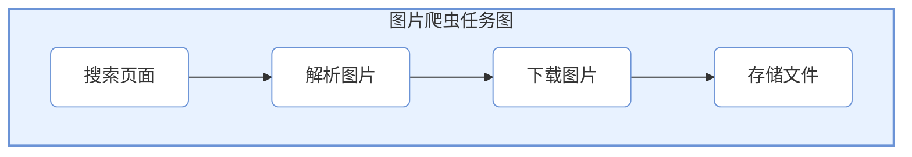

# 教程（Tutorial）：构建一个图片爬虫

本教程将通过一个完整的实战项目——**百度图片爬虫**，带你从零开始学习 CelestialFlow 的使用。

## 项目目标

爬取百度图片搜索结果，下载指定关键词的图片到本地。我们将学习如何：
1. 分析任务流程并拆解
2. 编写各阶段的处理函数
3. 组装任务图并运行
4. 通过 Web UI 监控执行状态

---

## 第一步：任务分析与拆解

在开始编码前，我们需要分析爬虫的执行流程：

```
用户输入关键词 → 搜索页面 → 解析图片列表 → 下载图片 → 保存文件
```

### 任务层级设计

| 层级 | 功能 | 输入 | 输出 |
|------|------|------|------|
| **Layer 1: 搜索** | 获取搜索结果页面 | 关键词 | 页面 HTML |
| **Layer 2: 解析** | 提取图片 URL 列表 | HTML | 图片 URL 列表 |
| **Layer 3: 下载** | 下载图片内容 | 图片 URL | 图片二进制数据 |
| **Layer 4: 存储** | 保存到本地 | 图片数据 | 文件路径 |

### 任务图结构



---

## 第二步：编写处理函数

我们先编写各个阶段的处理函数，并单独测试验证。

### 2.1 搜索页面

```python
import requests
from urllib.parse import quote

def search_images(keyword: str) -> str:
    """
    根据关键词搜索百度图片，返回页面 HTML。
    
    :param keyword: 搜索关键词
    :return: 页面 HTML 内容
    """
    url = f"https://image.baidu.com/search/index?tn=baiduimage&word={quote(keyword)}"
    headers = {
        "User-Agent": "Mozilla/5.0 (Windows NT 10.0; Win64; x64) AppleWebKit/537.36"
    }
    response = requests.get(url, headers=headers, timeout=10)
    response.raise_for_status()
    return response.text

# 单独测试
if __name__ == "__main__":
    html = search_images("猫咪")
    print(f"获取到 {len(html)} 字符的 HTML")
```

### 2.2 解析图片 URL

```python
import re
import json

def parse_image_urls(html: str) -> list[str]:
    """
    从 HTML 中解析图片 URL 列表。
    
    :param html: 页面 HTML
    :return: 图片 URL 列表
    """
    # 百度图片的数据嵌入在 JavaScript 中
    pattern = r'"hoverURL":"(https?://[^"]+)"'
    urls = re.findall(pattern, html)
    # 处理转义字符
    urls = [url.replace("\\/", "/") for url in urls]
    return urls[:20]  # 限制数量

# 单独测试
if __name__ == "__main__":
    html = search_images("猫咪")
    urls = parse_image_urls(html)
    print(f"解析到 {len(urls)} 个图片 URL")
    for url in urls[:3]:
        print(f"  - {url}")
```

### 2.3 下载图片

```python
import time

def download_image(url: str) -> bytes | None:
    """
    下载图片内容。
    
    :param url: 图片 URL
    :return: 图片二进制数据，失败返回 None
    """
    headers = {
        "User-Agent": "Mozilla/5.0 (Windows NT 10.0; Win64; x64) AppleWebKit/537.36",
        "Referer": "https://image.baidu.com/"
    }
    try:
        response = requests.get(url, headers=headers, timeout=15)
        response.raise_for_status()
        return response.content
    except Exception as e:
        print(f"下载失败: {url}, 错误: {e}")
        return None

# 单独测试
if __name__ == "__main__":
    html = search_images("猫咪")
    urls = parse_image_urls(html)
    if urls:
        data = download_image(urls[0])
        if data:
            print(f"下载成功，大小: {len(data)} 字节")
```

### 2.4 存储文件

```python
import os
import hashlib

def save_image(image_data: bytes, keyword: str) -> str:
    """
    保存图片到本地。
    
    :param image_data: 图片二进制数据
    :param keyword: 关键词（用于创建目录）
    :return: 保存的文件路径
    """
    # 创建目录
    save_dir = os.path.join("images", keyword)
    os.makedirs(save_dir, exist_ok=True)
    
    # 使用数据哈希作为文件名
    file_hash = hashlib.md5(image_data).hexdigest()[:12]
    file_path = os.path.join(save_dir, f"{file_hash}.jpg")
    
    # 避免重复下载
    if not os.path.exists(file_path):
        with open(file_path, "wb") as f:
            f.write(image_data)
    
    return file_path

# 单独测试
if __name__ == "__main__":
    html = search_images("猫咪")
    urls = parse_image_urls(html)
    if urls:
        data = download_image(urls[0])
        if data:
            path = save_image(data, "猫咪")
            print(f"保存成功: {path}")
```

---

## 第三步：组装任务图

处理函数验证无误后，我们将它们分配到各自的 `TaskStage`，然后用 `TaskGraph` 组织结构。

### 3.1 创建节点

```python
from celestialflow import TaskStage, TaskSplitter

# 搜索阶段：输入关键词，输出 HTML
stage_search = TaskStage(
    func=search_images,
    execution_mode="serial",  # 只有一个关键词，串行即可
    max_retries=2,
)

# 解析阶段：输入 HTML，输出多个图片 URL（需要拆分）
# 这里需要自定义 Splitter 来拆分 URL 列表
class URLSplitter(TaskSplitter):
    """将 URL 列表拆分为多个独立任务。"""
    
    def _split(self, html: str):
        urls = parse_image_urls(html)
        print(f"解析到 {len(urls)} 个图片 URL")
        return tuple(urls)

stage_parse = URLSplitter()

# 下载阶段：输入 URL，输出图片数据
stage_download = TaskStage(
    func=download_image,
    execution_mode="thread",  # 网络IO密集，使用线程池
    worker_limit=10,          # 并发下载10张
    max_retries=3,
)

# 存储阶段：输入图片数据，输出文件路径
stage_save = TaskStage(
    func=lambda data: save_image(data, "猫咪") if data else None,
    execution_mode="serial",
    enable_duplicate_check=False,  # 允许保存重复数据（用于重试）
)
```

### 3.2 构建任务图

```python
from celestialflow import TaskGraph

# 设置节点间的连接关系
stage_search.set_graph_context(
    next_stages=[stage_parse],
    stage_mode="process",
    stage_name="搜索页面"
)

stage_parse.set_graph_context(
    next_stages=[stage_download],
    stage_mode="process",
    stage_name="解析图片"
)

stage_download.set_graph_context(
    next_stages=[stage_save],
    stage_mode="process",
    stage_name="下载图片"
)

stage_save.set_graph_context(
    next_stages=[],
    stage_mode="process",
    stage_name="存储文件"
)

# 创建任务图
graph = TaskGraph(
    root_stages=[stage_search],
    schedule_mode="eager",
    log_level="SUCCESS"
)
```

### 3.3 启动 Web 监控（可选）

```python
# 启用 Web 监控
graph.set_reporter(True, host="127.0.0.1", port=5005)
```

启动 Web 服务：
```bash
celestialflow-web --port 5005
```

访问 http://localhost:5005 查看实时状态。

### 3.4 运行任务图

```python
# 准备初始任务
init_tasks = {
    stage_search.get_tag(): ["猫咪", "小狗", "风景"]
}

# 启动
print("开始爬取图片...")
graph.start_graph(init_tasks)

# 获取统计
print(f"成功: {graph.get_graph_summary().get('total_successed', 0)}")
print(f"失败: {graph.get_graph_summary().get('total_failed', 0)}")
```

---

## 第四步：完整代码

将所有代码整合到一个文件中：

```python
# crawler.py
import os
import re
import hashlib
import requests
from urllib.parse import quote

from celestialflow import (
    TaskStage, 
    TaskSplitter, 
    TaskGraph,
)

# ========== 处理函数 ==========

def search_images(keyword: str) -> str:
    """搜索百度图片。"""
    url = f"https://image.baidu.com/search/index?tn=baiduimage&word={quote(keyword)}"
    headers = {"User-Agent": "Mozilla/5.0 (Windows NT 10.0; Win64; x64) AppleWebKit/537.36"}
    response = requests.get(url, headers=headers, timeout=10)
    response.raise_for_status()
    return response.text

def parse_image_urls(html: str) -> list[str]:
    """解析图片 URL。"""
    pattern = r'"hoverURL":"(https?://[^"]+)"'
    urls = re.findall(pattern, html)
    return [url.replace("\\/", "/") for url in urls][:20]

def download_image(url: str) -> bytes | None:
    """下载图片。"""
    headers = {
        "User-Agent": "Mozilla/5.0 (Windows NT 10.0; Win64; x64) AppleWebKit/537.36",
        "Referer": "https://image.baidu.com/"
    }
    try:
        response = requests.get(url, headers=headers, timeout=15)
        response.raise_for_status()
        return response.content
    except Exception:
        return None

def save_image(image_data: bytes, keyword: str) -> str | None:
    """保存图片。"""
    if not image_data:
        return None
    save_dir = os.path.join("images", keyword)
    os.makedirs(save_dir, exist_ok=True)
    file_hash = hashlib.md5(image_data).hexdigest()[:12]
    file_path = os.path.join(save_dir, f"{file_hash}.jpg")
    if not os.path.exists(file_path):
        with open(file_path, "wb") as f:
            f.write(image_data)
    return file_path

# ========== 自定义节点 ==========

class URLSplitter(TaskSplitter):
    """URL 列表拆分器。"""
    
    def _split(self, html: str):
        urls = parse_image_urls(html)
        print(f"解析到 {len(urls)} 个图片 URL")
        return tuple(urls)

# ========== 构建任务图 ==========

def build_crawler_graph(keyword: str) -> TaskGraph:
    """构建爬虫任务图。"""
    
    # 创建节点
    stage_search = TaskStage(
        func=search_images,
        execution_mode="serial",
        max_retries=2,
    )
    
    stage_parse = URLSplitter()
    
    stage_download = TaskStage(
        func=download_image,
        execution_mode="thread",
        worker_limit=10,
        max_retries=3,
    )
    
    # 使用闭包传递 keyword
    stage_save = TaskStage(
        func=lambda data: save_image(data, keyword),
        execution_mode="serial",
        enable_duplicate_check=False,
    )
    
    # 设置连接
    stage_search.set_graph_context([stage_parse], "process", "搜索页面")
    stage_parse.set_graph_context([stage_download], "process", "解析图片")
    stage_download.set_graph_context([stage_save], "process", "下载图片")
    stage_save.set_graph_context([], "process", "存储文件")
    
    return TaskGraph([stage_search], schedule_mode="eager", log_level="SUCCESS")

# ========== 主程序 ==========

if __name__ == "__main__":
    # 配置
    KEYWORDS = ["猫咪", "小狗", "风景"]
    
    # 构建图
    graph = build_crawler_graph(KEYWORDS[0])
    graph.set_reporter(True, host="127.0.0.1", port=5005)
    
    # 运行
    print("开始爬取图片...")
    graph.start_graph({
        graph.root_stages[0].get_tag(): KEYWORDS
    })
    
    # 统计
    summary = graph.get_graph_summary()
    print(f"\n爬取完成!")
    print(f"成功: {summary.get('total_successed', 0)}")
    print(f"失败: {summary.get('total_failed', 0)}")
```

---

## 第五步：运行与调试

### 5.1 启动 Web 服务

```bash
# 终端 1: 启动 Web 服务
celestialflow-web --port 5005
```

### 5.2 运行爬虫

```bash
# 终端 2: 运行爬虫
python crawler.py
```

### 5.3 查看 Web UI

打开 http://localhost:5005，你可以看到：

1. **Dashboard**: 实时显示各节点的处理进度
2. **Structure**: 任务图的可视化结构
3. **Errors**: 下载失败的图片 URL 和错误信息
4. **Task Injection**: 动态注入新的关键词

### 5.4 查看结果

```bash
# 查看下载的图片
ls images/猫咪/
ls images/小狗/
ls images/风景/
```

---

## 扩展：动态任务注入

通过 Web UI 可以动态注入新的关键词：

```python
# 或通过代码注入
from celestialflow import TerminationSignal

# 注入新关键词
graph.put_stage_queue({
    stage_search.get_tag(): ["汽车", "美食"]
})

# 注入终止信号（停止爬取）
graph.put_stage_queue({
    stage_search.get_tag(): [TerminationSignal()]
})
```

---

## 总结

本教程展示了 CelestialFlow 的完整使用流程：

1. **任务分析**: 将复杂任务拆解为独立的层级
2. **函数编写**: 为每个层级编写处理函数并单独测试
3. **节点创建**: 将函数包装为 `TaskStage`
4. **图组装**: 用 `TaskGraph` 组织节点关系
5. **监控运行**: 通过 Web UI 实时监控执行状态

### 关键概念回顾

| 概念 | 说明 |
|------|------|
| `TaskStage` | 任务节点，包装处理函数 |
| `TaskSplitter` | 分裂器，将一个任务拆分为多个 |
| `TaskGraph` | 任务图，组织节点关系和执行流程 |
| `stage_mode` | 节点运行模式（serial/process） |
| `execution_mode` | 节点内部执行模式（serial/thread） |

### 下一步

- 尝试使用 `TaskRouter` 实现条件分发
- 探索 `TaskRedisTransport` 实现跨语言协作
- 阅读其他 [API 参考](reference/stage/core_executor.md) 了解更多功能