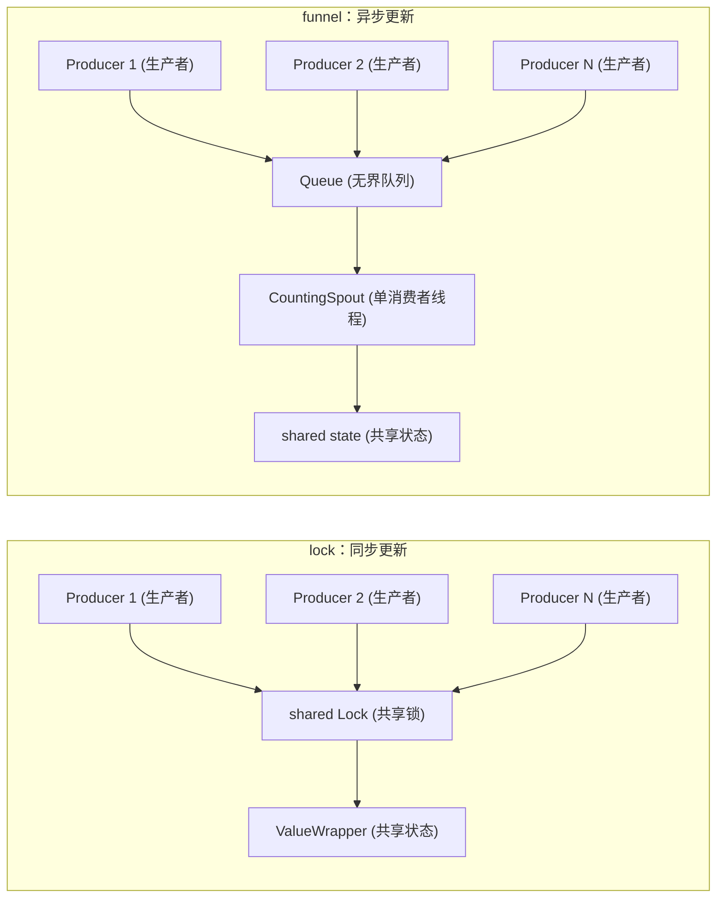

# bench_funnel_vs_lock.py 基准测试说明

> 📅 最后更新日期: 2026/09/14

## 目标

对比两种让多个生产者线程安全更新同一份共享状态的机制：

- **漏斗（funnel）**：生产者只把记录投入队列，由单个 `BaseSpout` 后台线程串行消费，即不同步地更新状态。
- **加锁（`ValueWrapper`）**：生产者持共享 `Lock` 直接更新状态，即同步更新。

脚本在**相同负载**下（相同生产者数量、相同总记录数、相同单条记录处理开销）运行两类机制，回答的问题是：

1. 发送端成本（生产者要等多久）差异有多大？
2. 端到端吞吐差异有多大？
3. 异步化需要付出什么代价（积压 / 内存）？
4. 读压力对两者的写路径分别有多大干扰？

> ⚠️ **结论先行**：漏斗不是吞吐优化手段。端到端吞吐上限由接收端决定，两者串行的工作量相同；
> 漏斗真正的收益是**降低发送端等待**与**天然获得有序单写流**，代价是**队列积压无背压约束**。

## 测试内容

### 场景

| 场景 | 同步方式 | 说明 |
|------|---------|------|
| `lock` | `ValueWrapper` + 共享 `Lock` | 生产者持锁更新，写操作同步可见。对应 `TaskMetrics` 中计数器共享同一把锁的用法 |
| `nolock` | `ValueWrapper`，不挂锁 | 刻意不加锁的基线，用于量化锁本身的开销，而非正确性演示（见下方“可能出现的问题”） |
| `sharded` | 每个生产者一个无锁 `ValueWrapper` | 结束时汇总。无任何跨线程争用，但只适用于可聚合负载，无法表达共享记录流 |
| `funnel` | `BaseInlet` + `BaseSpout` | 生产者调用 `emit` 入队；`CountingSpout` 单线程串行消费并更新状态 |

`funnel` 场景中记录形如 `(producer_id, seq)`，`CountingSpout` 会在消费时校验同一生产者内 `seq` 是否严格连续，因此 `order_violations` 是漏斗“有序单写流”这一保证的实测验证。
`lock` / `nolock` / `sharded` 不建模记录流，该维度为 `n/a`：加锁只保证单次更新的原子性，要拿到跨生产者的 FIFO 次序需要额外设计（如分片 + 归并）。

### 度量维度

| 指标 | 含义 |
|------|------|
| `submit` | 生产者侧耗时，即“提交完全部记录”消耗的墙钟时间，反映发送端成本 |
| `drain` | 生产者提交完成后，接收端处理完剩余记录的时间，反映异步积压的代价 |
| `total` | 端到端耗时，`submit + drain`（`lock` 类场景两者相同） |
| `peak_pending` | 队列积压峰值，即漏斗的内存代价；无队列的场景恒为 `0` |
| `order_violations` | 单生产者内序号错乱次数；不建模记录流的场景显示 `n/a` |
| `reader_ops` | `--readers` 指定的读线程在写阶段完成的读次数 |

### 两种机制的数据流



关键差异：`lock` 路径上，用户负载（序列化、写文件、写 SQLite 等）与临界区在同一线程内连续发生，生产者必须等待；
`funnel` 路径把这段负载整体搬到接收端线程，生产者只承担一次入队成本，但队列会在上游快于下游时持续增长。

## 关键配置

| 参数 | 默认值 | 说明 |
|------|-------|------|
| `--items` | `400000` | 每轮的总记录 / 更新次数 |
| `--producers` | `4` | 生产者线程数 |
| `--readers` | `0` | 读线程数，`lock` 场景轮询 `ValueWrapper.get()`，`funnel` 场景轮询 `get_pending_count()` |
| `--work-iters` | `0` | 单条记录的模拟处理开销（纯 CPU 变换迭代次数），`0` 表示不模拟 |
| `--repeats` | `3` | 每个场景的重复轮数 |
| `--scenarios` | `lock,nolock,sharded,funnel` | 逗号分隔，只运行选中的场景 |

脚本内常量：

- `PENDING_SAMPLE_INTERVAL = 0.0005`：采样队列积压的间隔（秒）。受平台定时器精度限制，`peak_pending` 是真实峰值的**下界**。
- 工作负载函数 `apply_work(seed, iters)`：对 `seed` 做 `iters` 次 `((acc * 33) ^ i) & 0x7FFF_FFFF` 变换。在 `lock` 场景中它发生在生产者线程，在 `funnel` 场景中它发生在消费线程——这正是两种机制差异的来源。

参数合法性由 `validate_args()` 校验（`--items >= 0`、`--producers >= 1`、`--readers >= 0`、`--work-iters >= 0`、`--repeats >= 1`），非法值在打印配置头之前直接报错退出。

脚本会把项目 `src/` 目录插入 `sys.path`，因此无需安装包即可直接运行。

## 可能出现的问题

1. **`nolock` 不能用来演示“无锁会算错”**：在启用 GIL 的解释器上，`counter.value += 1` 的竞争窗口（数个字节码）远小于线程切换粒度，本机实测 200 万次更新仍未丢计数。该场景只能当作“无同步的性能上界”；只有在 free-threaded 构建下才会真正丢更新。
2. **`peak_pending` 是下界**：按 0.5ms 间隔采样，短促的积压峰值可能被漏掉。
3. **端到端吞吐由接收端决定**：`funnel` 把处理集中到单个消费线程，串行工作量与 `lock` 在临界区内完成的工作量相同，因此不应期待 `total` 明显变优。
4. **`--readers` 会造成重度干扰**：所有读线程自旋争用写路径上的同一把锁（`lock` 场景是 `ValueWrapper` 的锁，`funnel` 场景是 `PendingCounter` 的锁）。两种设计都要为读付代价，`funnel` 的入队路径同样会被拖慢。
5. **`--work-iters` 是 GIL 受限的纯 CPU 负载**：本机 GIL 开启时两端吞吐接近；free-threaded 构建下结论可能不同。
6. **`sharded` 不是通用解**：它没有共享记录流，只适用于可聚合负载，放在这里是为了给出“无争用”的参照点。
7. **`drain` 在无队列场景为噪声**：`lock` / `nolock` / `sharded` 的 `drain` 应当视为 `0`，实测出现的 `0.0000s ~ 0.0008s` 来自读线程回收。
8. **小样本偏差**：记录数过少时，线程启动与 `spout` 启停的固定成本占比会明显上升。

## 基准结果（实测）

> 🟢 本节各表格中的耗时/吞吐量均为历史实测数据，无法从源码验证，需人工确认。

三组结果均来自同一台 Windows 机器、本地 `.venv`、Python 3.14.3、**GIL 已启用**、生产者数 `4`。

### 2026/09/14 - 纯交接开销（`--items 400000 --work-iters 0 --repeats 2`）

没有可搬走的用户负载，考察的是纯粹的“交接成本”。

| 场景 | `submit` 均值 | `drain` 均值 | `total` 均值 | 端到端吞吐 | 正确性 | `peak_pending` | `order_violations` |
|------|--------------|-------------|-------------|-----------|--------|---------------|-------------------|
| `lock` | 0.0608s | 0.0000s | 0.0608s | 6,589,743 items/s | 2/2 | 0 | n/a |
| `nolock` | 0.0520s | 0.0000s | 0.0521s | 7,685,825 items/s | 2/2 | 0 | n/a |
| `sharded` | 0.0533s | 0.0000s | 0.0533s | 7,508,702 items/s | 2/2 | 0 | n/a |
| `funnel` | 0.4590s | 0.1782s | 0.6372s | 627,859 items/s | 2/2 | 266,001 | 0 |

**本轮结论**：

- 加锁本身的成本有限：`lock` 相对 `nolock` 吞吐下降约 **14%**，`sharded` 与 `nolock` 基本持平，说明这道共享锁并不是纯计数的瓶颈。
- `funnel` 在此场景下慢约 **10x**：没有耗时负载可搬走时，线程间交接是纯开销，`submit` 反而是 `lock` 的 7.5 倍。
- `funnel` 的 `peak_pending` 达到 `266,001 / 400,000`：生产者吞吐高于消费者，近三分之二的记录停留在队列中，这是无背压设计的直接内存代价。
- 四种场景计数全部正确，`funnel` 的 `order_violations` 为 `0`。

### 2026/09/14 - 带单条处理开销（`--items 30000 --work-iters 200 --repeats 2`）

给每条记录加上 CPU 处理开销，模拟“负载可以被搬到接收端”的情况。

| 场景 | `submit` 均值 | `drain` 均值 | `total` 均值 | 端到端吞吐 | 正确性 | `peak_pending` | `order_violations` |
|------|--------------|-------------|-------------|-----------|--------|---------------|-------------------|
| `lock` | 0.4992s | 0.0000s | 0.4992s | 60,106 items/s | 2/2 | 0 | n/a |
| `nolock` | 0.5012s | 0.0000s | 0.5012s | 59,852 items/s | 2/2 | 0 | n/a |
| `sharded` | 0.5092s | 0.0000s | 0.5092s | 58,931 items/s | 2/2 | 0 | n/a |
| `funnel` | 0.1450s | 0.4092s | 0.5543s | 54,126 items/s | 2/2 | 23,247 | 0 |

**本轮结论**：

- 处理开销成为主导后，加锁与不加锁几乎没有区别（`lock` 0.4992s vs `nolock` 0.5012s）：临界区只占整条记录耗时的极小一部分。
- 发送端差距被显著放大：`funnel` 的 `submit` 为 `0.1450s`，是 `lock` 的 **1/3.4**，即生产者等待时间大幅下降。
- 但端到端反而略慢（`0.5543s` vs `0.4992s`，约 **11%**），因为 GIL 下 CPU 负载无法真正并行，处理只是从生产者线程搬到了消费线程。
- 积压达到 `23,247 / 30,000`：**异步化的收益（低发送延迟）与代价（高内存占用）在这一轮同时出现**。

### 2026/09/14 - 注入读压力（`--items 300000 --readers 2 --repeats 1`）

额外启动 2 个读线程，在写阶段持续轮询共享状态。

| 场景 | `submit` 均值 | `drain` 均值 | `total` 均值 | 端到端吞吐 | 正确性 | `peak_pending` | `reader_ops` |
|------|--------------|-------------|-------------|-----------|--------|---------------|-------------|
| `lock` | 0.4052s | 0.0008s | 0.4060s | 738,935 items/s | 1/1 | 0 | 2,333,379 |
| `nolock` | 0.4033s | 0.0003s | 0.4035s | 743,437 items/s | 1/1 | 0 | 2,726,586 |
| `funnel` | 1.2632s | 0.1186s | 1.3818s | 217,114 items/s | 1/1 | 210,553 | 5,547,967 |

**本轮结论**：

- 读线程自旋争用同一把锁的代价极大：`lock` 的写吞吐从第一轮的 6,589,743 items/s 降到 738,935 items/s，**下降约 8.9x**。
- `funnel` 的入队路径同样被拖慢（`submit` `1.2632s`）：`PendingCounter` 的锁就在入队路径上，读侧开销无法被异步化隔离。
- 反过来看，读侧却“更划算”：同样时长内 `funnel` 场景完成了 5,547,967 次读（`lock` 为 2,333,379 次），因为其写路径被拖慢后，读线程获得了更多调度机会。
- 结论是**读不是免费的**：无论哪种机制，读压力都会直接损害写路径，只是损害的位置不同。

### 综合参考

- **不要把漏斗当吞吐优化**：端到端上限取决于接收端，两者串行工作量相同。
- **漏斗的价值在发送端**：降低 `submit`、吸收突发流量、以及与单消费者绑定的有序单写流（`order_violations` 恒为 0）。
- **漏斗的代价是积压**：实测 `peak_pending` 可逼近全量记录，当前 `Queue` 无界且无背压。
- **加锁成本本身不高**：在 GIL 环境下，共享 `int` 计数的锁开销约 14%，真正放大成本的是读竞争而不是锁本身。

## 运行方式

```bash
python bench/bench_funnel_vs_lock.py
```

使用 `uv` 运行：

```bash
uv run python bench/bench_funnel_vs_lock.py
```

若项目未安装为可导入包，也可以直接使用本地虚拟环境解释器：

```bash
.\.venv\Scripts\python.exe bench/bench_funnel_vs_lock.py
```

## 参数调整

### 只对比漏斗与加锁

```bash
python bench/bench_funnel_vs_lock.py --scenarios lock,funnel
```

### 放大记录数与生产者数

```bash
python bench/bench_funnel_vs_lock.py --items 800000 --producers 8
```

### 模拟可搬运的用户负载

```bash
python bench/bench_funnel_vs_lock.py --work-iters 200 --scenarios lock,funnel
```

### 注入读压力

```bash
python bench/bench_funnel_vs_lock.py --readers 2 --scenarios lock,funnel
```

### 提高重复轮数以观察稳定性

```bash
python bench/bench_funnel_vs_lock.py --repeats 5
```

## 依赖

- Python 标准库：`argparse`、`statistics`、`sys`、`threading`、`time`、`dataclasses`、`pathlib`
- 项目源码中的 `celestialflow.funnel`（`BaseInlet`、`BaseSpout`）
- 项目源码中的 `celestialflow.runtime.util_types`（`ValueWrapper`）
