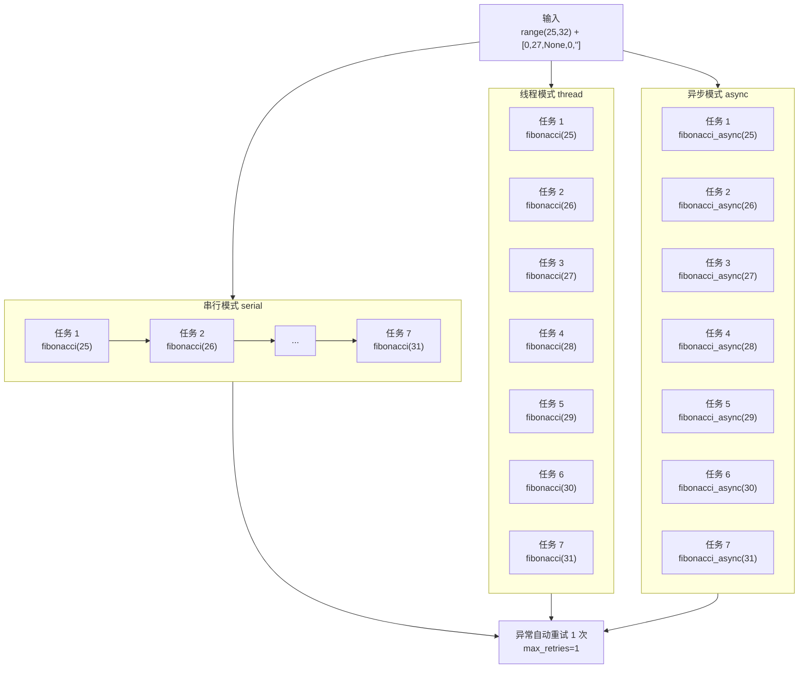

# demo_executor.py 演示说明

> 📅 最后更新日期: 2026/05/28

## 目标

演示 `TaskExecutor` 在三种执行模式（`serial`、`thread`、`async`）下的独立运行能力。展示异常重试、进度显示和任务统计的完整生命周期，适合作为框架入门的第一手体验。

## 演示内容

三种执行模式的核心策略对比如下：



| 函数 | 模式 | 任务 | 特性 |
|------|------|------|------|
| `demo_fibonacci_serial` | serial | 斐波那契计算 | 单线程顺序执行 |
| `demo_fibonacci_thread` | thread | 斐波那契计算 | 6 线程并发 |
| `demo_fibonacci_async` | async | 异步斐波那契 | 协程并发 |

- **输入**：`range(25, 32) + [0, 27, None, 0, ""]`
- **异常设计**：`0`、`None`、`""` 会触发 `ValueError`，框架自动重试 1 次

## 关键配置

- `max_workers = 6`
- `max_retries = 1`
- 通过 `executor.add_observer(TaskProgress())` 添加进度条

## 可能出现的问题

1. **递归深度与耗时**：`fibonacci(31)` 的递归调用量巨大，serial 模式下可能耗时 10 秒以上。
2. **`asyncio` 环境**：`demo_fibonacci_async` 使用 `asyncio.run()`，在 Jupyter Notebook 中直接运行会报错（Notebook 已有事件循环）。
3. **无断言**：此文件为**演示脚本**，不含 `assert`。运行成功仅代表未抛出未捕获异常，不验证结果正确性。

## 运行方式

```bash
python demo/demo_executor.py
```

## 预期行为

运行后将依次执行三种模式，输出类似以下流程：

```
========================================
[serial] Fibonacci benchmark (N=12 tasks, max_workers=6)
========================================
 80%|████████████████░░░░| ...

--- Summary ---
  mode=serial  success=07  fail=05  dup=0  pending=0  elapsed=0.90s

========================================
[thread] Fibonacci benchmark (N=12 tasks, max_workers=6)
========================================
 80%|████████████████░░░░| ...

--- Summary ---
  mode=thread  success=07  fail=05  dup=0  pending=0  elapsed=0.86s

========================================
[async] Fibonacci benchmark (N=12 tasks, max_workers=6)
========================================
 80%|████████████████░░░░| ...

--- Summary ---
  mode=async  success=07  fail=05  dup=0  pending=0  elapsed=0.01s
```

> **说明**：12 个任务中，5 个异常输入（`0`、`27`、`None`、`0`、`""`）触发 `ValueError`，经重试后最终标记为失败；`success=07` 为正常执行的 7 个斐波那契任务。
> 三种模式均使用 `demo_utils` 中的迭代版斐波那契（O(n)），性能可比。

## 依赖

- `celestialflow`（`TaskExecutor`、`TaskProgress`）
- `demo_utils`（`fibonacci`、`fibonacci_async`）
