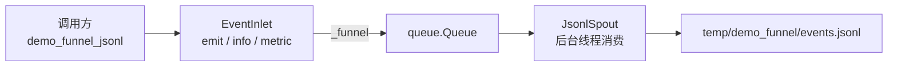

# demo_funnel.py 演示说明

> 📅 最后更新日期: 2026/06/18

## 目标

演示 `funnel` 模块可以脱离 `TaskGraph`、`TaskStage` 和 `TaskExecutor` 单独使用。这个示例直接基于 `BaseInlet` 和 `BaseSpout` 组装一个最小的“事件采集 -> 后台消费 -> JSONL 落地”管道。

## 演示内容

### `demo_funnel_jsonl`



这个演示由两个自定义类和一个运行入口组成：

- `JsonlSpout`
  - 继承 `BaseSpout`
  - 在 `_before_start()` 中创建目录并打开输出文件
  - 在 `_handle_record()` 中把记录写成 JSONL
  - 在 `_after_stop()` 中关闭文件
- `EventInlet`
  - 继承 `BaseInlet`
  - 对 `_funnel()` 做了轻量封装，提供 `emit()` / `info()` / `metric()` 三个业务方法
- `demo_funnel_jsonl()`
  - 创建 `JsonlSpout` 和 `EventInlet`
  - 启动后台消费线程
  - 发送 3 条事件记录
  - 停止线程后打印输出文件和内容

## 为什么这个 demo 有价值

- 它说明 `funnel` 不只是 persistence 的底层实现，也可以直接拿来搭建独立的生产者-消费者通道。
- 它覆盖了 `BaseSpout` 的完整生命周期：`start()`、`_before_start()`、`_handle_record()`、`stop()`、`_after_stop()`。
- 它也展示了 `BaseInlet` 的典型用法：业务侧不直接操作队列，而是通过自定义方法把记录送进 `_funnel()`。

## 关键实现

### 事件记录格式

`EventInlet.emit()` 会构造如下结构的记录：

```json
{
  "timestamp": "2026-06-18 11:50:29",
  "event": "metric",
  "payload": {
    "name": "processed",
    "value": 3
  }
}
```

### 输出文件

- 路径：`temp/demo_funnel/events.jsonl`
- 格式：每行一条 JSON 记录，方便后续 grep、流式读取或导入日志系统

## 关键配置

- 输出文件使用 `buffering=1` 打开，采用行缓冲
- `spout.stop()` 会发送终止信号并等待后台线程结束
- 示例默认写入 3 条记录：
  - `info`
  - `metric`
  - `batch_finished`

## 可能出现的问题

1. **不是同步写入**：`BaseInlet` 只是把记录放进队列，真正消费发生在 `JsonlSpout` 的后台线程里。
2. **输出目录变化**：JSONL 文件会写到当前工作目录下的 `temp/demo_funnel/`，如果从别的目录启动脚本，输出位置会随之变化。
3. **无断言**：这是演示脚本，运行成功只说明通路打通，不代表业务语义被自动校验。

## 运行方式

```bash
python demo/demo_funnel.py
```

## 预期行为

运行后会打印输出文件路径、处理条数以及写入的 JSONL 内容，类似：

```text
Output file: D:\Project\CelestialFlow\temp\demo_funnel\events.jsonl
Handled records: 3
{"timestamp": "2026-06-18 11:50:29", "event": "info", "payload": {"message": "funnel demo start"}}
{"timestamp": "2026-06-18 11:50:29", "event": "metric", "payload": {"name": "processed", "value": 3}}
{"timestamp": "2026-06-18 11:50:29", "event": "batch_finished", "payload": {"items": ["A", "B", "C"], "success": true}}
```

## 与其他模块的关系

- 如果你想看 `funnel` 作为框架底层能力如何被复用，可继续阅读：
  - [__init__.md](file:///d:/Project/CelestialFlow/docs/zh-CN/src/funnel/__init__.md)
  - [core_inlet.md](file:///d:/Project/CelestialFlow/docs/zh-CN/src/funnel/core_inlet.md)
  - [core_spout.md](file:///d:/Project/CelestialFlow/docs/zh-CN/src/funnel/core_spout.md)
- 如果你想看它在框架内的典型落地，可参考：
  - `persistence` 里的 `LogSpout` / `LogInlet`
  - `FailSpout` / `FailInlet`
  - `SuccessSpout`

## 依赖

- `celestialflow.funnel`（`BaseInlet`、`BaseSpout`）
- Python 标准库：`json`、`pathlib`、`time`
