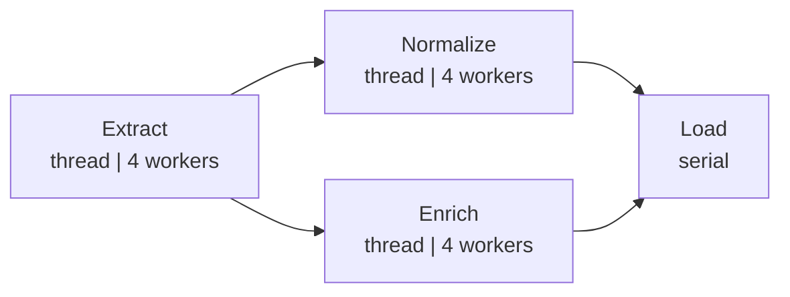
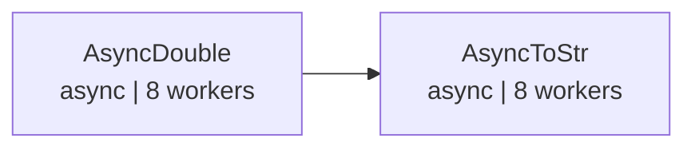

# demo_graph.py 演示说明

> 📅 最后更新日期: 2026/05/24

## 目标

演示 CelestialFlow 中 `TaskGraph` 的高级图拓扑构建：扇出/扇入（fan-out/fan-in）ETL 管道，以及异步分阶段流水线。

## 演示场景

### `demo_etl_fan_out_fan_in`
ETL 管道，扇出/扇入拓扑：



ASCII 补充示意：

```
Extract ──┬── Normalize ──┬── Load
          └── Enrich ─────┘
```

- `Extract` → 根据 ID 生成记录（thread 模式，4 worker）
- `Normalize` → 对记录值做归一化（thread 模式，4 worker）
- `Enrich` → 为记录添加分类标签（thread 模式，4 worker）
- `Load` → 保存记录（serial 模式）

**图结构**：DAG，一对多扇出 + 多对一扇入
**调度模式**：`eager`
**执行后**：调用 `graph.get_graph_summary()` 输出成功/失败任务数

### `demo_async_staged_pipeline`
两阶段异步流水线：



ASCII 补充示意：

```
AsyncDouble ──> AsyncToStr
```

- `AsyncDouble` → 异步将输入翻倍（async 模式，8 worker）
- `AsyncToStr` → 异步将结果转为字符串（async 模式，8 worker）

**图结构**：DAG，线性两阶段
**调度模式**：`staged`（逐层执行）
**执行后**：调用 `graph.get_status_snapshot()` 输出每阶段成功/失败任务数

## 关键配置

- 所有 stage 使用 `stage_mode="thread"`
- ETL 管道使用 `schedule_mode="eager"`，异步管道使用 `schedule_mode="staged"`
- `execution_mode="async"` 用于协程任务函数

## 可能出现的问题

1. **无断言**：演示脚本，不验证结果正确性。
2. **ETL 函数含 sleep**：`extract_record`（0.5s）、`transform_normalize`/`transform_enrich`（0.3s）、`load_record`（0.2s），完整执行有一定耗时。

## 运行方式

```bash
python demo/demo_graph.py
```

## 预期行为

### ETL 管道（`demo_etl_fan_out_fan_in`）

依次执行 Extract → Normalize/Enrich → Load，输出包含 sleep 日志和最终摘要：

```
[Extract] Input: 0 -> Output: {'id': 0, 'value': 101}
[Extract] Input: 1 -> Output: {'id': 1, 'value': 102}
[Normalize] Input: {'id': 0, 'value': 101} -> Output: {'id': 0, 'value': 0.01}
[Enrich] Input: {'id': 0, 'value': 101} -> Output: {'id': 0, 'label': 'odd'}
...
--- Graph Summary ---
Extract    : success=5  fail=0
Normalize  : success=5  fail=0
Enrich     : success=5  fail=0
Load       : success=10 fail=0
```

> 每个 Extract 产生 1 条记录，经 Normalize 和 Enrich 分别处理后由 Load 聚合。当输入为 `range(5)` 时，Load 节点共接收 10 个任务（5 × 2 下游）。

### 异步流水线（`demo_async_staged_pipeline`）

分阶段逐层执行，先完成 AsyncDouble 再启动 AsyncToStr：

```
--- Staged 1: AsyncDouble ---
[AsyncDouble] Input: 1 -> Output: 2
[AsyncDouble] Input: 2 -> Output: 4
...
--- Staged 2: AsyncToStr ---
[AsyncToStr] Input: 2 -> Output: 'Result: 2'
[AsyncToStr] Input: 4 -> Output: 'Result: 4'
...
--- Status Snapshot ---
AsyncDouble : success=5  fail=0  pending=0
AsyncToStr  : success=5  fail=0  pending=0
```

> 总执行时间约 3-5 秒，主要受内置 `sleep` 影响。

## 依赖

- `celestialflow`（`TaskGraph`、`TaskStage`）
- `demo_utils`（`extract_record`、`transform_normalize`、`transform_enrich`、`load_record`、`async_double`、`async_to_str`）
- `python-dotenv`
- 外部服务：CelestialTree（可选）、Reporter（可选）
