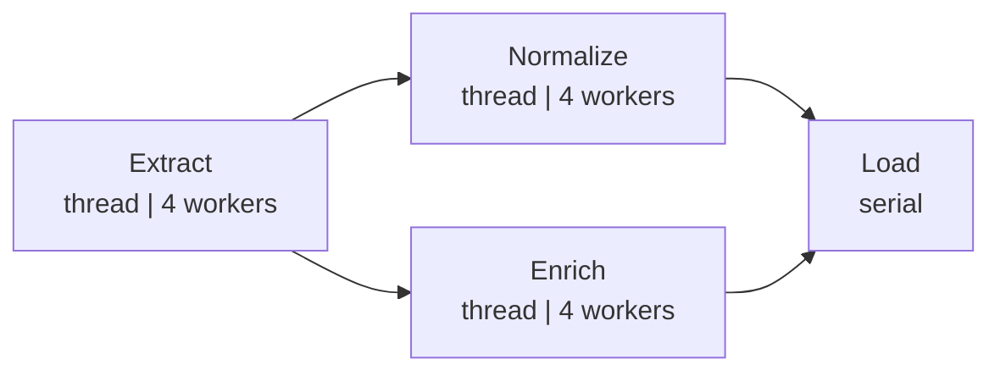

# demo_graph.py 演示说明

> 📅 最后更新日期: 2026/08/31

## 目标

演示 CelestialFlow 中 `TaskGraph` 的高级图拓扑构建：扇出/扇入（fan-out/fan-in）ETL 管道，以及异步分阶段流水线。

## 演示场景

### `demo_etl_fan_out_fan_in`
ETL 管道，扇出/扇入拓扑：


```mermaid
flowchart LR
    Extract["Extract<br/>thread | 4 workers"] --> Normalize["Normalize<br/>thread | 4 workers"]
    Extract --> Enrich["Enrich<br/>thread | 4 workers"]
    Normalize --> Load["Load<br/>serial"]
    Enrich --> Load
```

ASCII 补充示意：

```
Extract ──┬── Normalize ──┬── Load
          └── Enrich ─────┘
```

- `Extract` → 根据 ID 生成记录（thread 模式，4 worker）
- `Normalize` → 对记录值做归一化（thread 模式，4 worker）
- `Enrich` → 为记录添加分类标签（thread 模式，4 worker）
- `Load` → 保存记录（serial 模式）

**图结构**：DAG，一对多扇出 + 多对一扇入
**图模式**：`graph_mode="thread"`

### `demo_async_pipeline`
两阶段异步流水线：


```mermaid
flowchart LR
    AsyncDouble["AsyncDouble<br/>async | 8 workers"] --> AsyncToStr["AsyncToStr<br/>async | 8 workers"]
```

ASCII 补充示意：

```
AsyncDouble ──> AsyncToStr
```

- `AsyncDouble` → 异步将输入翻倍（async 模式，8 worker）
- `AsyncToStr` → 异步将结果转为字符串（async 模式，8 worker）

**图结构**：DAG，线性两阶段
**图模式**：`graph_mode="async"`

## 关键配置

- 各 Stage 通过 `TaskStage(..., execution_mode="thread" | "async")` 显式指定执行模式
- ETL 管道与异步管道分别通过 `TaskGraph(..., graph_mode="thread")` 与 `graph_mode="async"` 指定图模式
- `execution_mode="async"` 用于协程任务函数（`async_double`、`async_to_str`）

## 可能出现的问题

1. **无断言**：演示脚本，不验证结果正确性。
2. **ETL 函数含 sleep**：`extract_record`（0.5s）、`transform_normalize`/`transform_enrich`（0.3s）、`load_record`（0.2s），完整执行有一定耗时。

## 运行方式

```bash
python demo/demo_graph.py
```

> **注意**：当前 `__main__` 会依次调用 `demo_etl_fan_out_fan_in()` 与 `asyncio.run(demo_async_pipeline())`，两个演示场景都会运行。

## 预期行为

### ETL 管道（`demo_etl_fan_out_fan_in`）

依次执行 Extract → Normalize/Enrich → Load，每个 Stage 内部通过 `print` 或 sleep
休眠输出执行日志。脚本本身不主动打印最终的 Graph Summary 或各 Stage 计数，
需人工确认（mock 输出仅作示意）。

```
[Extract] Input: 1 -> Output: {'id': 1, 'value': 10, 'label': 'item_1'}
[Extract] Input: 2 -> Output: {'id': 2, 'value': 20, 'label': 'item_2'}
[Normalize] Input: {'id': 1, 'value': 10} -> Output: {'id': 1, 'value': 10, 'normalized': 0.1}
[Enrich] Input: {'id': 1, 'value': 10} -> Output: {'id': 1, 'value': 10, 'category': 'odd'}
...
```

> 每个 Extract 产生 1 条记录，经 Normalize 和 Enrich 分别处理后由 Load 聚合。当输入为 `range(1, 16)` 时，Extract 处理 15 条记录，Normalize 与 Enrich 各接收 15 条，Load 节点共接收 30 条任务（15 × 2 下游）。

### 异步流水线（`demo_async_pipeline`）

两阶段顺序执行：先 `AsyncDouble` 完成所有 20 个任务，再 `AsyncToStr` 逐个接收并格式化输出。

```
[AsyncDouble] Input: 1 -> Output: 2
[AsyncDouble] Input: 2 -> Output: 4
...
[AsyncToStr] Input: 2 -> Output: 'result=2'
[AsyncToStr] Input: 4 -> Output: 'result=4'
...
```

> 总执行时间约 1-3 秒（需人工确认），主要受内置 `sleep`（`async_double` 0.3s + `async_to_str` 0.2s）和 8 协程并发调度影响。

## 依赖

- `celestialflow`（`TaskGraph`、`TaskStage`、`TaskReporter`）
- `demo_utils`（`extract_record`、`transform_normalize`、`transform_enrich`、`load_record`、`async_double`、`async_to_str`）
- `python-dotenv`
- 外部服务：CelestialTree（可选）、Reporter（可选）
