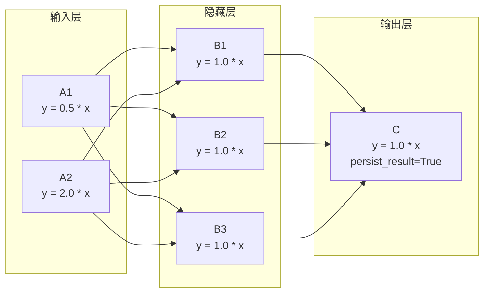

# demo_network.py 演示说明

> 📅 最后更新日期: 2026/08/12

## 目标

演示如何使用 `TaskCross` 构建多层神经网络拓扑（2→3→1 全连接），
并通过闭包工厂函数为每个节点赋予不同的权重参数，
展示 CelestialFlow 在类神经网络场景下的图表达能力。

本文件在 `demo_structure.py` 的 `demo_network` 基础上做了第一次演化：
将每个节点的运算从固定的 `add_one_sleep`（`x + 1`）替换为可配置的线性函数
`y = w * x + b`，使每个节点拥有独立的权重和偏置。

## 演示内容

### `demo_network_step1`



#### 构建方式

- 使用 `TaskCross` 构建 2-3-1 三层拓扑，`stage_mode="thread"`
- **输入层**：`A1(x) = 0.5x`、`A2(x) = 2.0x`，分别接收不同的输入范围
- **隐藏层**：`B1..B3(x) = 1.0x`，三个节点并行处理两个输入层的 Fan-in 结果
- **输出层**：`C(x) = 1.0x`，设置 `persist_result=True` 以保留所有接收到的结果
- 运行后通过 `C.get_success_pairs()` 收集前 10 条 `(输入 → 输出)` 对并打印

#### 核心函数

**`linear(w, b)`**：闭包工厂函数，返回 `_forward(x) -> w * x + b`。满足 `TaskStage`
对 `func` 只接收一个位置参数的约束，通过闭包固定权重和偏置，无需为每个权重组合
单独定义函数。

```python
def linear(w: float, b: float):
    def _forward(x):
        return w * x + b
    return _forward
```

## 关键配置

| 节点 | 函数 | 权重 w | 偏置 b | max_workers | 输入 |
|------|------|:------:|:------:|:-----------:|------|
| A1 | `linear(0.5, 0.0)` | 0.5 | 0.0 | 2 | `[1, 2, 3, 4, 5]` |
| A2 | `linear(2.0, 0.0)` | 2.0 | 0.0 | 2 | `[11, 12, 13, 14, 15]` |
| B1~B3 | `linear(1.0, 0.0)` | 1.0 | 0.0 | 2 | 来自 A1/A2 的 Fan-in |
| C | `linear(1.0, 0.0)` | 1.0 | 0.0 | 2 | 来自 B1~B3 的 Fan-in |

- 所有 Stage 使用 `stage_mode="thread"`、`execution_mode="thread"`
- 输出层 C 额外设置 `persist_result=True`

## 设计意图

本文件的定位是 **Step 1**——在保持 `demo_structure.py` 中 `demo_network` 的
2-3-1 拓扑不变的基础上，将节点函数从固定的硬编码运算升级为参数化的线性变换。
后续步骤可以在此基础上扩展：

- 激活函数（ReLU / Sigmoid）
- 样本配对（A1 与 A2 的同一输入编号对应同一个样本）
- 损失计算与反向传播

## 可能出现的问题

1. **无断言**：演示脚本，运行成功仅说明图构建和调度无误，不验证权重或计算结果。
2. **无样本配对**：A1 和 A2 的任务是独立处理的，尚未实现"同一个原始样本分别经
   A1 和 A2 处理后汇聚到同一个 B 节点"的配对逻辑。
3. **无 sleep**：`linear` 函数内部不包含延迟，因此执行非常快（微秒级），
   不会像其他 demo 那样有明显等待。
4. **30 个任务汇聚到 C**：A1（5 任务）× 3 个隐藏节点 + A2（5 任务）× 3 个隐藏节点
   = 30 个隐藏层输出，再全部经过 C 处理后得到 30 条结果记录。

## 运行方式

```bash
python demo/demo_network.py
```

## 预期行为

运行后打印节点配置信息和 C 节点收集的输入 → 输出映射：

```
─── Step 1: 每个节点 y = w*x + b ───

  A1(x) = 0.5 * x,  输入: [1, 2, 3, 4, 5]
  A2(x) = 2.0 * x,  输入: [11, 12, 13, 14, 15]
  B1..B3(x) = 1.0 * x
  C(x) = 1.0 * x
  运行中...
  C 共收到 30 个任务

  C 的 (输入 → 输出) 前 10 条:
     0.5  →  0.5
     2.0  →  2.0
     1.0  →  1.0
    22.0  →  22.0
     5.5  →  5.5
     1.0  →  1.0
    11.0  →  11.0
     2.0  →  2.0
     0.5  →  0.5
     1.0  →  1.0
```

> 由于当前各隐藏节点权重均为 1.0，C 的输出值直接等于输入值。
> A1（5 个值）和 A2（5 个值）分别经 B1/B2/B3 三个隐藏节点后汇入 C，
> 共生成 30 条结果记录。

## 依赖

- `celestialflow`（`TaskCross`、`TaskStage`）
